# 创建服务

## 概述

接入条件：

* 具备能够独立完成对接的技术能力。
* 公司运营状况良好，拥有一定客户群。
* 支持合作后进行服务联动，及时提供数据反馈和处理用户异议。
* 通过开发者联盟注册、企业实名认证和资格审查。
* 完成网签协议签署。

## 应用开发前准备

在开发应用前，需要先进行准备工作，具体参考[应用开发准备](https://developer.huawei.com/consumer/cn/doc/harmonyos-guides/application-dev-overview)。

## AirTouch栏目添加

完成应用开发前准备，创建项目后，首先检查左侧绿色框内的“构建”栏目下，是否包含AirTouch选项。若没有，则点击左下角的全部功能，在右侧“构建”栏目中选中AirTouch选项即可

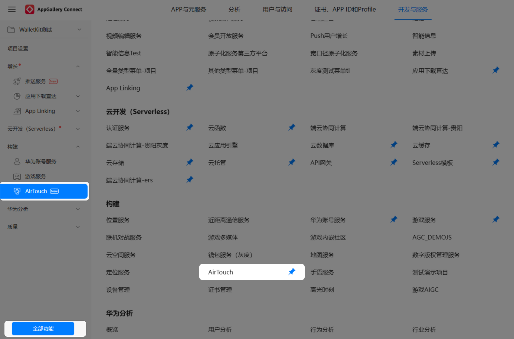

## 服务创建

1. 登录[AppGallery Connect](https://developer.huawei.com/consumer/cn/service/josp/agc/index.html)网站，点击“开发与服务”。

   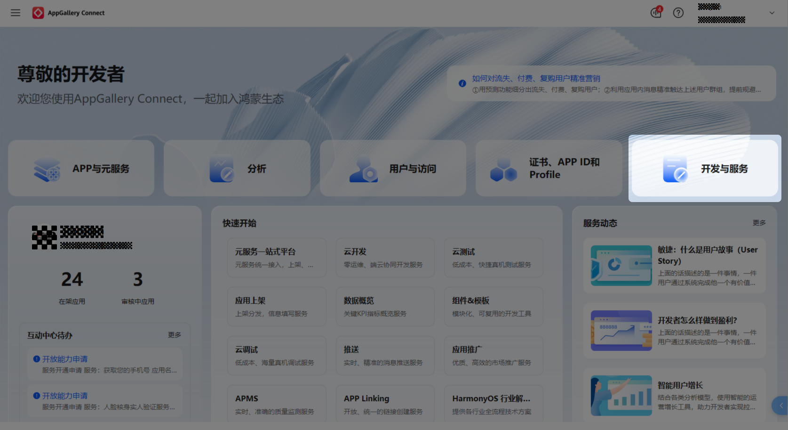
2. 选择需要创建AirTouch服务的项目，进入项目设置页面。

   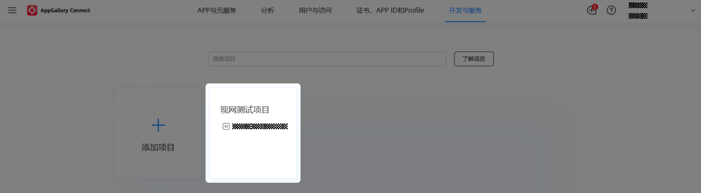

   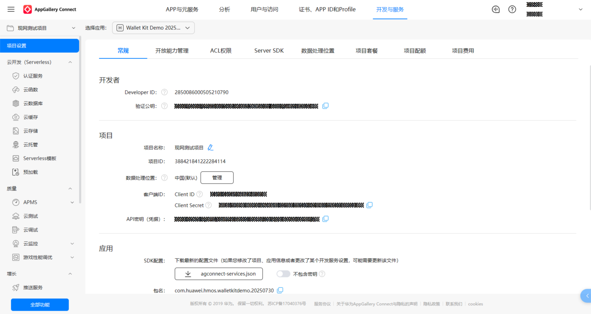
3. 在“项目设置”页签，左侧导航选择“构建 > AirTouch”。

   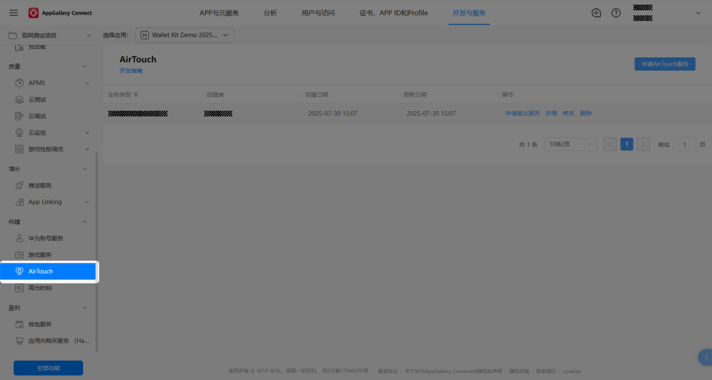
4. 点击“申请AirTouch服务”。

   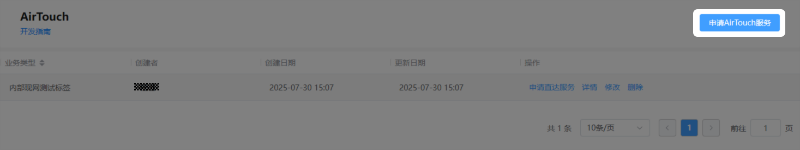
5. 设置AirTouch服务基本信息。

   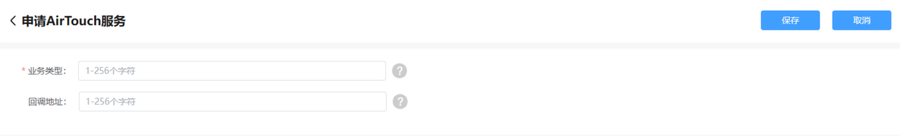

   

   * 伙伴名称：AirTouch服务首页列表展示所有接入伙伴服务时，伙伴名称用于区分不同的接入伙伴。
   * 回调地址：伙伴提供给华为的地址，用于华为反向回调开发者获取标签跳转链接参数。如果商户在[设置跳转参数来源](#ZH-CN_TOPIC_0000002105172798__li20667114554214)中选择“根据TagId查询参数”则该地址必须填写，否则无须填写。

     

     HarmonyOS 5.0及以上版本不支持回调地址，HarmonyOS 3.1/4.0及以下版本回调实现请参见[参数回调接口](/docs/distribute/service-dist/AirTouch/appebdices-0000002140931469/callback-0000002148323061)
6. 点击“保存”，创建完成后，返回AirTouch服务创建首页，可对所创建的服务进行详情查看、修改与直达服务的创建。

   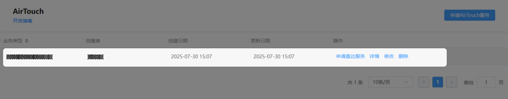
7. 在AirTouch服务首页列表项中，点击“申请直达服务”按钮，进入直达服务创建首页。

   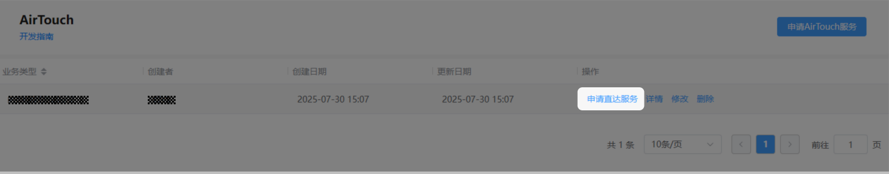
8. 点击“新建商家直达服务”，请填写服务信息。点击“下一步”。

   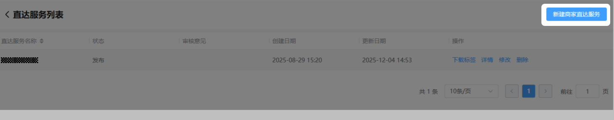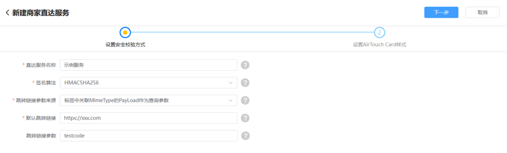

   

   * 商家名称：直达服务首页列表展示所有商家注册信息时，商家名称用于区分不同的商家。
   * 签名算法：定义华为对直达标签的验证方式。有两种验签方式：

     1. HMACSHA256签名算法。

     2. RSA3072签名算法。

     

     HarmonyOS 5.0及以上版本请选择HMACSHA256签名算法。
   * 跳转链接参数来源：设置跳转链接参数的获取方式，有以下三种方式：

     1. 不需要查询参数。

     2. 根据TagId查询参数，如果选择此种方式需要对应配置[回调地址](#ZH-CN_TOPIC_0000002105172798__li1238916019377)，此地址用于AirTouch服务识别到标签后通过标签的TagId去开发者服务器获取跳转参数。

     3. 标签中关联MimeType的PayLoad作为查询参数。举一个示例场景：一个连锁餐饮商户每一个店面的标签里面可以写入不同的店面Id，实现拉起相同应用不同的商户落地页。如果有此类场景诉求，请选择该选项，同时在跳转链接参数输入框中填写参数Key。

     

     1. 方式2不支持HarmonyOS 5.0及以上版本

     2. 方式3在HarmonyOS 5.0及以上版本只支持配置单个参数，在HarmonyOS 3.1/4.0及以下版本可配置多个跳转参数（多个参数可以用“&”连接），多个参数具体跳转拼接规则如下：

     + 如果跳转链接和跳转参数均不带连接符“？”，则完整跳转链接为商户配置的跳转链接+“？”+跳转参数。
     + 如果跳转链接带有连接符“？”，则完整跳转链接为商户配置的跳转链接+“&”+跳转参数。
     + 如果参数带有连接符“？”，则完整跳转链接为商户配置的跳转链接+“&”+跳转参数。
   * 默认跳转链接： 此项配置为跳转链接的兜底地址。HarmonyOS 3.1/4.0及以下版本在跳转时，若找不到对应的App，QuickApp及H5时，可以直接依据此跳转H5。HarmonyOS 5.0及以上版本在跳转时，若找不到对应的元服务，鸿蒙App及H5时，可以直接依据此跳转H5。
   * 跳转链接参数： 当跳转参数来源字段配置为“取标签中关联MimeType的PayLoad作为参数”时，此字段必填，用于设置MimeTyp的值，如果为其它则此处可设置为空。跳转链接参数请设置一个Key值，例如：storeId。被拉起方应用，可以在UIAbility的onCreate或者onNewWant回调中，通过want.parameters['tagParam']取到对应签中关联MimeType的PayLoad的值。
9. 点击“下一步”，设置AirTouch卡片样式。

   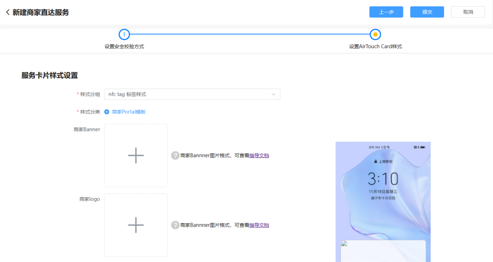

   

   * 样式分组、样式分类选择默认即可。
   * 商家Banner、商家Logo、标题、商家描述信息、跳转按钮文字配置请参考[预览界面定义](https://developer.huawei.com/consumer/cn/doc/service/custom-setting-0000002140771881)章节进行配置。
   * 跳转地址请参考[跳转分发](https://developer.huawei.com/consumer/cn/doc/service/jump-0000002105332614)章节进行配置。
10. 点击“提交按钮”，完成商家直达服务的配置，此时该服务状态为待审核。
11. 等待华为运营人员对创建的商家直达服务进行审核，审核通过后，可下载对应的直达标签内容。

    

    标签内容下载完成后，请参考[制作标签](https://developer.huawei.com/consumer/cn/doc/service/make-label-0000002140931465)章节进行标签写入。
