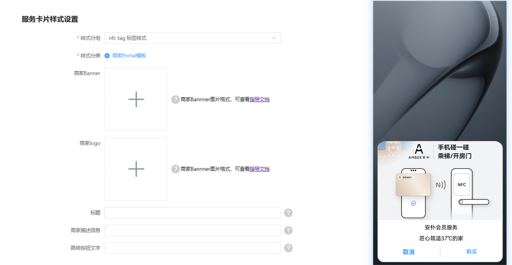

# HarmonyOS 3.1/4.0及以下

在HarmonyOS 3.1/4.0及以下版本，用户通过标签拉起AirTouch时，AirTouch会首先给用户展示一个商户推广页，在此推广页中商户可自定义页面内的文字以及图片背景，配置后的体验如下图所示。

* 商家Banner图片大小推荐100kb以内，长宽比为16:9，分辨率1920 x 1344。规范详见附件`banner样例.sketch.zip`。
* 商家Logo图片大小推荐20kb以内，长宽比为1:1，分辨率1080 x 1080。
* 标题字数限制在6个字以内。
* 商家描述信息推荐在8个字以内。
* 跳转按钮文字限制在4个字以内。

**banner图片生成**：

1. 下载[banner样例.sketch.zip](https://alliance-communityfile-drcn.dbankcdn.com/FileServer/getFile/cmtyPub/011/111/111/0000000000011111111.20260409191805.61462392894376599887567666189737%3A20260602115804%3A2800%3A135346A54E17668AFED16BB48B82283FAEB1BD23B2F78941E545EF8028EC2261.zip?needInitFileName=true)压缩包，解压并打开“banner样例.sketch”
2. 打开Sketch文档，画板一是图片的规范规则（参考），画板二是导出Banner画板(注意本地安装好sketch软件)
3. 图片中主体物保持在红色辅助线内
4. 画板导出成图片
