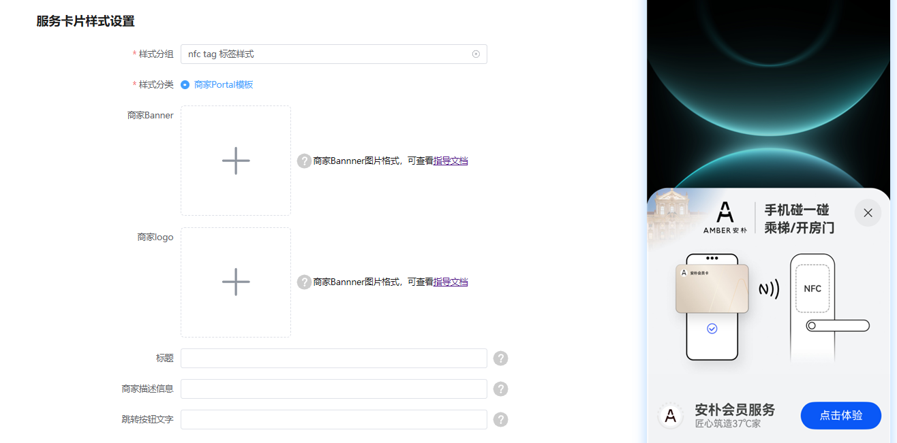

# HarmonyOS 5.0及以上

在HarmonyOS 5.0及以上版本，AirTouch商户推广页进行全新升级，更加简洁美观，配置后的体验如下图所示。

* 商家Banner图片大小推荐100kb以内，长宽比为10:7，分辨率1920 x 1344。规范详见附件`AirTouch商家Banner规范.zip`。
* 商家Logo图片大小推荐20kb以内，长宽比为1:1，分辨率1080 x 1080。如果商家接入的是元服务，规范详见附件`AirTouch商家元服务Logo规范.zip`。
* 标题字数限制在6个字以内。
* 商家描述信息推荐在8个字以内。
* 跳转按钮文字限制在4个字以内。

[AirTouch商家Banner规范.zip](https://alliance-communityfile-drcn.dbankcdn.com/FileServer/getFile/cmtyPub/011/111/111/0000000000011111111.20260409191804.82835333503308084477906028917163%3A20260602115802%3A2800%3A81D79962A089BCEEF6FFFF8433FDCB7AE39FC94FC647D0ED26C3BAACCBFDBC39.zip?needInitFileName=true)

[AirTouch商家元服务Logo规范.zip](https://alliance-communityfile-drcn.dbankcdn.com/FileServer/getFile/cmtyPub/011/111/111/0000000000011111111.20260409191804.27215933339101718950457860100897%3A20260602115802%3A2800%3AB0A7ADCA4FA8FD6947B5E8B8488A86007DB5AA54AC242B4B5E277E7DA2438CDE.zip?needInitFileName=true)
