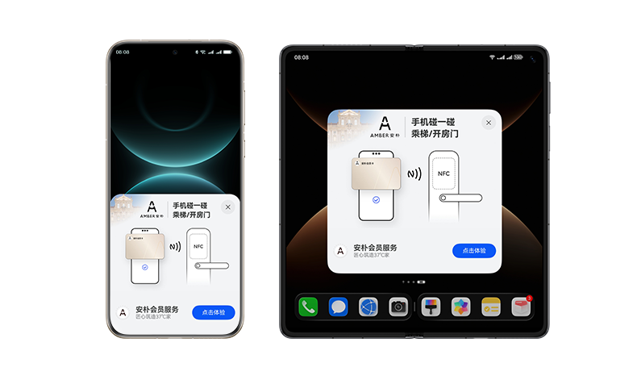

# 业务简介

AirTouch服务以短距离通信为触发，构建新的连接点，为用户提供服务直达。通过碰一碰，轻松满足用户即用即走的碎片化需求，帮助你的产品提升创新变现能力。

## 场景介绍

AirTouch作为服务标签的统一分发入口，支持元服务、鸿蒙应用、快应用、APP、H5等触达服务。通过NFC-Tag，完成标签解析与服务分发。对于商超、餐饮、出行、活动、支付等多行业多场景，用户“碰一碰“服务标签，轻松通过众多应用入口获取服务信息。

典型场景：

* 餐饮

  用户手机碰Tag标签 -> Portal页 -> 快速点餐。
* 出行

  用户手机碰Tag标签 -> Portal页 -> 解锁共享单车。
* 活动

  用户手机碰Tag标签 -> Portal页 -> 查看活动信息。
* 商超

  用户手机碰Tag标签 -> Portal页 -> 获取优惠券。
* 支付

  用户手机碰支付闸机 -> 完成支付。

## 优势与亮点

* 便捷使用：使用NFC-TAG，用户仅需要碰一碰服务标签即可获取服务信息。
* 快速接入：四步（注册、认证，配置服务、开发应用），少量开发即可上线服务。
* 精准触达：基于用户短距离碰一碰，精准触达服务。
* 开放设计：精准配置满足用户体验设计，模板信息支持伙伴在开发者联盟进行配置上架。
