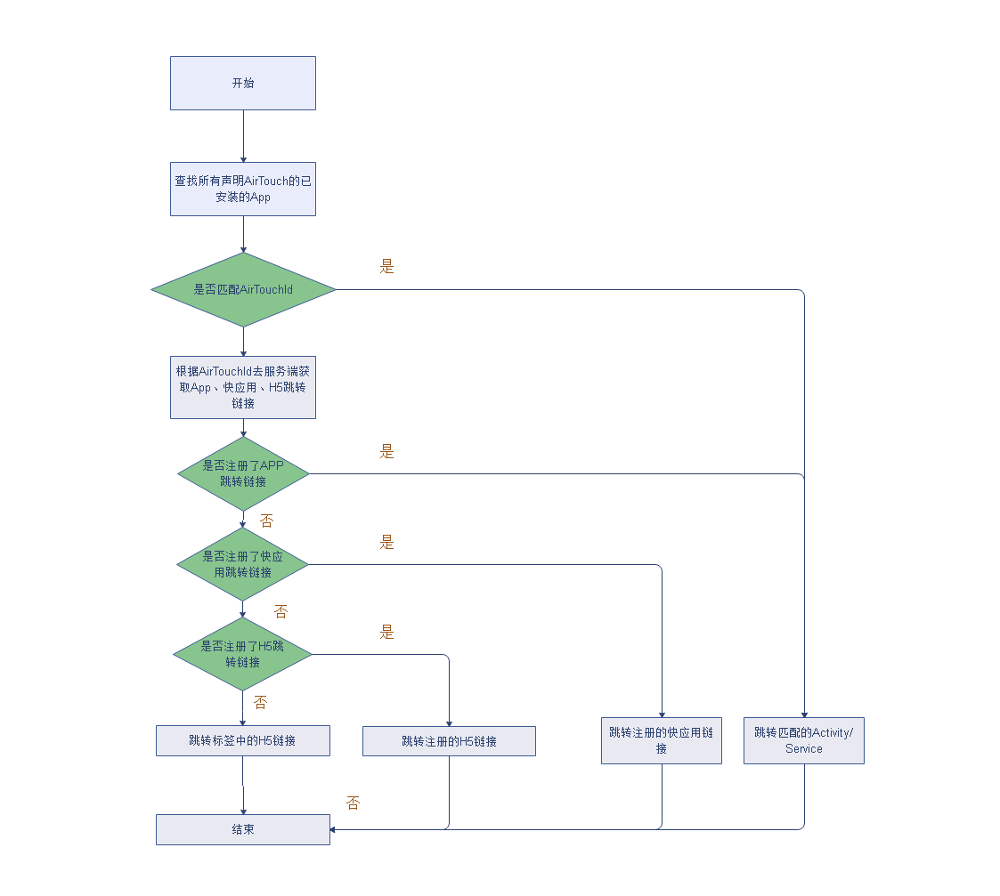
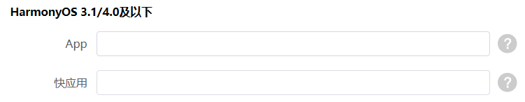

# HarmonyOS 3.1/4.0及以下

## 概述

商户通过标签拉起AirTouch应用时，AirTouch将从标签中解析出AirTouchId（通用标签无此数据）和AirTouch Link字段，并通过AirTouchId和AirTouch Link先查询是否有匹配的商户APP应用，如果跳转失败则去AirTouch服务器获取商户在开发者联盟填写的App、快应用、H5跳转链接，并且依次尝试是否可以跳转成功，如果有一次跳转成功则不再进行后面的尝试，直到当所有的跳转都失败时则取标签中的AirTouch Link进行跳转H5操作。



## 跳转商户App

AirTouch提供“meta-data匹配AirTouchId”或直接跳转商户应用内Activity二种方式拉起商户App应用，商户可根据场景选择对应开发方式。

**方式一：meta-data匹配AirTouchId拉起商户APP应用**

1. 商户需要在开发者联盟网站申请一个AirTouch应用，待AirTouch应用审核通过后即可从标签中得到AirTouchId。
2. 在App工程中的AndroidManifest.xml设置AirTouchId，配置参考：

   ```
   <meta-data
   android:name="AirTouchId"
   android:value="airTouchId的值" />
   ```

   

   “android:name”固定为“AirTouchId”无需修改。

   “android:value”请从开发者联盟注册的标签内容中获取。
3. 在AndroidManifest.xml配置文件中为需要拉起的Activity设置Action，配置参考：

   ```
   <intent-filter>
       <action android:name="com.huawei.hms.airtouch.action" />
       <category android:name="android.intent.category.DEFAULT" />
   </intent-filter>
   ```

   

   “android:name”为固定值
4. 用户通过标签拉起AirTouch预览界面并点击按钮后，AirTouch将遍历手机应用的meta-data配置，如果匹配到标签对应的AirTouch，则执行跳转Action操作。

**方式二：****跳转商户应用内Activity**

用户通过标签拉起AirTouch预览界面后，点击跳转按钮时如果用户手机内没有能匹配标签AirTouchId的App应用时。AirTouch会通过AirTouch服务器去获取商户在开发者联盟网站上配置的跳转App应用的链接。

1. 商户需要在开发者联盟网站申请一个AirTouch应用。
2. 在“[App](https://developer.huawei.com/consumer/cn/doc/service/create-service-0000002105172798#ZH-CN_TOPIC_0000002105172798__li5766246184413)”栏目填写Schema跳转链接。

   
3. 用户通过标签拉起AirTouch预览界面并点击按钮后，看是否可以跳转到指定Activity。

   

   此处需要注意当前测试手机内是否有能匹配AirTouchId的APP应用，如果有则会先跳转匹配AirTouchId的APP应用并结束拉起流程。

## 跳转商户快应用

用户通过标签拉起AirTouch预览界面，点击跳转按钮无法跳转商户App时，AirTouch客户端会通过AirTouch服务器去获取商户在开发者联盟网站上配置的跳转快应用的链接。

1. 商户需要在开发者联盟网站申请一个AirTouch应用。
2. 在“[快应用](https://developer.huawei.com/consumer/cn/doc/service/create-service-0000002105172798#ZH-CN_TOPIC_0000002105172798__li5766246184413)”栏目填写跳转链接。

   
3. 用户通过标签拉起AirTouch预览界面并点击按钮后，查看是否可以跳转到指定快应用界面。

## 跳转商户H5页面

用户通过标签拉起AirTouch预览界面，点击跳转按钮无法跳转商户App和快应用时，AirTouch客户端会通过AirTouch服务器去获取商户在开发者联盟网站上配置的H5的跳转链接。

1. 商户需要在开发者联盟网站申请一个AirTouch应用。
2. 在“[H5](https://developer.huawei.com/consumer/cn/doc/service/create-service-0000002105172798#ZH-CN_TOPIC_0000002105172798__li5766246184413)”栏目填写跳转链接。

   
3. 用户通过标签拉起AirTouch预览界面并点击按钮后，查看是否可以跳转到指定H5界面。
4. 当设置的链接不可达时，AirTouch则会读取标签里面的Deep Link链接作为兜底界面进行跳转H5操作。
