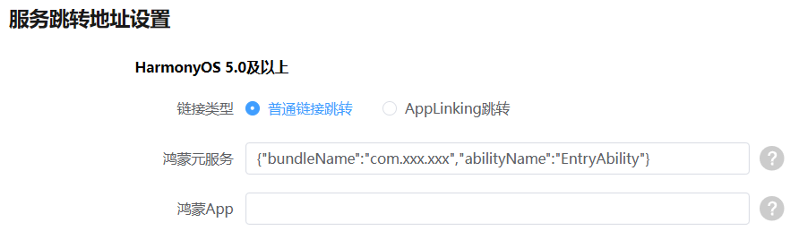
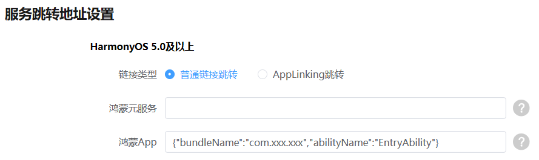

# 普通链接跳转

## 概述

当用户配置HarmonyOS 5.0及以上跳转方式，链接类型选中普通链接跳转，进行相应配置后，通过标签拉起AirTouch应用时，AirTouch将从云端获取商户配置的元服务、鸿蒙App以及H5链接，并且依次尝试是否可以跳转成功，如果有一次跳转成功则不再进行后面的尝试，直到当所有的跳转都失败时则取标签中的AirTouch Link进行跳转H5操作。

## 跳转商户鸿蒙元服务

用户通过标签拉起AirTouch预览界面后，点击跳转按钮会首先尝试跳转商户配置的元服务链接。

1. 商户需要在开发者联盟网站申请一个AirTouch应用。
2. 在“[鸿蒙元服务](/docs/distribute/service-dist/AirTouch/create-service-0000002105172798#ZH-CN_TOPIC_0000002105172798__li5766246184413)”栏目填写跳转链接。

   

   

   * 元服务跳转地址为Want类型的json格式，示例如下：

     \\{"bundleName":"xxx","abilityName":"xxx","moduleName":"xxx","parameters":\\{"xxx":"xxx"\\}\\}
   * 被拉起方应用，可以在UIAbility的onCreate或者onNewWant回调中，通过want.parameters['configParam']取到上述配置中的parameters
3. 用户通过标签拉起AirTouch预览界面并点击按钮后，查看是否可以跳转到指定元服务。

## 跳转商户鸿蒙App

用户通过标签拉起AirTouch预览界面后，点击跳转按钮无法跳转商户元服务时，会尝试跳转商户配置的鸿蒙App地址。

1. 商户需要在开发者联盟网站申请一个AirTouch应用。
2. 在“[鸿蒙App](/docs/distribute/service-dist/AirTouch/create-service-0000002105172798#ZH-CN_TOPIC_0000002105172798__li5766246184413)”栏目填写跳转链接。

   

   

   * 鸿蒙App跳转地址为Want类型的json格式，示例如下：

     \\{"bundleName":"xxx","abilityName":"xxx","moduleName":"xxx","parameters":\\{"xxx":"xxx"\\}\\}
   * 被拉起方应用，可以在UIAbility的onCreate或者onNewWant回调中，通过want.parameters['configParam']取到上述配置中的parameters
3. 用户通过标签拉起AirTouch预览界面并点击按钮后，查看是否可以跳转到指定鸿蒙App。

## 跳转商户H5界面

用户通过标签拉起AirTouch预览界面，点击跳转按钮无法跳转元服务和鸿蒙app时，AirTouch客户端会跳转商户配置的H5跳转链接。

1. 商户需要在开发者联盟网站申请一个AirTouch应用。
2. 在“[H5](/docs/distribute/service-dist/AirTouch/create-service-0000002105172798#ZH-CN_TOPIC_0000002105172798__li5766246184413)”栏目填写跳转链接。

   

   

   H5跳转地址格式：https://域名/参数
3. 用户通过标签拉起AirTouch预览界面并点击按钮后，查看是否可以拉起浏览器跳转到指定H5界面。
4. 当设置的链接不可达时，AirTouch则会读取标签里面的默认跳转链接作为兜底界面进行跳转H5操作。
