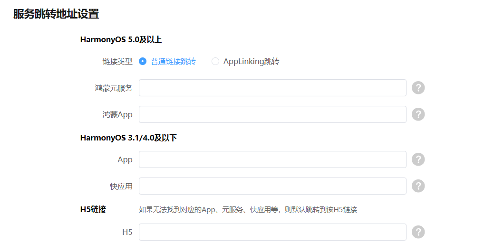

# 能力简介

AirTouch支持配置多种跳转方式：

* HarmonyOS 5.0及以上版本支持[普通链接跳转](https://developer.huawei.com/consumer/cn/doc/service/jump-normal-0000002552678999)和[AppLinking跳转](https://developer.huawei.com/consumer/cn/doc/service/jump-applinking-0000002521479036)两种方式。
* HarmonyOS 3.1/4.0及以下版本不支持AppLinking跳转。
* 支持同时配置HarmonyOS 5.0及以上和HarmonyOS 3.1/4.0及以下版本跳转方式。
* H5链接为兜底配置，只需配置一次，在HarmonyOS 5.0及以上和HarmonyOS 3.1/4.0及以下同时生效。

