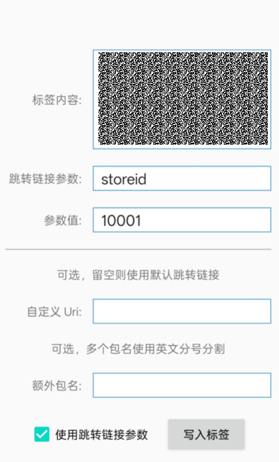

# 标签烧录工具

## 使用方法

首先下载附件中提供的工具并进行安装，打开后展示如下页面。

1. 将[下载的标签数据](/docs/distribute/service-dist/AirTouch/create-service-0000002105172798#ZH-CN_TOPIC_0000002105172798__li1318115108185)粘贴到“标签内容”输入框中。
2. 如果[跳转链接参数来源](/docs/distribute/service-dist/AirTouch/create-service-0000002105172798#ZH-CN_TOPIC_0000002105172798__li20667114554214)配置了“标签中关联的MimeType的PayLoad作为查询参数”，请勾选“使用跳转链接参数”，如果没有配置该参数则直接跳转步骤5。
3. 在“跳转链接参数中”填写“[跳转链接参数](/docs/distribute/service-dist/AirTouch/create-service-0000002105172798#ZH-CN_TOPIC_0000002105172798__li20667114554214)”中配置的Key值。
4. 在“参数值”中填写“跳转链接参数的”的具体值，AirTouch会将该值进行透传携带给被拉起方，值的内容会被当做字符处理。如果开发者有特殊业务诉求，可以在该内容中进行定制化数据传递。被拉起方应用，可以在UIAbility的onCreate或者onNewWant回调中，通过want.parameters['tagParam']取到该值。
5. 点击“写入标签”，将标签靠近手机，等待写入成功即可。

[标签烧录工具](https://alliance-communityfile-drcn.dbankcdn.com/FileServer/getFile/cmtyPub/011/111/111/0000000000011111111.20260409193807.38681827525356225782444254457976%3A20260602115814%3A2800%3A41A0DCC5495E0E69865A197BA5C822914545B5E5EEE761A5A75667AE6A0FDE4D.zip?needInitFileName=true)
