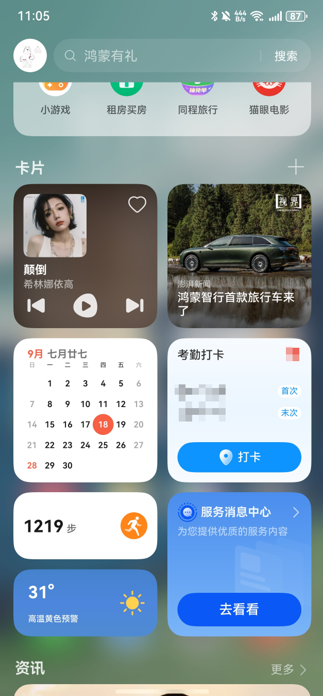
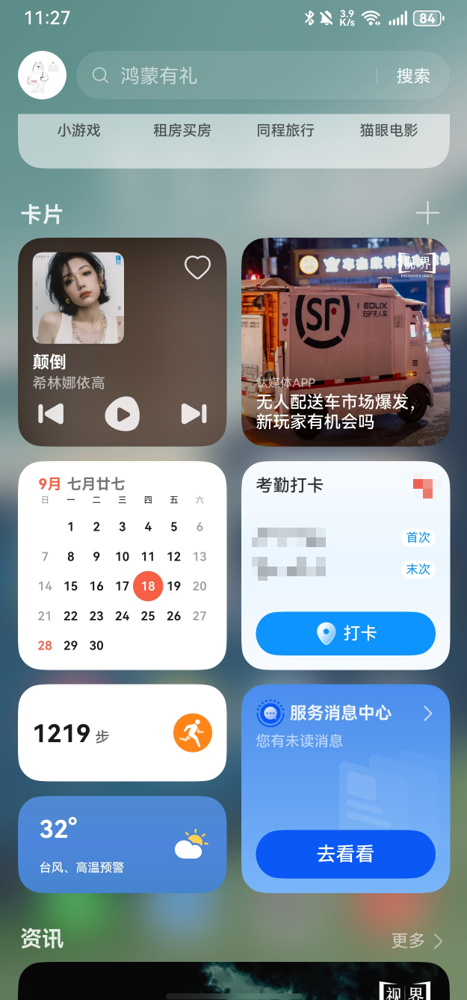
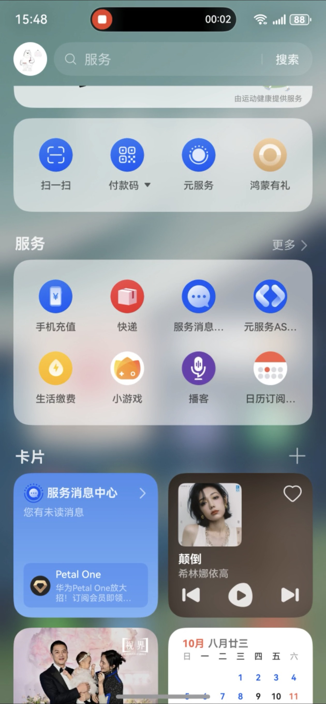
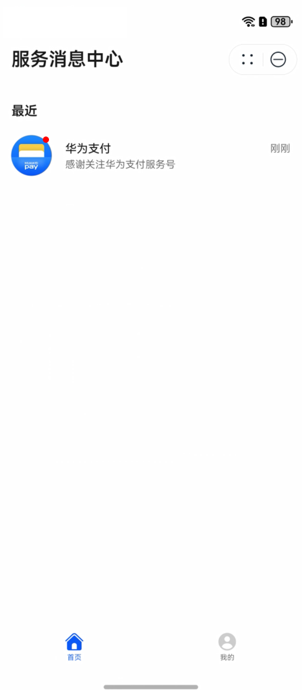
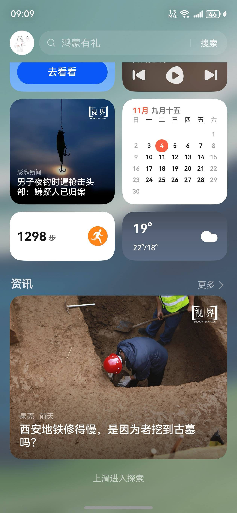
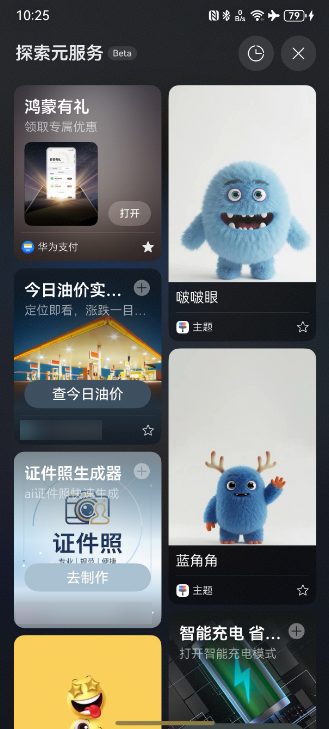
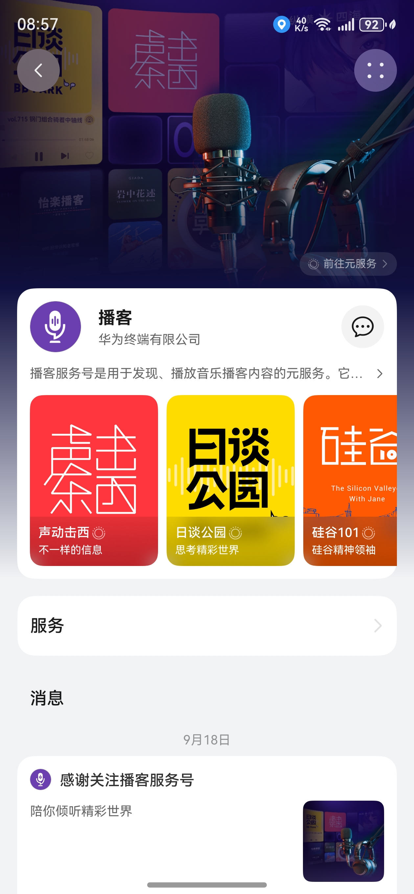
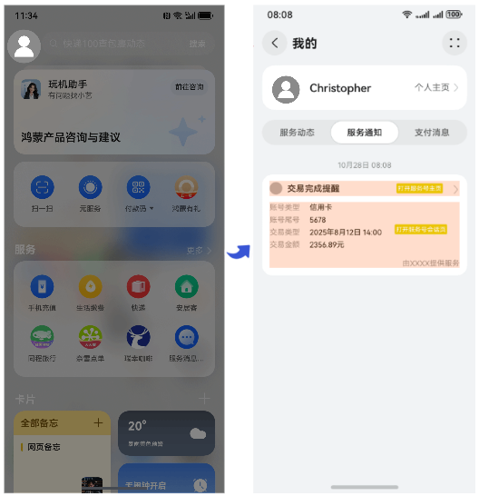

# 负一屏

负一屏是用户获取服务号信息的重要阵地。华为鸿蒙设备主界面右滑即可进入负一屏，通过负一屏卡片区域的服务消息卡片、探索流页面服务号卡片等入口，用户可触达和使用服务号。

## 服务消息卡片

负一屏卡片区域的服务消息卡片可承载服务消息，用户点击卡片可进入[服务消息中心](/docs/distribute/service-dist/huawei-service-account/entrance-0000001052924071/service_message_center-0000001151986766)查看服务号消息。

**表1** 服务消息卡片状态

| 卡片默认样式 | 有未读消息时的卡片样式 | 有未读图文消息时的卡片样式 | 点击卡片进入服务消息中心 |
| --- | --- | --- | --- |
|  |  |  |  |

## 探索页面卡片流

用户在负一屏下滑可进入探索页面，探索页面支持展示服务号卡片（服务号主页需为画廊模式），用户点击服务号卡片可进入服务号主页。

**表2** 探索页面卡片流体验

| 负一屏上滑进入探索页面 | 探索页面支持服务号卡片 | 点击卡片进入服务号主页 |
| --- | --- | --- |
|  |  |  |

## “服务通知”消息盒子

用户路径：用户点击负一屏的 头像区域，即可打开“消息盒子”。

核心功能：

消息盒子将集中展示所有来自服务号的通知消息，每条消息以独立卡片形式呈现。

用户点击任意一条消息卡片，即可直接跳转至对应的服务号 会话页面 或 主页，快速处理相关事宜。

用户通过点击负一屏头像区域，可以打开消息盒子。用户点击“服务通知”下的服务号模板消息卡片可进入服务号会话页或主页。

