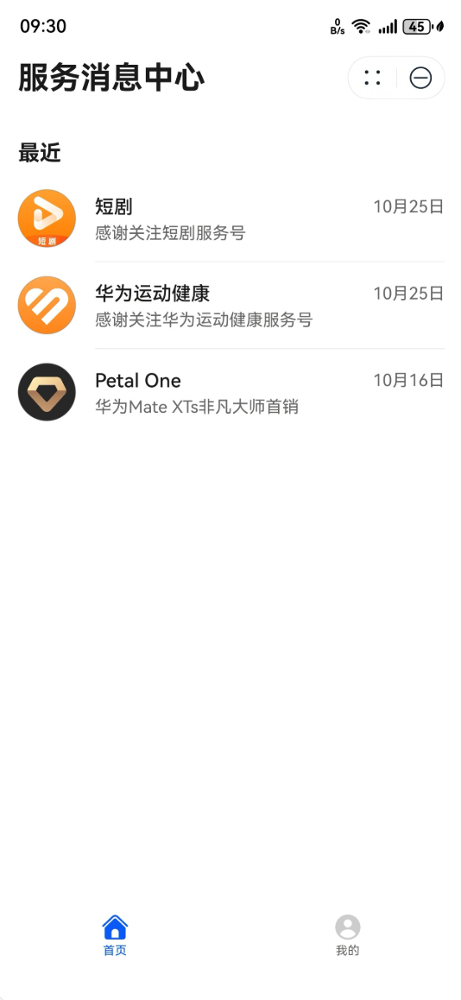
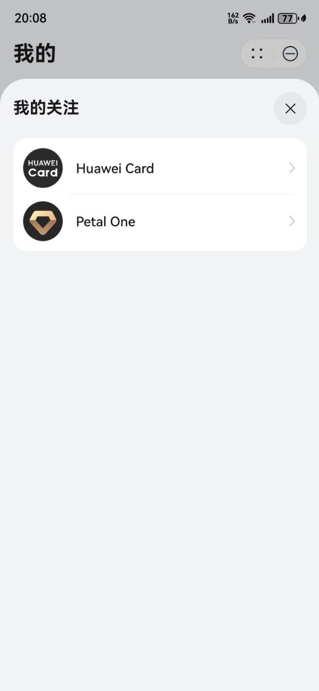

# 服务消息中心

服务消息中心是聚合服务号消息的统一平台，支持一站式查看服务号信息和管理服务号关注，帮助用户便捷获取优质服务，目前提供最近使用列表“最近”、用户关注列表“我的关注”。

## 最近

“最近”列表基于用户与服务号的近期互动行为生成，聚合了用户最近接收过消息或主动沟通的服务号。它能帮助用户快速回溯并找到当前最关心的服务号。

## 我的关注

“我的关注”列表是用户所有已关注服务号的完整集合，用户可以在此快速找到并进入任意服务号的会话页，以进行查看历史消息、会话等深度操作。

