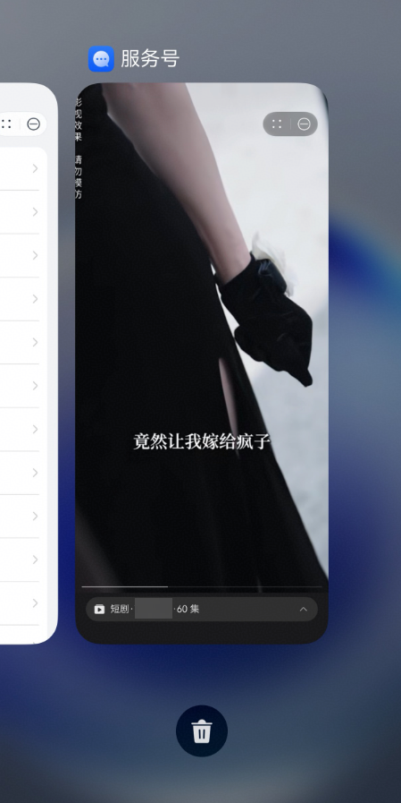
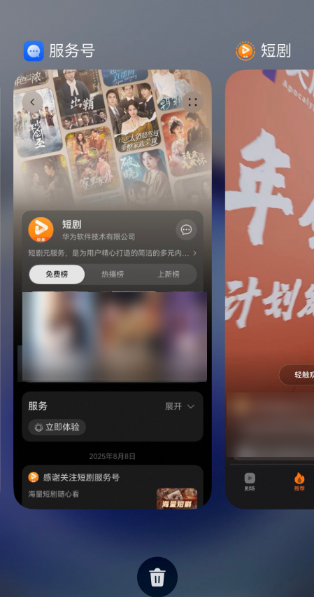

# FAQ

## **1. 进入管理中心后，找不到服务号入口？**

首次进入服务号，需要自行添加服务号入口，点击右上角“自定义桌面”按钮，选择华为服务号签署服务号协议后进入商家Portal。

## **2. 华为服务号支持的跳转类型？**

服务号暂支持跳转元服务，特殊场景需要支持H5、APP的需通过 biztouch@huawei.com 联系华为平台运营人员了解相关流程和合作规则。

## 3. **服务号处于审核状态能够进行修改吗？**

不可以，审核状态的服务号是不支持修改，只能查看，审核结果返回后才能修改。

## 4. **如何查看服务号上架状态？**

在华为开发者联盟管理中心，进入商家portal管理界面，在服务号管理列表中可以查看每个服务号的状态。

## 5. **服务号的状态有哪些？**

1. 未生效，指您创建服务号未经过审核，或提交审核后华为运营管理后台正在受理；或您的服务号因不符合标准，上线申请未通过审核；

2. 已生效，指您的服务号已通过审核，已在商家portal上线；

## 6. **用户关注服务号后，如果更换手机，关注的服务号是否会变化？**

服务号是基于用户华为账号管理，同一个华为账号下，更换终端设备后，关注的服务号不变。

## 7. **如何在探索元服务出现服务号卡片？**

完成服务号主页画廊模式装修，并通过审核的服务号，平台会根据规则选用服务号主页素材（第一个商品的信息）自动生成服务号卡片后推送至探索流，探索流基于算法进行推荐展示。

## 8. **界面提示“本消息类型暂未支持，请升级至最新版本”，需要在哪升级？**

请在 设置>隐私和安全>数据与隐私>元服务中，点击“小红点”入口更新最新版本或在应用市场>我的>设置>应用网络设置>自动更新应用中，设置为仅WLAN。

## 9. **嵌入式打开元服务和跳出式打开元服务有什么区别？**

在服务号内使用非嵌入式打开元服务时，元服务以独立方式打开，用户在跳转时感受到切换的过程拉起不同APP的效果，且在滑动切换APP时，会显示对应的元服务界面。

当元服务在服务号内以嵌入式打开时，元服务在服务号内打开，用户滑动操作时，元服务没有单独的界面，用户操作时体验更好。

**表1**

| 短剧元服务在服务号中嵌入式打开时，切换应用时显示为“服务号” | 短剧元服务在服务号中跳出式打开时，切换应用时显示为“短剧” |
| --- | --- |
|  |  |

画廊模式主页背景图/商品图/banner、服务Tab菜单、关联元服务列表等位置，开发者可选择配置在服务号内全屏嵌入式打开元服务。其他方式位置则使用跳出式打开元服务。

## 10. **服务号客服的联系方式**

邮件：biztouch@huawei.com

## 11. **收到消息回复和关键词自动回复的优先级是怎样的？**

通常，关键词自动回复的优先级高于收到消息回复。即如果用户消息匹配到关键词规则，则优先触发关键词回复；未匹配到任何关键词规则时，才会触发收到消息回复。被关注的欢迎消息是独立的，仅在用户关注时触发。

## 12. **关键词自动回复，一个关键词可以设置多条回复规则吗？**

一个关键词只能对应一条回复规则。

## 13. **关键词自动回复，关键词匹配支持大小写吗？**

默认情况下，关键词匹配通常是大小写不敏感的。

## 14. **主页上传的图片显示模糊或被裁剪怎么办？**

请检查图片尺寸是否符合各模块的建议规格。为保证图片在不同设备上都能完整、清晰地展示，请使用推荐尺寸及比例的图片进行上传。

## 15. **主页商品组件里的 Tab 和商品组有什么关系？**

Tab 是顶层的分类标签，用于组织商品。每个 Tab 下可以包含多个具体的商品组（即一个可点击的商品卡片）。您可以把它理解为：一个书架（商品组件）上有多个隔层，每个隔层上放着几本书。

## 16. **主页装修我只创建了一个 Tab，为什么在用户端看不到Tab标签？**

这是正常的设计。当商品组件仅包含一个 Tab 时，系统会自动隐藏 Tab 栏，以提供更简洁的浏览体验，直接向用户展示该 Tab 下的所有商品。只有当您创建两个或更多 Tab 时，标签栏才会显示出来。
