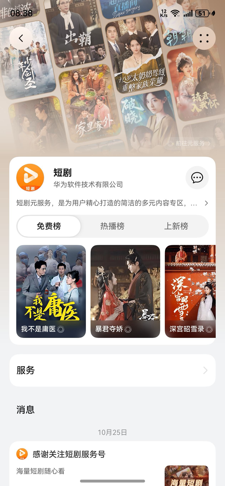
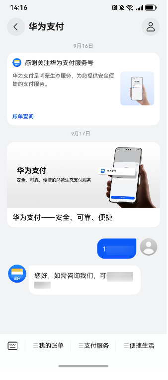

# 华为服务号介绍

华为服务号为商家打造专属的私域经营阵地。服务号作为统一出口，聚合元服务、应用、智能体等多种服务形态。通过场景化消息精准触达用户，结合多样化经营工具，促进履约复访与服务转化，构建从关系到交易的商业闭环。

围绕服务号主页与服务号会话页两个核心场景，基于智慧助手·今天（负一屏）、智能短信等鸿蒙系统级入口，打通私域经营链路，整合多场景触达、消息留存与数据分析能力，为商家构建私域运营体系，将流量沉淀为存量。

* 服务号主页：作为品牌形象的“门面”，主页是一个高度可定制的经营空间。通过视觉沉浸区等[五个核心模块](/docs/distribute/service-dist/huawei-service-account/specification-0000001053205318/portal_rules-0000001057117474)，系统化地构建从品牌感知到商业引导的全链路体验。
* 服务号会话页：作为与用户沟通的“收件箱”，会话页聚合图文消息、会话消息以及服务菜单，提供服务支持的核心交互场景。

## 华为服务号核心能力

华为服务号提供服务号主页、服务号会话页、图文消息、一键关注组件等营销工具，帮助您进行品牌宣传、粉丝沉淀、优惠促销、会员服务等活动推广，助力营销转化落地。

### 服务号主页

服务号主页是您集品牌展示、服务推荐、活动宣传的个性化品牌门户，平台提供品牌主页装修能力，您可自定义装修，向用户提供各类服务、传达活动信息以及拉动用户活跃。有利于加深用户对品牌的认知和信任，打造品牌IP资产。

**表1** 服务号主页

| 主页样式 | 名片模式 | 画廊模式 |
| --- | --- | --- |
| 条件 | 服务号创建生效后默认具备 | 需要商家装修，参考[装修服务号主页](/docs/distribute/service-dist/huawei-service-account/operationguide-0000001263024771/homepage_decoration-0000002476707102) |
| 示意 |  |  |

### 服务号会话页

服务号会话页是用户关注您服务号后，商家与用户进行互动的界面，用户的所有互动行为以及您主动推送的消息，都可在此呈现。您可以通过[配置服务菜单](/docs/distribute/service-dist/huawei-service-account/operationguide-0000001263024771/servicer_menu-0000002508947049)提高会话页服务效率。

**图1** 会话页

### 服务号图文消息

服务号图文消息是指由封面图、标题、摘要、正文等内容组成的消息形式。您可以通过群发功能将图文消息推送给关注您服务号的用户，也可以将图文消息详情链接放置在菜单、自动回复或其他推广渠道中，可参考[发布图文消息](/docs/distribute/service-dist/huawei-service-account/operationguide-0000001263024771/article-0000002508827071)。

