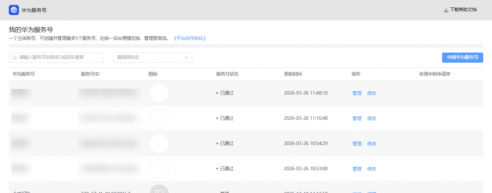
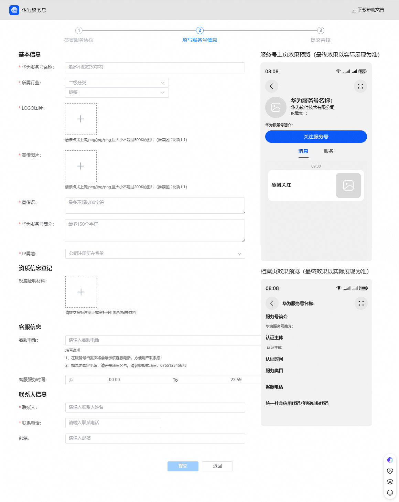
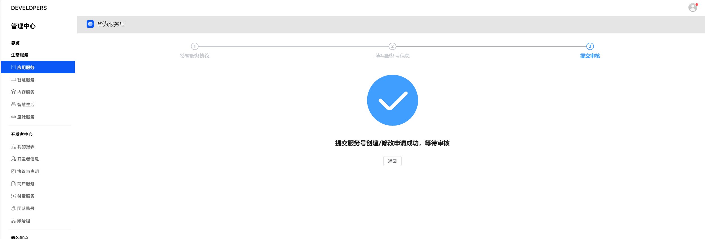

# 步骤4 创建服务号

## 进入服务号列表页

点击华为服务号页面右侧的“申请华为服务号”按钮，进行服务号的创建，每个开发者账号最多支持创建5个服务号。

## 填写服务号信息

各字段规范请参考《[服务号基本信息规范](/docs/distribute/service-dist/huawei-service-account/specification-0000001053205318/registration_rules-0000001058075206)》。信息填写完成后，点击“下一步”提交审核。

## 提交人工审核

提交成功后，服务号为“未生效”状态，平台会在5个工作日内完成审核，审核通过后服务号更新为“已生效”状态，并自动开通相应的功能和权限，此时服务号可向用户展示，商户可对服务号进行管理和运营。

