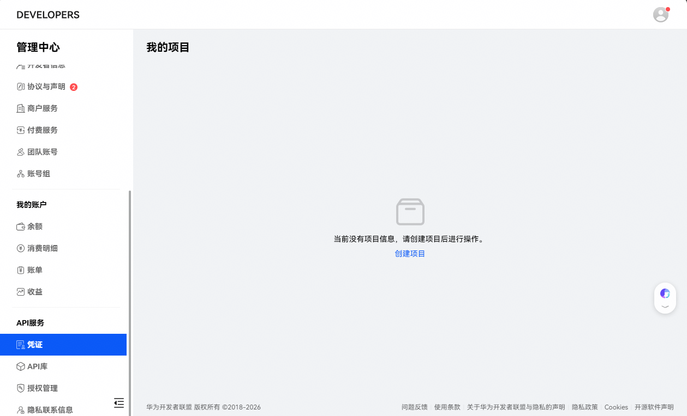
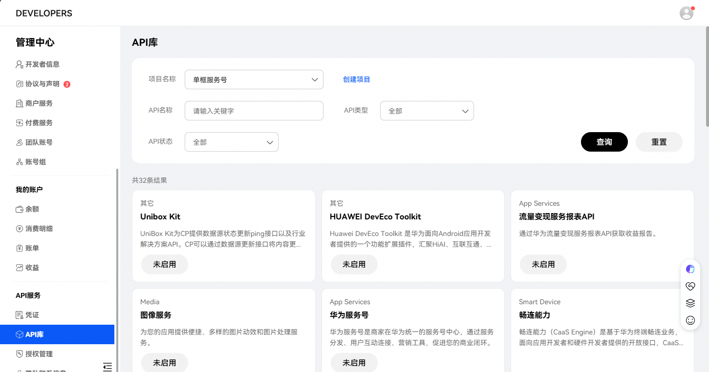
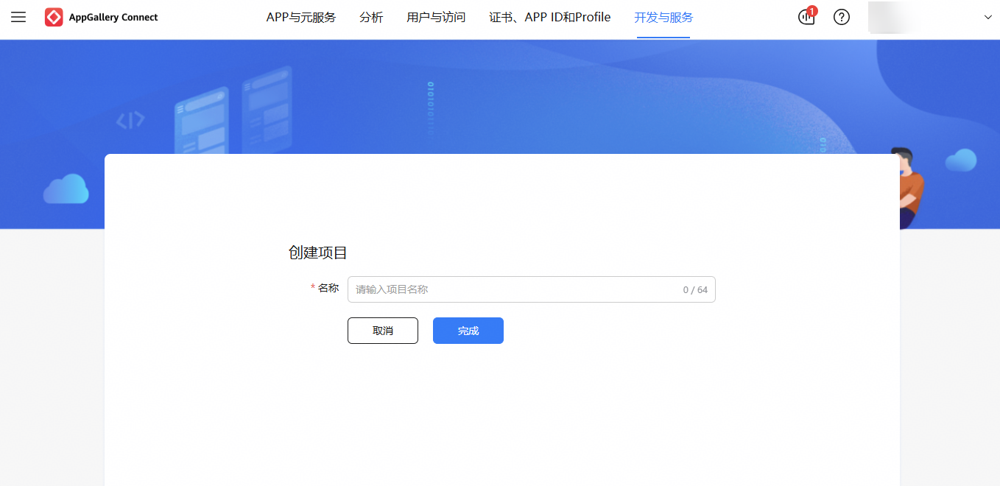
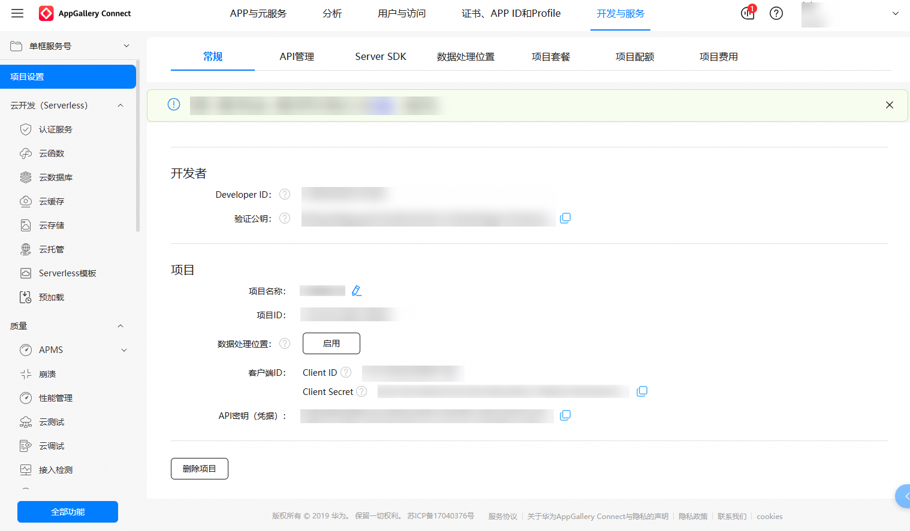
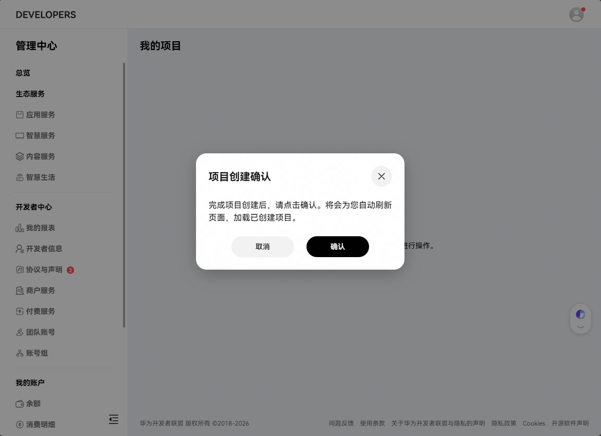
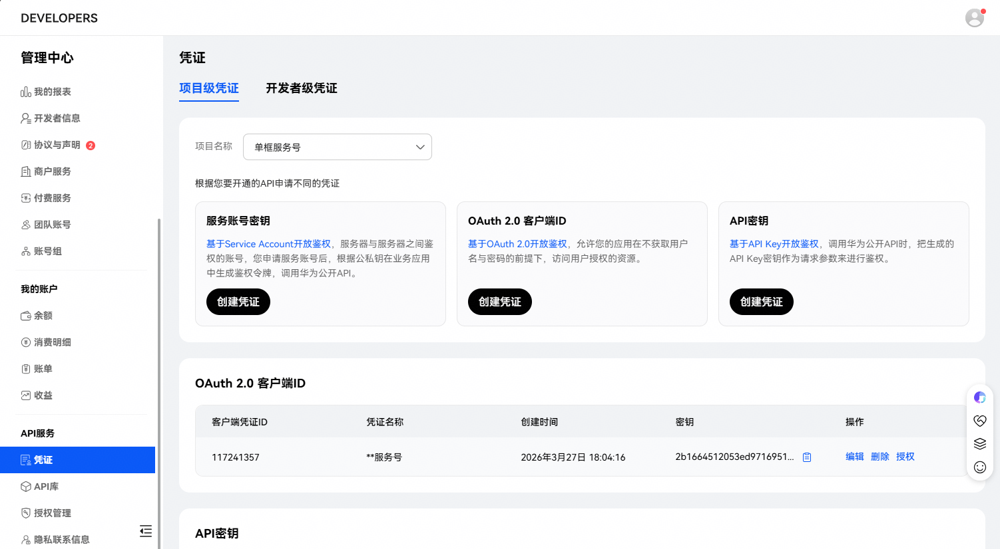
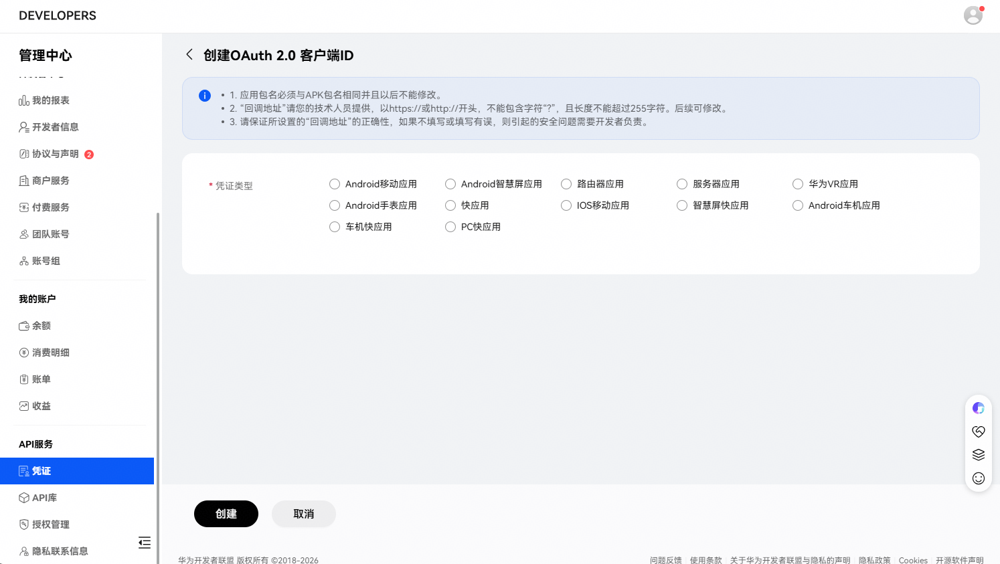
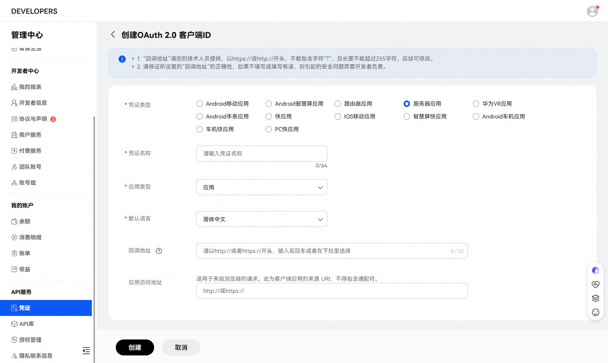
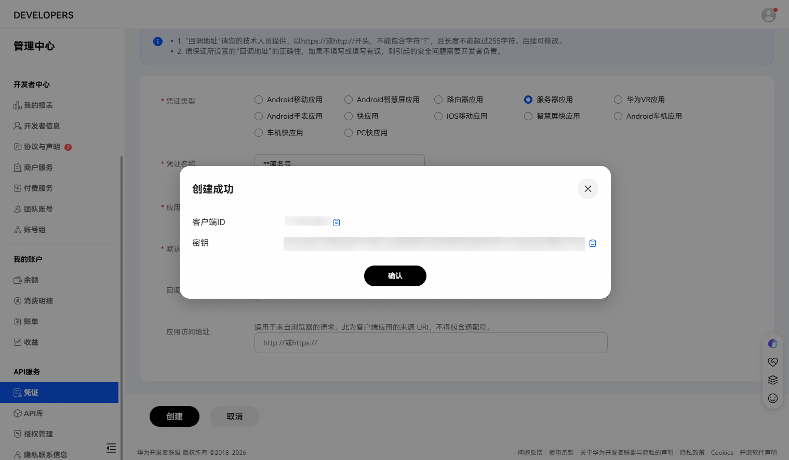
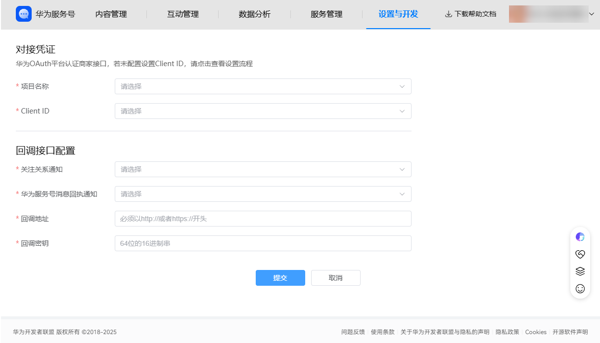

# 步骤5 设置开发者信息

如商家涉及开发接入场景（接收关注关系通知、发送模板消息、查询消息回执等），您需进入管理界面，配置开发者信息。

1）进入“管理中心”，选择左侧菜单栏”API服务”-“凭证”，若为首次创建项目，直接点击“创建项目”。

若非首次创建项目，选择"API服务"-"API库"，点击“创建项目”。

2）在新打开窗口中填写项目名称。

点击完成后跳转到项目详情页。

3）手动切换回原来网页，成功创建项目后，点击确认后可以查看到项目。

4）新建项目后，在“凭证”页面选中项目，点击“OAuth 2.0 客户端 ID”，选择“服务器应用”；

5）输入对应内容后，点击“创建”，显示客户端ID和客户端名称等信息即创建完成；

保存好以上参数，留作备用。

6）返回商家服务号列表页，进入目标服务号管理页面“装修与设置“-“设置开发者信息”，选择“项目名称”和“Client ID”（即OAuth 2.0 客户端 ID），填写回调接口配置的相关信息，完成后点击“提交”即可成功配置开发者信息。

