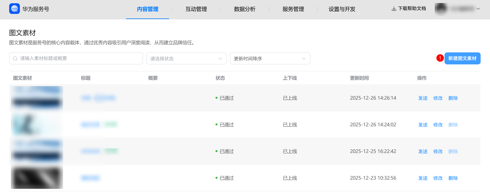
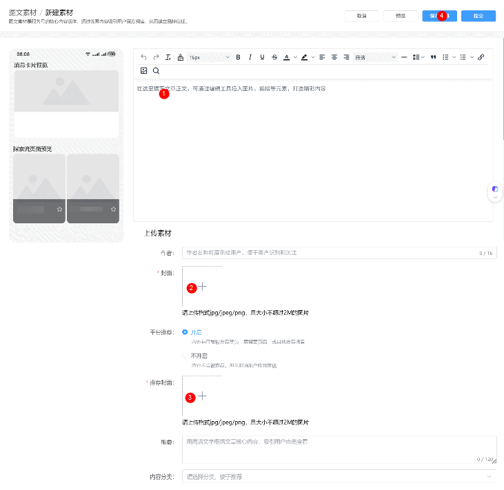
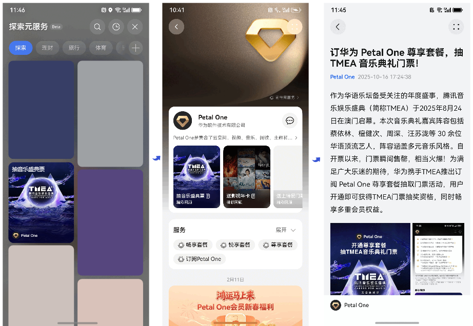
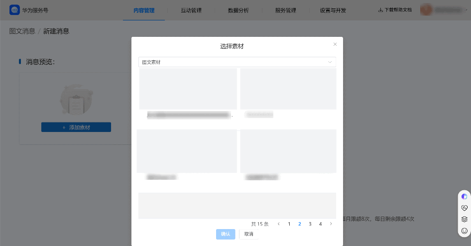
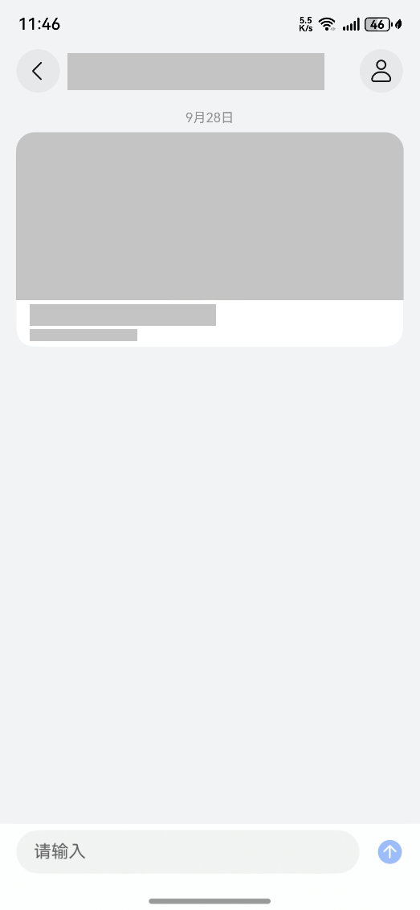
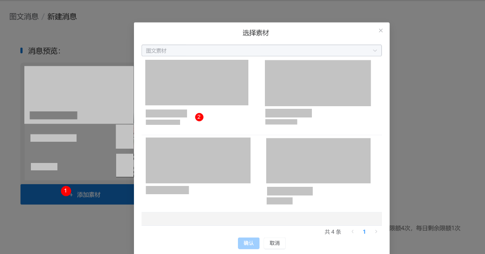
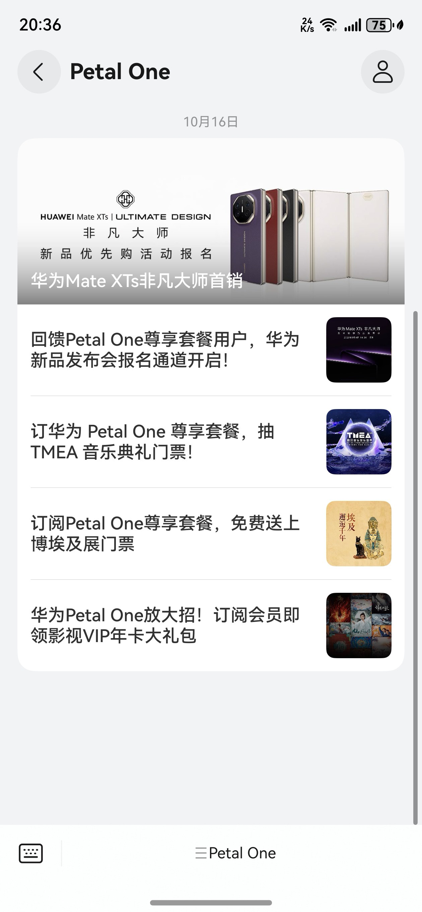
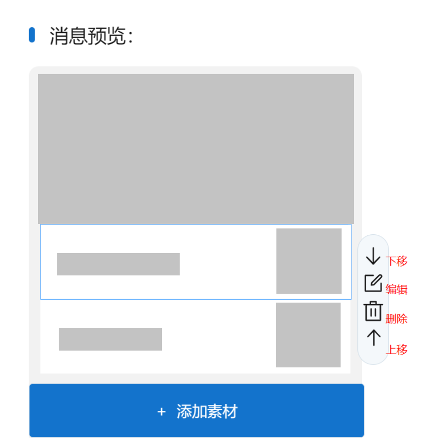

import MergeTable from '@site/src/components/MergeTable';

# 发布图文消息

## 创建图文素材

图文素材是服务号的核心内容载体，可通过精心编排的标题、封面和正文，为用户提供有价值的信息、深度内容或情感共鸣，适用于品牌故事、产品介绍、活动预告等场景。创建的重点在于优质内容本身，目标是吸引用户阅读，从而建立品牌信任与用户黏性。

**操作路径：**登录[服务号商户后台](https://developer.huawei.com/consumer/cn/console/service/FastService/service/1063)，进入“内容管理->图文素材"模块。点击“新建图文素材”按钮。

填写图文素材的基本信息：

**正文内容**：支持富文本编辑，可插入文字、图片、链接等。

**标题**：建议简洁、吸引人，避免过长。

**主封面图**：21:9比例，格式jpg/jpeg/png，且大小不超过2M，图片清晰、主题突出。适用于发布重要活动或深度内容。

**子封面图：**1:1比例**，**格式jpg/jpeg/png，且大小不超过2M，图片清晰、元素聚焦。适用于专题子集、活动系列、产品目录。

**平台推荐：**开启后，平台会将优质文章推荐至负一屏探索元服务展示；不开启，不会出现在任何平台的推荐场景中，但不影响在服务号主页和服务号会话页的展示。

**推荐封面图：**3:4比例，格式jpg/jpeg/png，且大小不超过2M，图片清晰、元素聚焦。适用于品牌故事、科普文章等。

**概要**：简要描述文章内容，提升用户点击意愿。

暂存草稿：若内容尚未编辑完毕，可点击 “保存草稿”按钮，将当前进度存为草稿，稍后继续编辑。

提交发布：点击 “提交”按钮，审核完成后，即完成图文素材的创建。素材将自动保存至图文素材库，供后续群发或菜单配置时引用。

注意事项：图文素材内容必须严格遵守平台规范及相关法律法规，严禁发布色情、暴力、欺诈、谣言等违规内容。违规将导致消息被风控拦截、下线删除，甚至影响账号的正常使用。

## 修改图文素材

已创建并审核通过的图文素材支持进行二次编辑，系统对修改权限和修改频次设有特定规范。

1）修改权限与频次限制

修改次数限制：每篇图文素材仅支持修改 1 次。

请在点击“提交修改”前，仔细核对所有内容，确保修改信息准确无误，以免浪费唯一的机会。

2）支持修改内容的范围

<MergeTable
  headers={['字段类别', '支持修改项', '说明']}
  rows={[
    [{ text: '正文内容', rowspan: 2 }, '正文文字', '支持对文章段落、文字内容进行增删改，修正错误或补充信息。'],
    [null, '正文图片', '支持插入新图片、替换旧图片或删除图片。'],
    [{ text: '基础信息', rowspan: 4 }, '标题', '建议优化标题吸引力，修正错别字或调整语序。'],
    [null, '作者', '可更新作者署名信息。'],
    [null, '概要', '即文章摘要，显示在推送的图文消息中，建议精炼描述以提升打开率。'],
    [null, '内容分类', '可调整素材所属的分类。'],
    [{ text: '视觉呈现', rowspan: 2 }, '封面', '主图文封面、子图文封面，支持重新上传更换。'],
    [null, '推荐封面', '用于负一屏探索流展示的封面图片，支持单独优化。'],
    ['分发策略', '平台推荐', '可调整内容的推荐状态： 支持操作：可将"开启"修改为"不开启"。 说明：若您希望内容仅对粉丝可见，不希望在公域流量（如负一屏探索流）中曝光，可执行此操作。']
  ]}
/>

发布图文消息是将已创建的图文素材有效触达用户的关键环节。本章节将指导运营者如何从素材库中选择内容，并灵活配置发送对象、发送时间等策略，最终将图文内容推送给目标用户。

**1****）发布单一图文**

进入“内容管理->图文消息" 模块。

点击“新建消息”进入到新建消息页。

点击“添加素材”，选择一条图文素材进行发送。

用户端展示形式：以“卡片形式”展示，封面图、标题、概要（如有）清晰呈现在卡片区域内。

**2****）发布组合图文**

进入“内容管理->图文消息" 模块。

点击“新建消息”，进入新建消息页。

点击“添加素材”，选择“图文素材”。

从素材库中选择已创建的图文素材进行组合，一次最多可组合5条图文，包括1条主图文和4条子图文。

用户端展示形式：

主图文位于顶部，以大卡片形式展示，展示封面图、标题。

子图文位于主图文下方，以小卡片形式展示，展示标题和缩略封面图。

操作说明：

点击“添加素材”，在素材库中选择要发送的图文素材。

系统自动将首条添加的图文设为主图文，其余为子图文。

在消息预览处，选中图文素材后点击“↑ ”“↓ ”按钮即可调整展示顺序，预览的展示顺序即为用户端的实际展示顺序。

**设置发送时间与对象**

在完成图文素材选择后，需配置本次发布的时间和接收对象。

**设置发送时间**：

**立即发送**：延时发送，选中“否”

**定时发送**：延时发送，选中“是”。可设置未来某一时间点自动发送，提前规划内容发布节奏。确认设置无误后，点击“发送”，完成图文内容的发布。

**设置发送对象**：当前仅支持面向全部用户的群发。

**全部用户**：是否群发，选中“是”。
