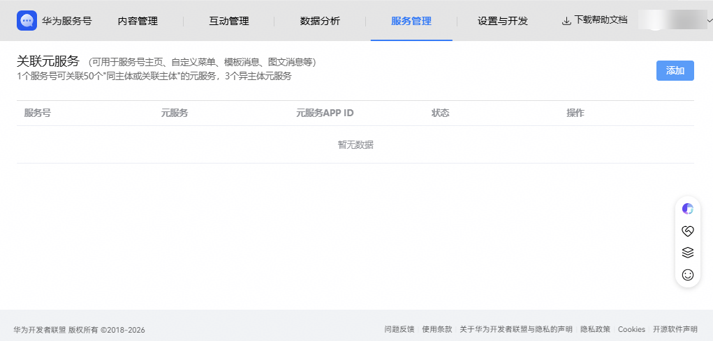
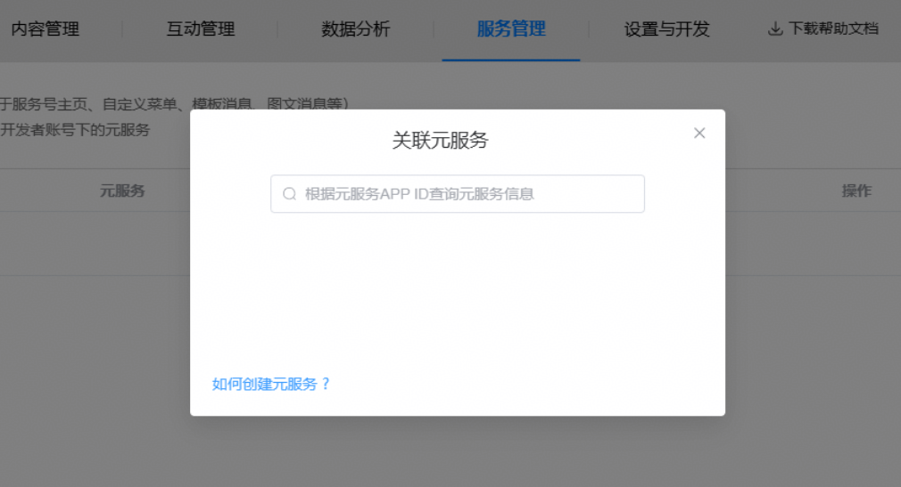
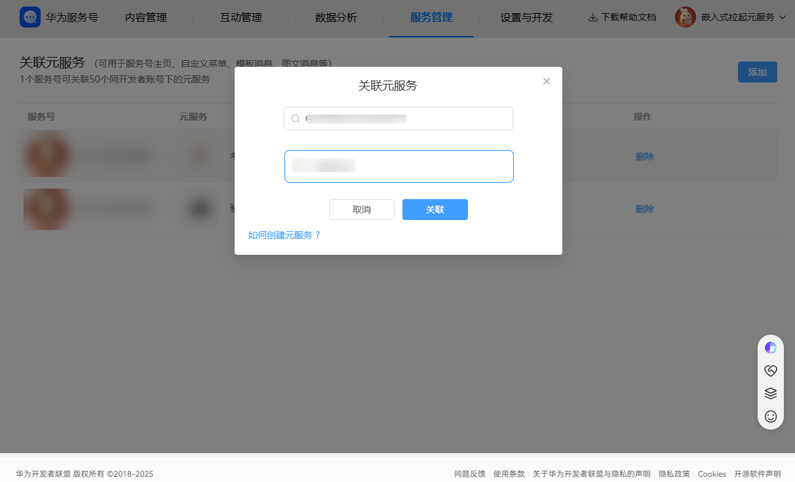
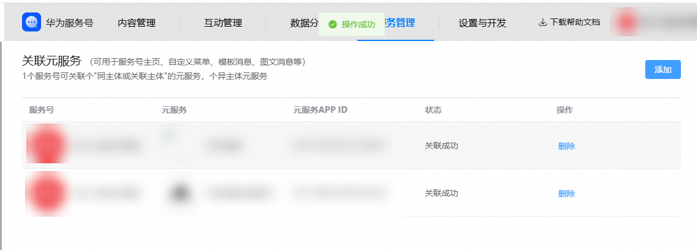
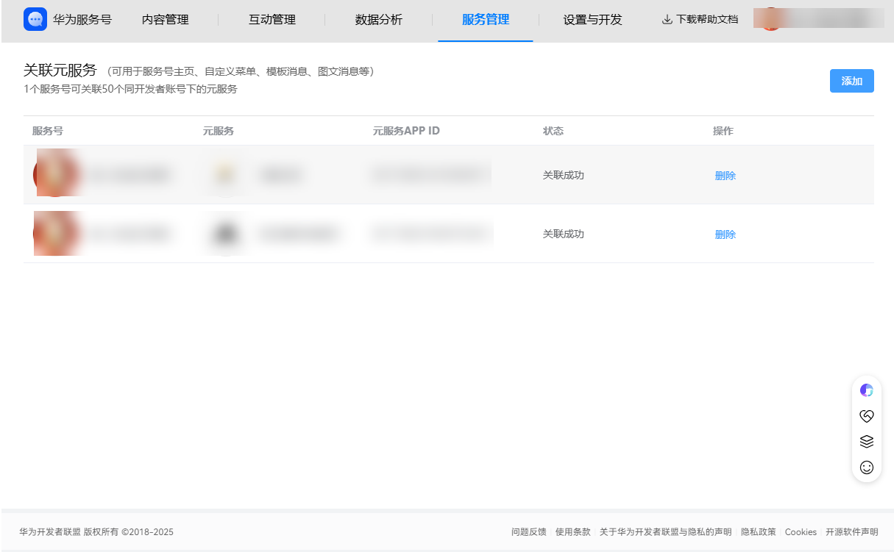

# 配置关联元服务

该功能支持将您的元服务与服务号进行绑定，并在服务号各位置生成快捷入口。旨在打通服务号与元服务的用户体验，构建“内容/服务”到“交易/工具”的无缝转化路径。

设置关联元服务后，可在服务号主页画廊模式主页背景头图/商品图/banner、服务菜单、关联元服务列表、欢迎消息、会话消息、图文消息和详情等位置设置打开元服务。关联的元服务也将以列表形式展示服务号主页的设置页。

如果未设置关联元服务，无法在服务号内跳转元服务。

## 添加关联元服务

1、进入服务号管理页面，选择菜单“服务管理”-“关联元服务”栏目，可以添加和查看关联元服务列表。

2、点击按钮“添加”，可新增关联。

查询条件包含：元服务APPID （[可在我的元服务查询](https://developer.huawei.com/consumer/cn/service/josp/agc/index.html#/myApp)），。

可关联的范围：同一开发者账号或关联主体的元服务，数量最多50个，异主体3个。

（备注：异主体关联有权限控制，联系邮箱：biztouch@huawei.com）

3、搜索到元服务后选中元服务，提交关联。

4、提交弹出提示绑定成功，点击确定后，返回到关联元服务列表。

## 管理关联元服务

已关联的元服务支持删除，删除元服务后，用户界面无法继续跳转至对应的元服务，相关的跳转入口会显示链接异常 ，请勿删除正常使用的已关联元服务。已关联的元服务不支持修改，如有需要，先删除后再添加。

