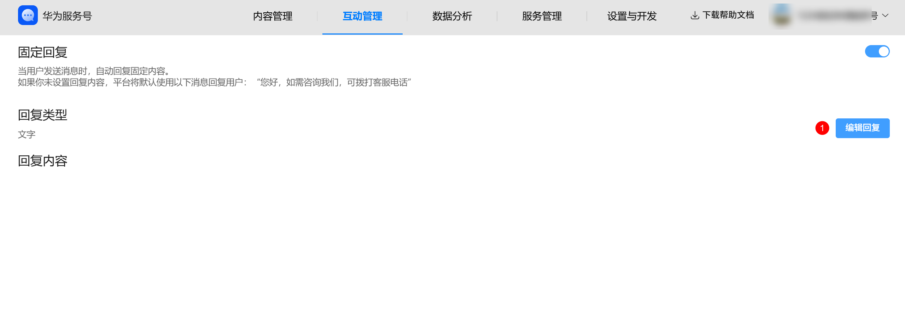
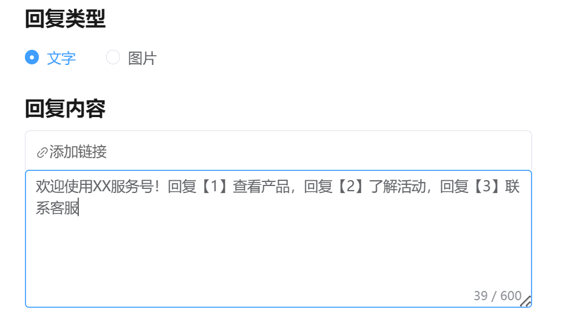
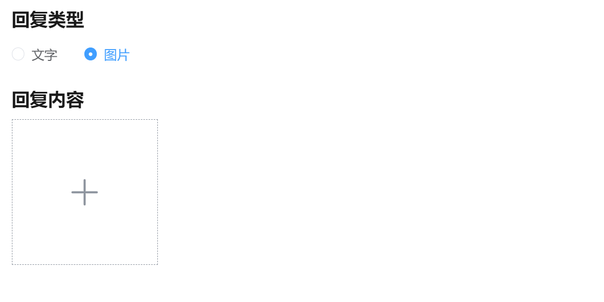

# 配置自动回复消息

**场景说明：**当用户给您的服务号发送任何消息时，系统会自动回复一条预设好的通用消息，让用户能得到即时响应。

操作路径：

第一步：登录服务号商家后台，进入“互动管理->收到消息回复”模块。点击“编辑回复”按钮。

第二步：点击编辑后，页面会展开详细的配置选项。首先，您需要在 回复类型 处选择您希望发送给用户的消息形式。目前支持两种类型：1）文字 2）图片

第三步：根据类型配置内容。

情况1：如果您选择了“文字”，在下方的回复内容区域，输入您希望自动回复的文字内容。

选中您希望添加链接的文字，在文本框上方出现的工具栏中，点击 “添加链接” 图标。

在弹出的窗口中，选择跳转目标。配置完成后，文字中的链接部分通常会变为蓝色高亮，表示添加成功。

情况2：如果您选择了“图片”，点击 回复内容区域的“+上传图片 ” 组件。

选择您希望用作自动回复的图片文件（支持JPG、PNG等常见格式）并上传。

图片上传成功后，会在此处显示预览图。

第四步：确认您的文字或图片内容已准确无误地配置完成后，点击“提交”按钮，

系统会提示“提交成功”，您的自动回复配置经过审核通过后立即生效。

现在，当有用户向您的服务号发送消息时，他们将收到您刚刚精心配置的自动回复了。
