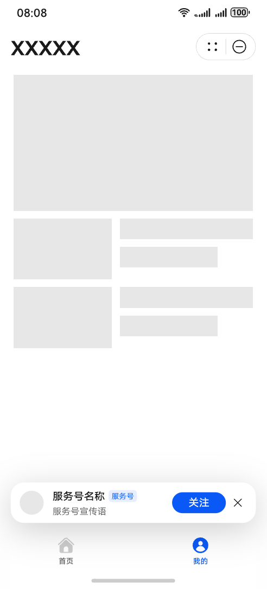
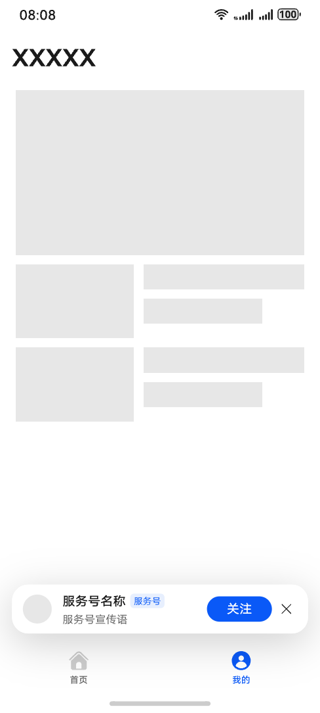

# 接入一键关注组件

一键关注组件是服务号提供给商户用于拉新获粉的工具。您可通过创建配置关注组件，应用于拉新页面，引导用户关注服务号，提升服务号的关注数。同时，通过引导用户关注，您可通过服务号关注后发消息能力进行触达和促活，提高自运营效率。

## 接入条件

已通过认证的服务号支持一键关注组件，没有认证或认证过期的不支持一键关注服务号。

元服务/应用和服务号属于同开发者账号时，可以接入一键关注服务号。

## 元服务内一键关注组件

元服务一键关注组件：在元服务内集成一键关注组件，用户使用元服务时，可快速关注企业服务号。用户侧效果如图：

接入此功能需要在元服务开发中调用一键关注组件，接入文档请参考[Scenario Fusion Kit（融合场景服务）-关注组件](/docs/dev/app-dev/application-services/scenario-fusion-kit-guide/scenario-fusion-api-information-attribute/scenario-fusion-api-followcomponent)

规则说明：

元服务和服务号必须处于同一开发者账号下，才能集成一键关注组件。

未按规范使用的，平台有权收回和禁止一键关注组件能力使用。

## APP内一键关注组件

APP内一键关注组件：在APP内集成一键关注组件，用户使用APP时，可快速关注企业服务号。用户侧效果如图：

接入此功能需要开发，接入文档请参考[Scenario Fusion Kit（融合场景服务）-关注组件](/docs/dev/app-dev/application-services/scenario-fusion-kit-guide/scenario-fusion-api-information-attribute/scenario-fusion-api-followcomponent)

规则说明：

APP和服务号必须处于同一开发者账号下，才能集成一键关注组件。

未按规范使用的，平台有权收回和禁止一键关注组件能力使用。
