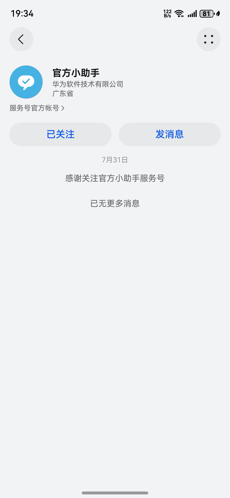
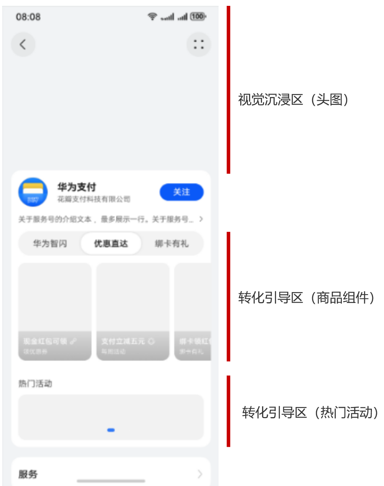
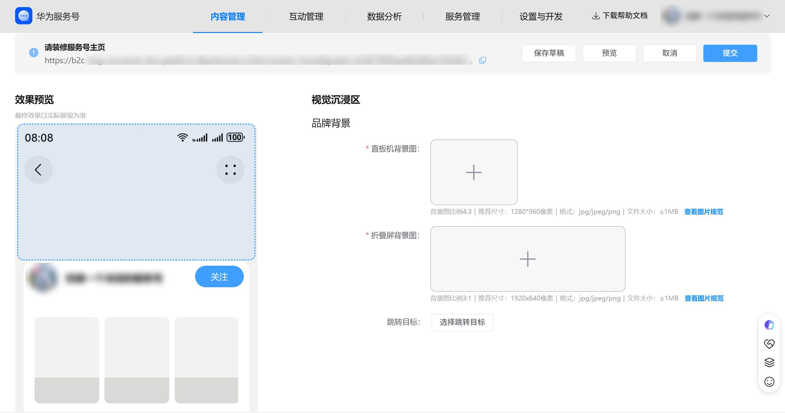
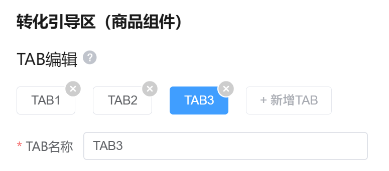
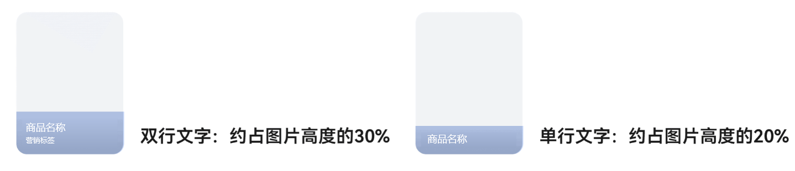
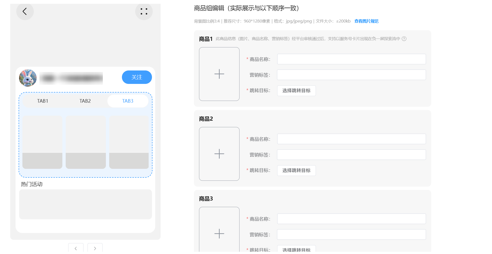
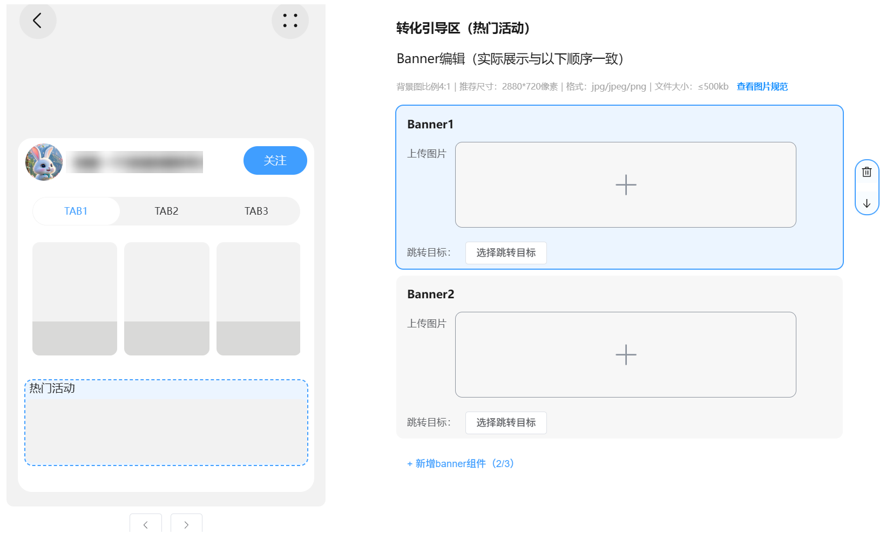
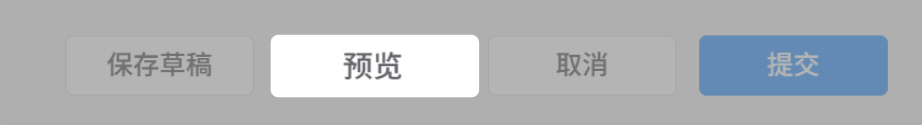
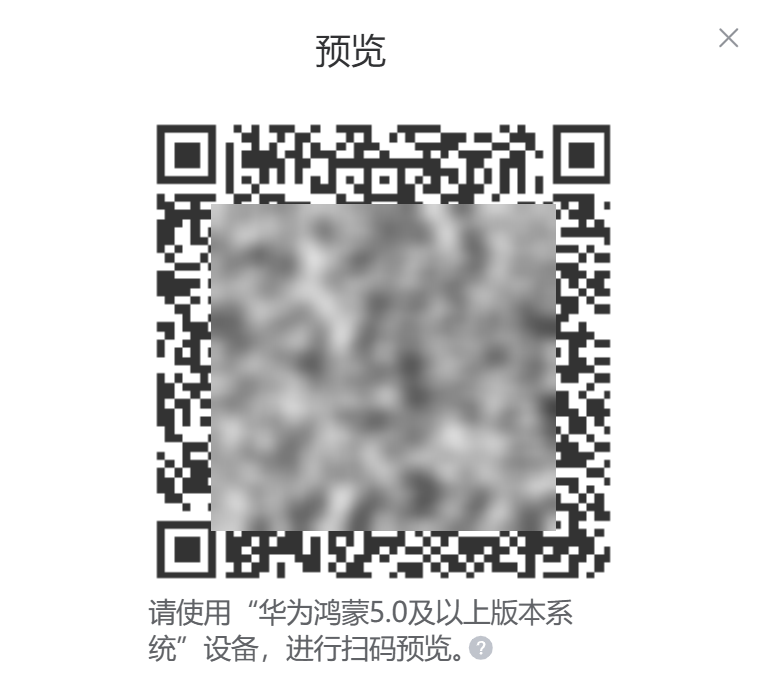
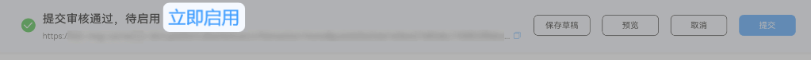

# 装修服务号主页

服务号主页是用户与服务号交互的重要入口，通过装修服务号主页，可以提升用户体验和服务效率，装修完成的服务号主页可以通过链接、二维码等方式用于推广。

## 装修名片模式

平台根据服务号基本信息自动生成名片模式（服务号主页默认样式），无需商家装修。效果如下：

## 装修画廊模式

**一、概述**

本文档将详细介绍主页装修中三个核心装修模块的配置方法，帮助您打造一个引人注目、高效转化的服务号主页。

| 服务号主页（未装修效果） | 服务号主页（已装修效果） |
| --- | --- |
|  |  |

**二、 核心模块配置指南**

主页装修主要由三个区域构成：视觉沉浸区（头图）、转化引导区（商品组件） 和 转化引导区（热门活动）。

**视觉沉浸区（头图）**

功能简介：视觉沉浸区是用户进入服务号主页时首屏最醒目的区域。通过精心设计的头图，您可以快速传递品牌调性，营造第一印象，是提升品牌形象的关键。

配置路径：“[商家后台](https://developer.huawei.com/consumer/cn/console/service/FastService/service/1063) -> 内容管理-> 主页装修” -> 点击左侧头图区域

配置步骤：

1. 上传图片
   * 直板机图片：点击“ +”上传直板机背景图，选择一张适配主流直板机屏幕的图片。
   * 折叠屏图片：点击 “+”上传折叠屏背景图，为折叠屏手机用户上传视野更广的专属图片。
2. 设置跳转目标
   * 在图片下方的配置区域，点击 “选择跳转目标 ”按钮。
   * 在弹出的窗口中，设置用户点击头图后跳转的落地页。

**转化引导区（商品组件）**

功能简介：商品组件是一个结构化的商品展示货架，支持通过 Tab(标签页), 对商品进行分类管理。您可以在此展示核心产品、热门活动或专属服务。通过精美的图片、吸睛的标题和营销标签，引导用户点击。

配置路径：“[商家后台](https://developer.huawei.com/consumer/cn/console/service/FastService/service/1063) -> 内容管理 -> 主页装修” -> 点击左侧商品组件区域

配置步骤：

第一步：管理 Tab（标签页）

Tab 是对商品进行分类的顶层结构，用户可以通过点击不同 Tab 查看不同类别的商品。

1. 添加 Tab：在配置界面顶部，点击 “+新增Tab”按钮，为您的商品创建一个分类。
2. 命名 Tab：
   * 当存在 2个或以上 Tab 时，必须为每个 Tab输入一个简短、清晰的名称,该名称将显示在用户端的标签栏上
   * 当仅有1个 Tab 时，无需填写名称，用户端将不显示Tab 栏，直接展示商品列表。
3. 删除 Tab：将鼠标悬停在已创建的 Tab 上，点击出现的“删除“”图标即可移除。

规则说明：

* 最少配置：至少需要创建 1个 Tab，并在其下添加 4个商品组，该组件才能正常显示。
* 最多配置：最多支持创建 3个 Tab，每个 Tab 下最多可添加 6个商品组，总计最多 18个商品组。

* Tab 显示逻辑：
  + 1个 Tab：用户端不显示 Tab 栏，直接展示该 Tab 下的商品。
  + 2个及以上 Tab：用户端显示 Tab 栏，用户可以点击切换。

第二步：在 Tab 下添加商品组

1. 上传商品图片
   * 点击 “+上传图片” ，选择一张高清、能突出商品卖点或活动氛围的图片。
2. 填写商品信息
   * 商品名称：输入一个简短、有吸引力的名称（不超过6个字符），该名称将直接覆盖在图片上方。
   * 营销标签：输入一个标签名称（不超过10个字符），用于突出活动亮点。

   
3. 设置跳转目标
   * 点击 “选择跳转目标” 按钮，设置用户点击该商品后跳转的落地页。
4. 添加更多商品
   * 若需展示多个商品，请重复以上步骤，继续添加新的商品组。

**转化引导区（热门活动）**

功能简介：热门活动位于商品组件下方，是一个横幅式的补充推广位。它适合承载与主推商品相关的次要活动、品牌宣传信息或长期的引导内容，作为主页转化的有益补充。

配置路径：“[商家后台](https://developer.huawei.com/consumer/cn/console/service/FastService/service/1063) -> 内容管理 -> 主页装修” -> 点击左侧热门活动区域

配置步骤：

1. 上传活动图片
   * 点击“+上传图片 ”，选择一张最能代表本次活动的精美图片。
2. 设置跳转目标
   * 点击 “选择跳转目标 ”按钮，将图片链接至活动的落地页。

**三、 实时预览与发布**

为确保装修效果符合预期，我们提供了实时预览功能，支持在华为鸿蒙5.0及以上版本系统设备上查看真实效果。

预览功能：

功能介绍：预览功能允许商家在正式发布前，通过手机扫码实时查看主页在不同设备（直板机、折叠屏、平板）上的显示效果和交互逻辑，以实现所有用户都能获得最佳的浏览体验。

操作步骤：

1. 进入预览：在主页装修配置页面的右上角，点击 “ 预览 ”按钮。
2. 扫码体验：屏幕上将弹出一个二维码。
3. 使用设备扫描：使用您的设备（华为鸿蒙5.0及以上版本系统）扫描该二维码。

建议：

* 多设备验证：建议您在所有支持的设备视图下进行预览，特别是当您为“视觉沉浸区”上传了折叠屏专用背景图时，务必检查其显示效果。
* 交互测试：在预览模式下，点击所有可点击的元素（如头图、商品、活动横幅），测试跳转链接是否正确无误。
* 迭代优化：在预览中发现任何问题，可随时返回后台修改，然后刷新预览页面即可看到最新效果，直至满意为止。

当您通过预览确认所有配置无误后，点击页面右上角的 “提交” 按钮进行机审。

审核通过后，可点击“立即启用”即可将装修效果正式上线，所有访问服务号主页的用户将看到更新后的页面。

