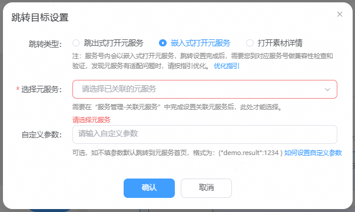
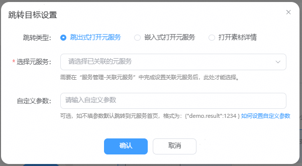
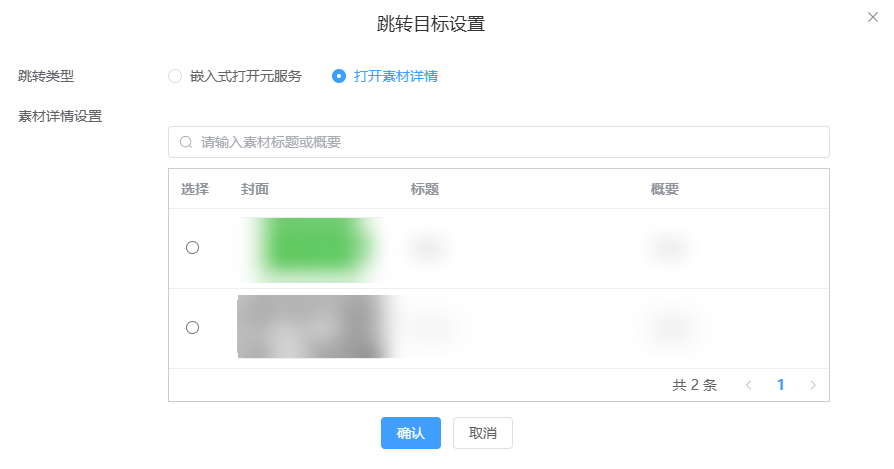

# 跳转配置

在自定义菜单、A级专区画廊模式主页背景图/商品图/banner、服务tab菜单、关联元服务列表、模板消息、图文消息、会话消息等位置都支持设置跳转目标。

## 跳转元服务

嵌入式和跳出式打开元服务的区别：主要表现在用户手机端界面名称和交互有不同。

嵌入式打开元服务时，是在服务号APP内打开目标元服务页面， 目标元服务没有独立的APP名称，而以”服务号”作为界面载体打开，用户切换APP时，目标元服务不独立显示。

跳出式打开元服务时，目标元服务以独立的APP界面打开，用户可以手动切换到目标元服务，跟用户操作打开元服务体验一致。

1）嵌入式打开元服务

在自定义菜单、A级专区画廊模式主页背景图/商品图/banner、服务tab菜单、关联元服务列表等位置，支持在服务号app内全屏嵌入式打开元服务落地页。

步骤1：选择元服务，只有操作关联过的元服务才会出现在选择列表中，可以进入”[关联元服务](https://developer.huawei.com/consumer/cn/doc/service/association_service-0000002508947051)”栏目操作。

步骤2：设置自定义参数

参数可选，如不填参数默认跳转到元服务首页；如果已选元服务已实现打开目标页功能，请联系对应元服务开发负责人提供具体参数，样例：\\{"demo.result":1234 \\}。

步骤3：嵌入式跳转元服务兼容性确认

在设置跳转元服务后，需要您检查对应元服务嵌入式打开兼容性验证，如发现元服务有适配界面布局、功能等，请将问题和优化指引发给对应元服务开发负责人做元服务端的优化。

2）跳出式打开元服务

在模板消息、欢迎消息、会话消息、图文消息等位置，支持在服务号app内跳出式打开元服务落地页。

步骤1：选择元服务，只有操作关联过的元服务才会出现在选择列表中，可以进入”[关联元服务](https://developer.huawei.com/consumer/cn/doc/service/association_service-0000002508947051)”栏目操作。

步骤2：设置自定义参数

参数可选，如不填参数默认跳转到元服务首页；如果已选元服务已实现打开目标页功能，请联系对应元服务开发负责人提供具体参数，样例：\\{"demo.result":1234 \\}。

## 跳转图文素材

在主页装修、自定义从菜单、图文素材内等位置，跳转目标支持设置跳转图文素材。您可以根据条件搜索到图文素材，在列表中选中图文素材，只有正常审核通过的素材才会出现在列表中。

