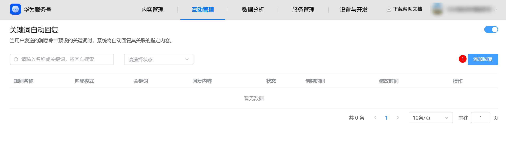
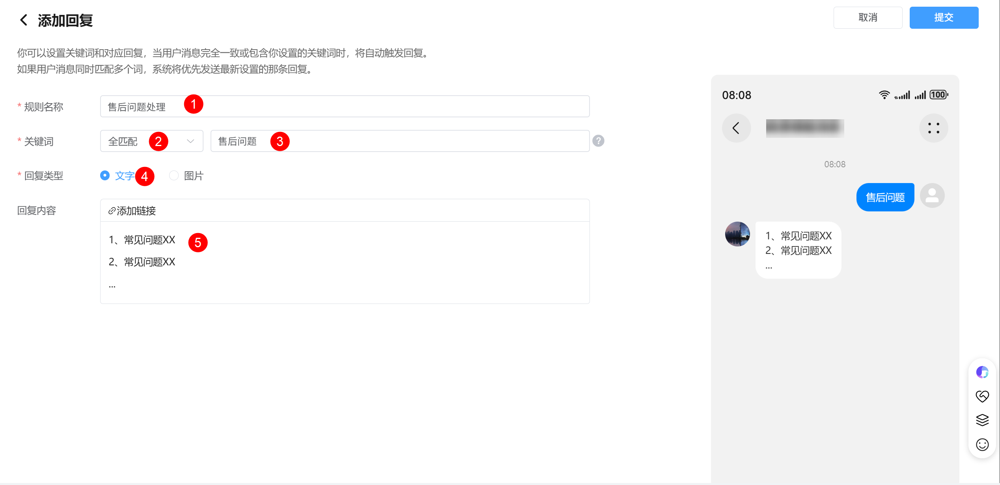
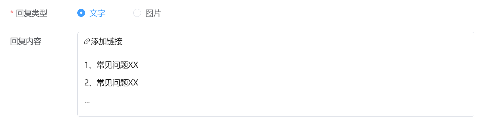
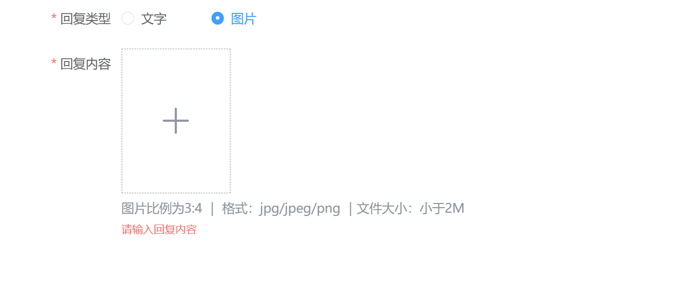

# 配置关键词回复消息

**场景说明：**当用户发送的消息内容包含您设定的特定“关键词”时，系统会自动回复与该关键词精确匹配的专属消息。

操作路径：

第一步：登录服务号商家后台，进入“互动管理->关键词自动回复”模块。

第二步：添加新规则

在关键词回复管理页面，您会看到已创建的规则列表（如果有的话）。点击页面右上角的 “添加回复” 按钮，开始创建一条新的关键词回复规则。

第三步：设置规则基本信息

进入添加回复页面后，首先需要定义规则的基本信息：

1. 输入规则名称：
   * 在 "规则名称"输入框中，为这条规则起一个便于您识别和管理的名字。
   * 提示：此名称仅用于后台管理，用户不可见。
2. 设置关键词：
   * 在 "关键词"输入框中，输入需要触发此回复的词语。
3. 选择匹配模式：
   * 在关键词输入框旁边，您需要选择匹配的精确度。这决定了用户如何触发您的回复：
     + 全匹配（精确匹配）： 只有当用户发送的消息 与您设置的关键词完全一致 时，才会触发回复。
       - 示例： 设置关键词为“价格”，用户发送“价格”会触发，但发送“产品价格”或“价格多少”则不会。
     + 半匹配（包含匹配）： 只要用户发送的消息 包含了您设置的关键词，就会触发回复。
       - 示例： 设置关键词为“价格”，用户发送“价格”、“产品价格是多少”、“请问价格”都会触发回复。
   * 建议： 对于短小精悍的指令（如“帮助”），推荐使用“全匹配”；对于可能出现在句子中的词语（如“活动”、“物流”），推荐使用“半匹配”。

第四步：配置回复内容

这是规则的核心部分。您需要设置当关键词被触发时，用户收到的具体消息。

1. 在 回复类型处，选择您希望发送的消息形式：“文字”或 “图片”。
2. 根据您的选择，进行相应配置：

   情况1：如果您选择了“文字”，在下方的回复内容区域，输入您希望自动回复的文字内容。

   

   选中您希望添加链接的文字，在文本框上方出现的工具栏中，点击 “添加链接” 图标。

   在弹出的窗口中，选择跳转目标。配置完成后，文字中的链接部分通常会变为蓝色高亮，表示添加成功。

   情况2：如果您选择了“图片”，点击 回复内容区域的“+上传图片 ” 组件。

   

   选择您希望用作自动回复的图片文件（支持JPG、PNG等常见格式）并上传。

   图片上传成功后，会在此处显示预览图。

   ⚠️ 重要提示： 图片类型的回复只能发送纯图片，不支持添加超链接。 用户点击图片后通常会放大查看，无法直接跳转。

第五步：保存并生效

1. 检查您的规则名称、关键词、匹配模式以及回复内容，确保准确无误。
2. 点击“提交”按钮，
3. 系统会提示“提交成功”，这条关键词回复规则即创建完成并立即生效。

现在，当用户发送包含您所设关键词的消息时，就能收到您配置的精准回复了！

**两者关系总结**

* 优先级： 通常，关键词回复的优先级高于自动回复。系统会先判断用户消息是否命中关键词规则，如果命中，则执行关键词回复；如果没有命中任何关键词，才会触发自动回复。
* 协同工作： 两者是拍档。用“自动回复”做兜底，保证每个用户都有回应；用“关键词回复”做精准服务，解决用户的特定问题。两者结合，能构建一个友好的用户互动体系。
