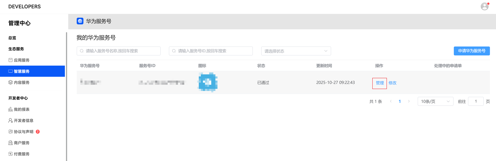
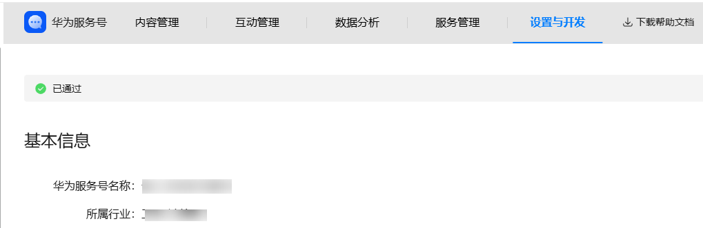
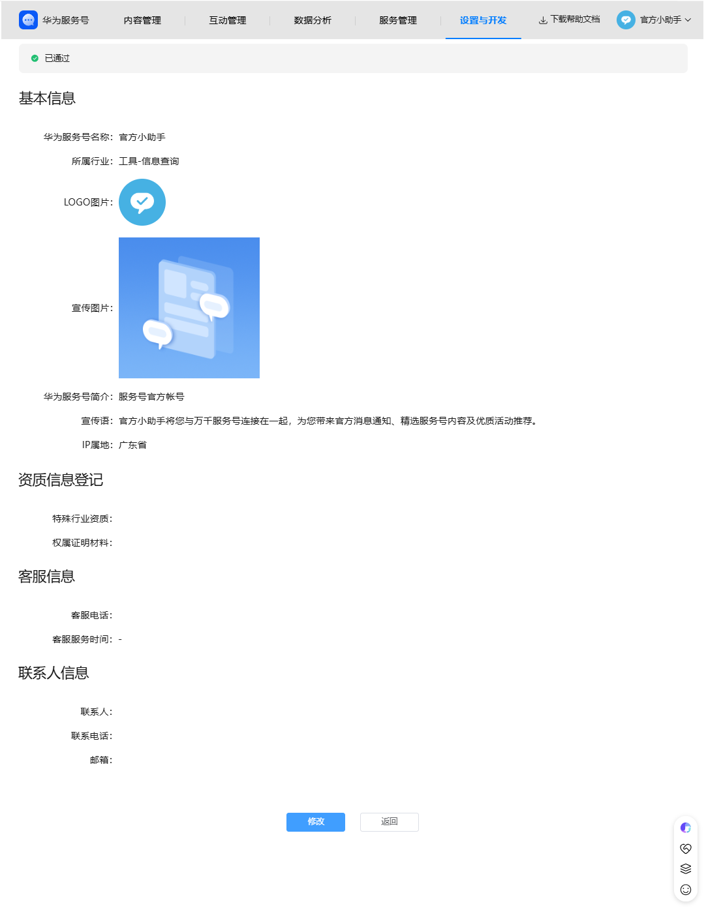
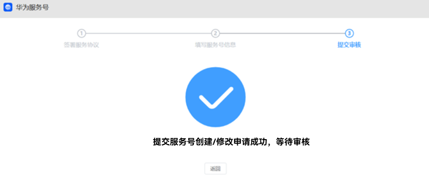
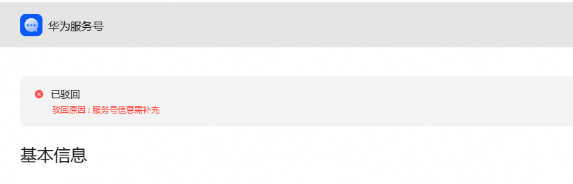

# 修改服务号基本信息

1）进入服务号管理页面

在服务号列表，选择需操作的服务号，在操作栏点击“管理”按钮，进入对应的服务号。

进入服务号后，点击菜单栏“设置与开发“-“账号信息”，查看服务号已录入的信息。

点击基本信息页面最底部的“修改”按钮，可进入到服务号修改页面进行服务号基本信息的修改。

2）修改服务号信息

进入修改页面后，根据需要更新信息，基本信息可在右边预览区域进行效果预览。修改完成后，点击页面底部“提交”确认修改信息。

请开发者合理修改信息，避免频繁变动。平台有权拒绝不合理的修改申请，各字段修改请遵守《[服务号基本信息规范](https://developer.huawei.com/consumer/cn/doc/service/registration_rules-0000001058075206)》。

修改所属行业可能影响到部分能力（如模板消息），请谨慎修改。

3）提交审核

修改信息提交后，进入平台审核流程，审核通过后信息生效。

4）修改驳回

如果提交的信息被驳回后，需要重新修改信息后，再次提交审核。

