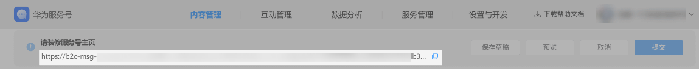

# 推广服务号主页

## 获取服务号主页链接

开发者可在服务号后台->内容管理->主页装修，在头部区域查看主页链接

## 创建服务号主页二维码

您可以根据推广需求，复制服务号主页链接，通过第三方工具生成二维码。

将生成的二维码应用于线上（官网、社交媒体）和线下（门店海报、宣传单）等各个渠道，引导用户扫码关注。

说明：线上和线下扫码场景需使用华为鸿蒙5.0及以上版本系统设备，采用系统扫一扫功能入口（如控制中心扫一扫、浏览器自带扫一扫）进行扫码。
