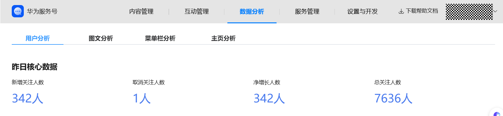
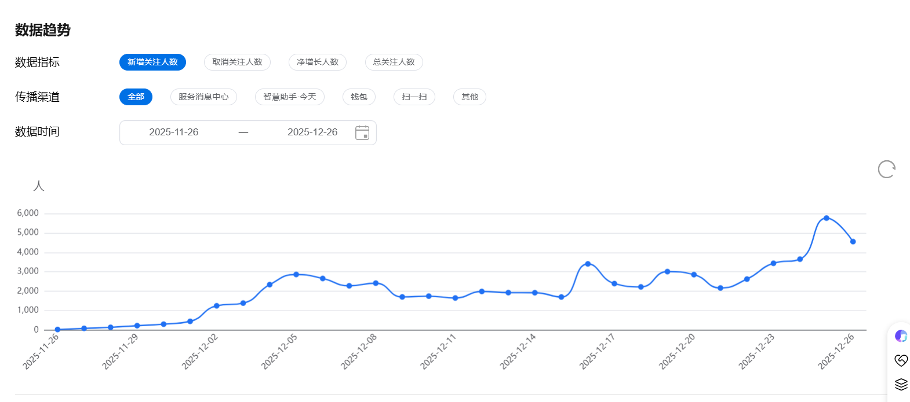
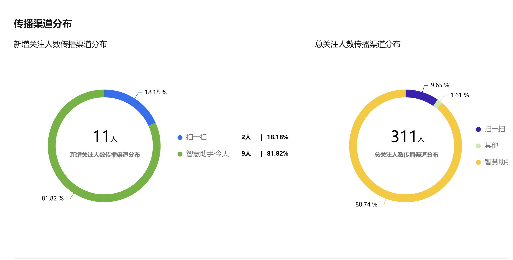
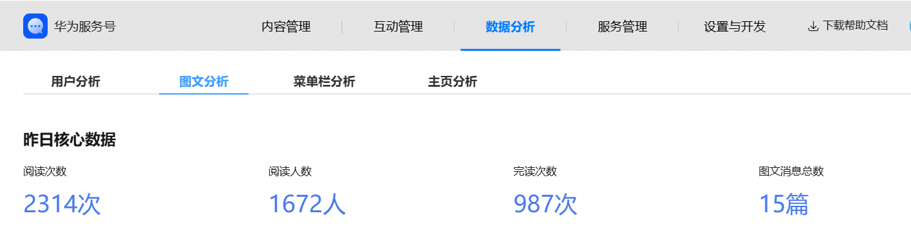
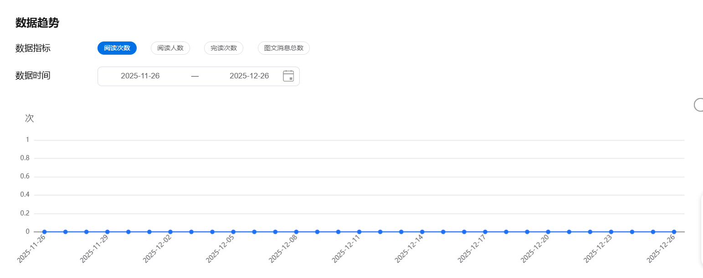
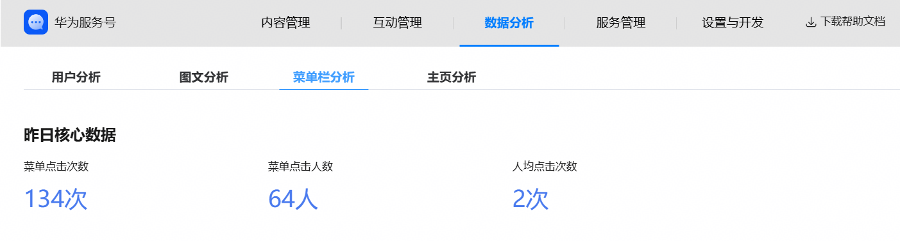
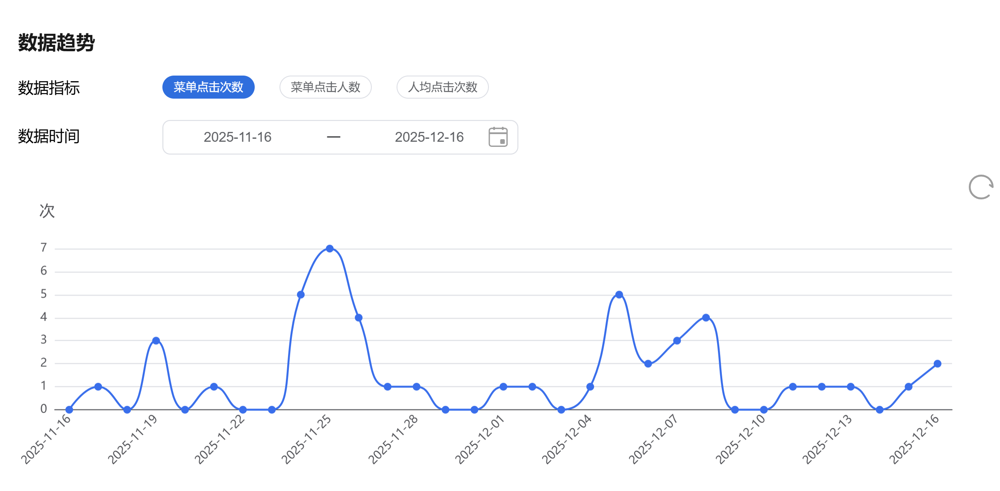
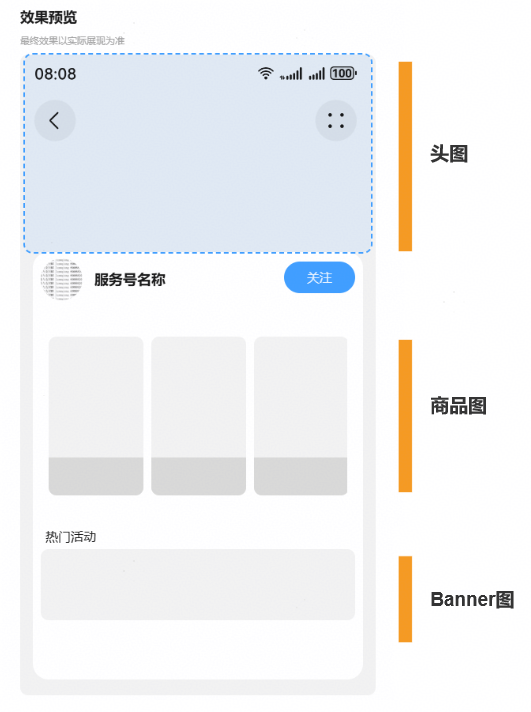
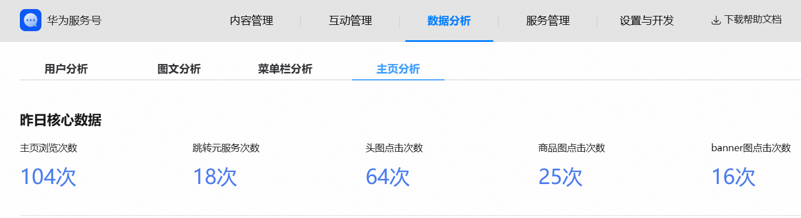
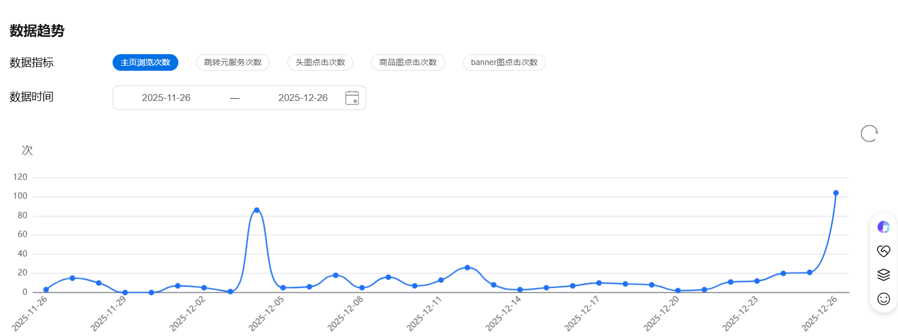

# 经营数据分析

开发者可在服务号后台->数据面板，点击菜单查看经营数据。数据面板分为4个tab模块：用户分析、图文分析、菜单栏分析、主页分析。开发者可点击切换tab查看不同模块的数据。

## 用户分析

用户分析模块可以查看服务号用户相关的指标数据，分为4个核心指标：新增关注人数、取消关注人数、净增长人数、总关注人数。页面分为昨日核心数据、数据趋势、传播渠道分布3个部分。

1. 昨日核心数据：可查看用户分析4个核心指标的昨日数据，当前支持查询T+1日的数据。

2. 数据趋势：可查看4个核心数据指标的曲线走势图，并且可根据数据指标、传播渠道、数据时间条件进行筛选，时间筛选默认展示近一个月的数据，最大可选择三个月。

3. 传播渠道分布：可查看新增关注人数和总关注人数的传播渠道分布。

## 图文分析

图文分析模块可查看创作者在服务号发布的图文消息相关的指标数据，分为4个核心指标：阅读次数、阅读人数、完读次数、图文消息总数。页面分为昨日核心数据和数据趋势2个部分。

1. 昨日核心数据：可查看图文分析4个核心指标的昨日数据，当前支持查询T+1日的数据。

2. 数据趋势：可查看4个核心指标的曲线走势图，并且可根据数据指标、数据时间条件进行筛选，时间筛选默认展示近一个月的数据，最大可选择三个月。

## 菜单栏分析

文章分析模块可查看服务号菜单栏相关的指标数据，分为3个核心指标：菜单点击次数、菜单点击人数、人均点击次数。页面分为昨日核心数据和数据趋势2个部分。

1. 昨日核心数据：可查看菜单栏分析3个核心指标的昨日数据，当前支持查询T+1的数据。

2. 数据趋势：可查看3个核心指标的曲线走势图，并且可根据数据指标、数据时间条件进行筛选，时间筛选默认展示近一个月的数据，最大可选择三个月。

## 主页分析

主页分析模块可查看服务号主页的相关的指标数据，分为5个核心指标：主页浏览次数、跳转元服务次数、头图点击次数、商品图点击次数、banner图点击次数。页面分为昨日核心数据和数据趋势2个部分。

1. 昨日核心数据：可查看主页分析5个核心指标的昨日数据，当前支持查询T+1的数据。

2. 数据趋势：可查看5个核心指标的曲线走势图，并且可根据数据指标、数据时间条件进行筛选，时间筛选默认展示近一个月的数据，最大可选择三个月。

