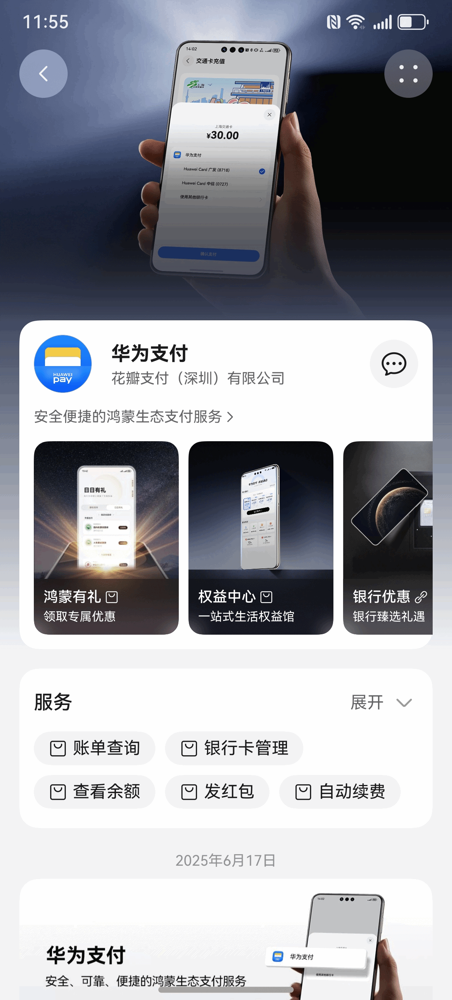
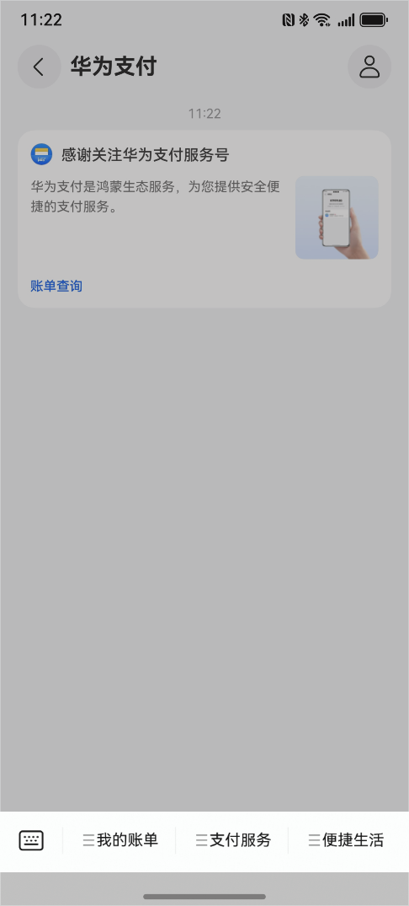
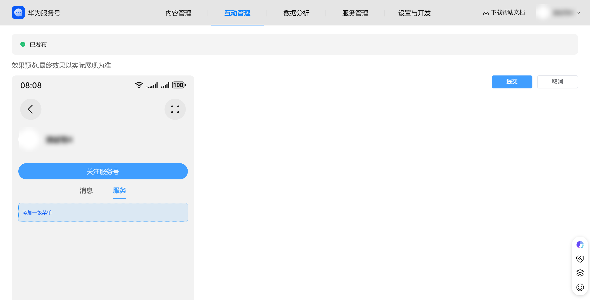
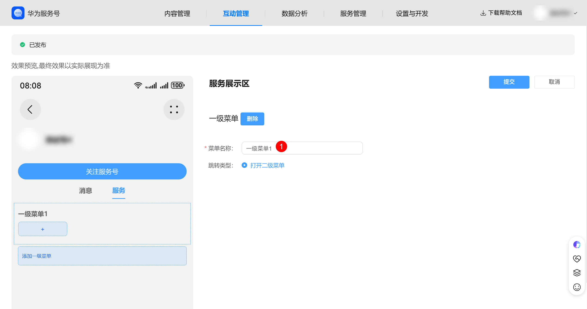
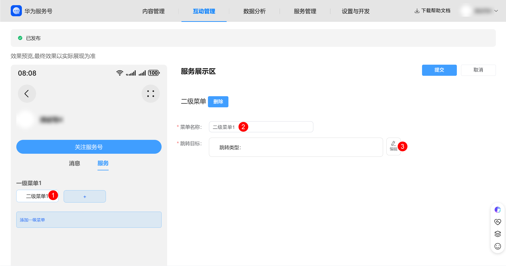

# 配置服务菜单

场景说明：服务菜单菜单项可设置为跳转图文或跳转元服务等，支持配置一级菜单和二级菜单。

商家可登录服务号主页装修后台，进入“服务菜单”模块进行菜单配置，配置的服务菜单会在主页“服务”tab下展示，服务号会话页下方菜单栏将会同步服务菜单配置。

**表1**

| 服务号主页服务菜单 | 服务号会话页服务菜单栏 |
| --- | --- |
|  |  |

菜单配置数量规则：

**表2**

| **菜单类型** | **数量限制** | **功能说明** |
| --- | --- | --- |
| 一级菜单 | 最多3个 | 仅支持打开二级菜单 |
| 二级菜单 | 每个一级菜单下最多5个 | 支持跳转图文或跳转元服务 |

## 配置一级菜单

进入[服务号商家后台](https://developer.huawei.com/consumer/cn/console/service/FastService/service/1063)，点击“互动管理->服务菜单”点击页面左侧“添加一级菜单”按钮进行触发菜单配置。

填写菜单名称（不超过5个汉字或10个字母）。系统自动支持打开二级菜单

## 配置二级菜单

在已创建的一级菜单下，点击“+”按钮添加二级菜单。填写菜单名称（不超过8个汉字或16个字母）。

设置菜单动作：

**跳转目标**：编辑跳转目标，具体规则详见[“链接与跳转规范”](https://developer.huawei.com/consumer/cn/doc/service/performance_specifications-0000001053045328) ，点击“提交”完成配置。

