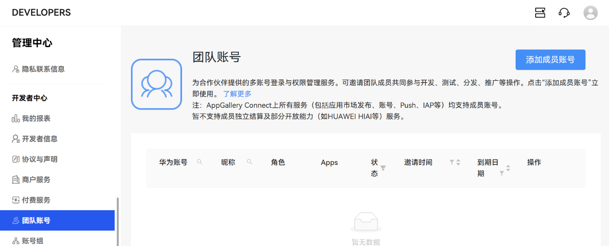
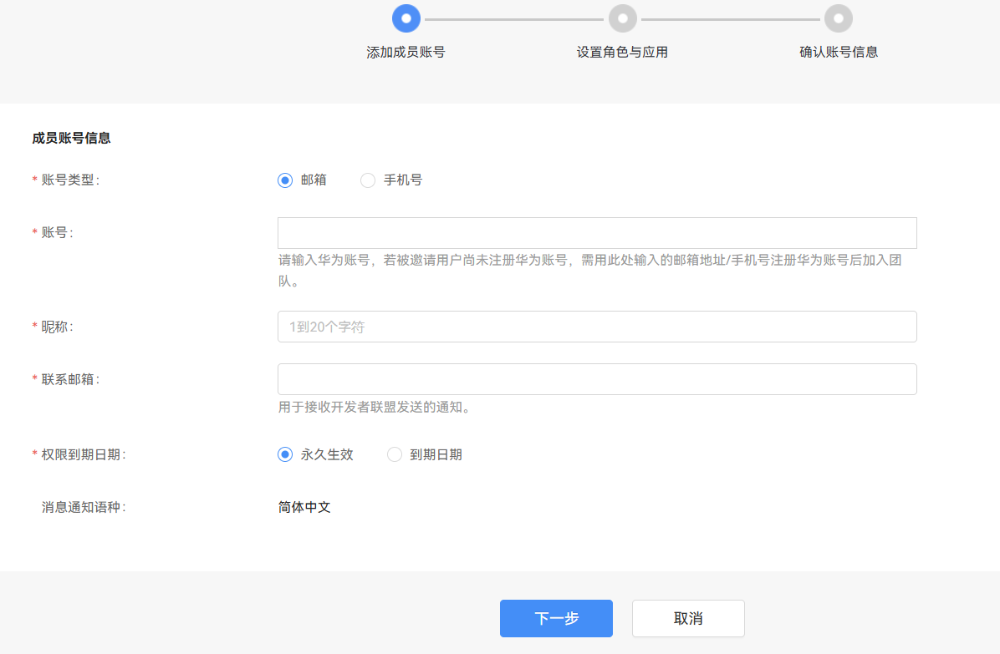
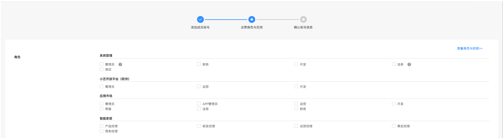
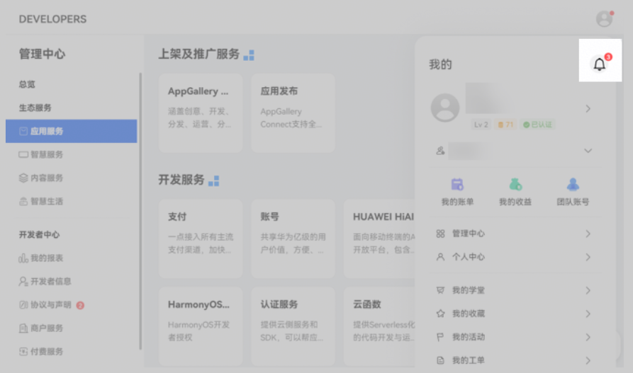
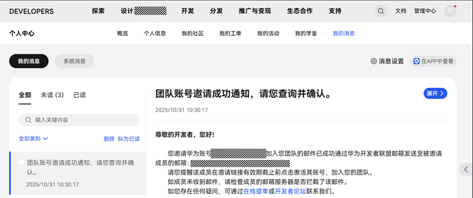
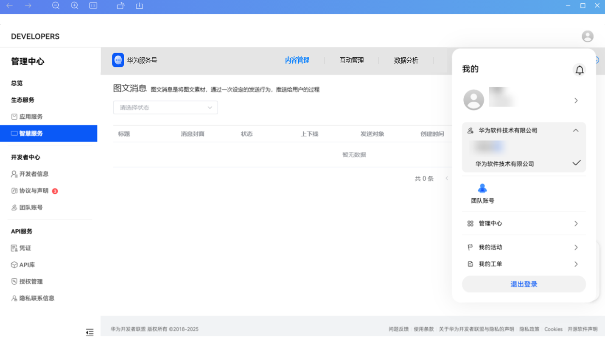

# 管理团队账号与成员账号

应用场景：主账号管理员申请服务号后，企业内部多个角色的操作员如需开发或运营服务号， 可以通过团队账号和成员账号管理功能实现。

1）管理员账号添加成员账号

使用服务号管理员账号（首次申请服务号时的账号）登录联盟管理中心，进入“开发者中心”-“团队账号”菜单；

管理员可将操作员账号添加为成员账号。成员账号支持个人账号和企业账号两种类型，企业类型的成员账号无需完成企业认证。

2）配置角色与应用

应用选择：选择“服务号”

角色选择：按实际角色选择（针对服务号业务，目前只支持管理员角色，成员账号具备管理同开发者账号下所有服务号的能力）

3）确认账号信息

管理员账号操作加入成员账号成功后，会发送一条通知子账号确认的消息，需要成员账号确认并接受邀请，成员账号点击确认后即可生效，生效后的成员账号具备完整的服务号管理能力。

4）成员账号登录成功后，进入服务号栏目，在”我的”账号里面选择团队账号，即可查看和操作团队账号下的服务号。

