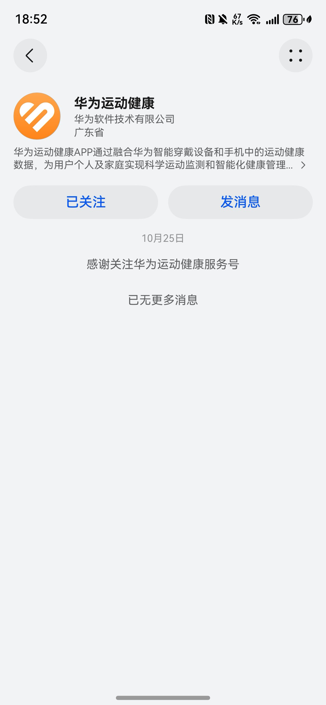
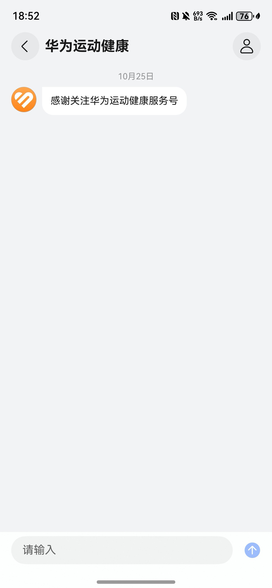
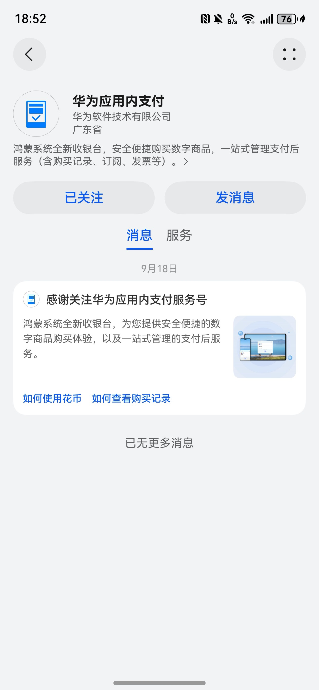
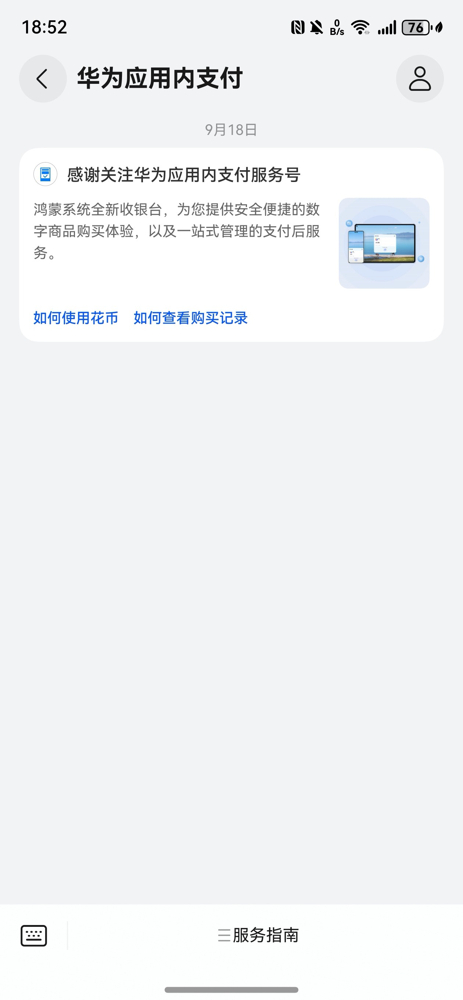

# 配置欢迎消息

场景说明：用户关注服务号后，立即会收到系统触发的欢迎消息。消息由平台基于商家信息默认生成，包括文字式欢迎消息、卡片式欢迎消息。

## 文字式欢迎消息

商家未设置服务菜单时，平台基于服务号名称生成欢迎消息，默认为“感谢关注XXX服务号”。

| 服务号主页欢迎消息 | 服务号会话页欢迎消息 |
| --- | --- |
|  |  |

## 卡片式欢迎消息

商家配置服务菜单后，平台基于服务号基本信息及服务菜单生成欢迎消息，消息卡片包含宣传语、宣传图和行动按钮。

宣传语：取自您申请服务号时填写的宣传语。

宣传图：取自您申请服务号时填写的宣传图。

行动按钮：取自您服务菜单中首个一级菜单的前两个二级菜单，按钮可点击。

| 服务号主页欢迎消息 | 服务号会话页欢迎消息 |
| --- | --- |
|  |  |
