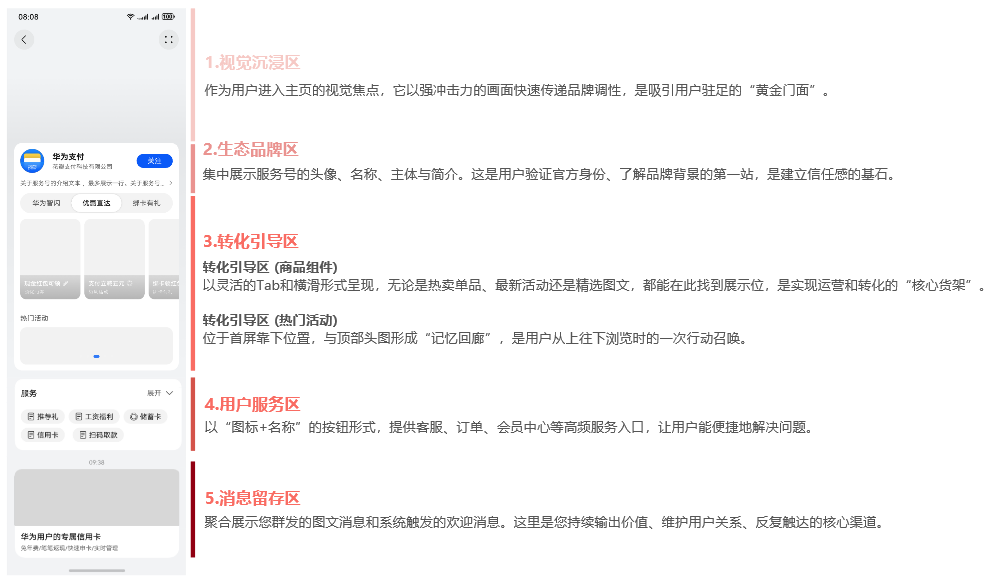
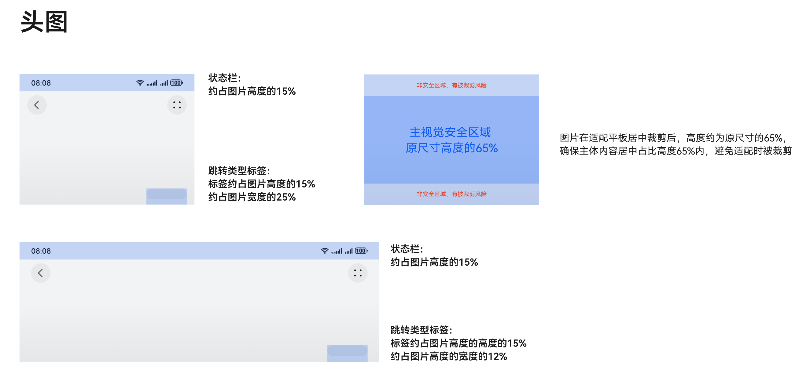
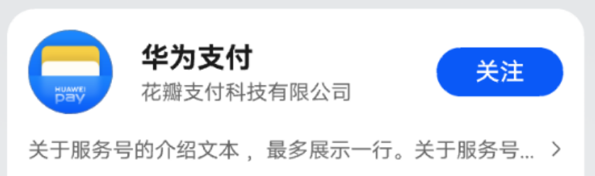
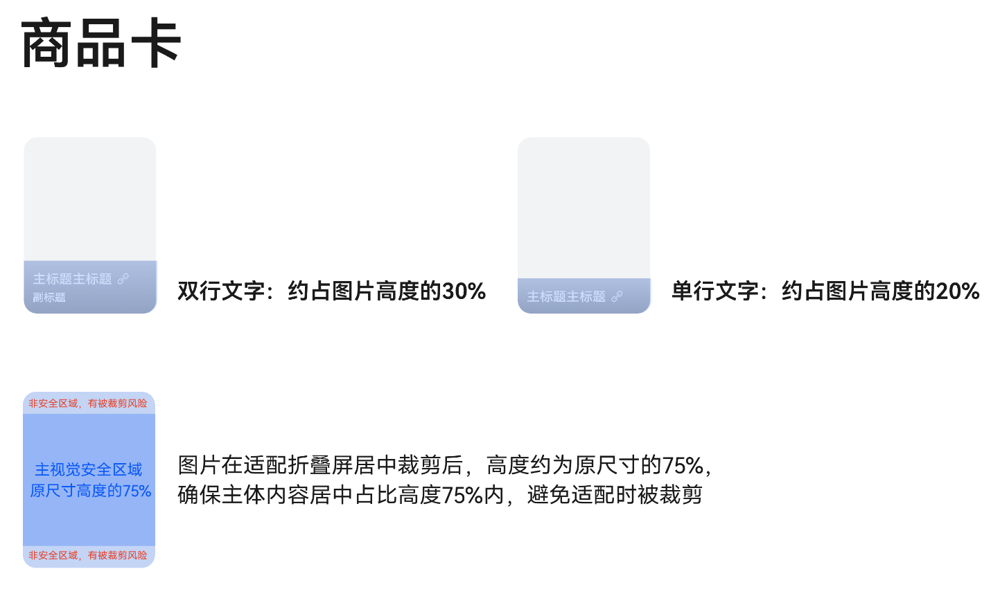
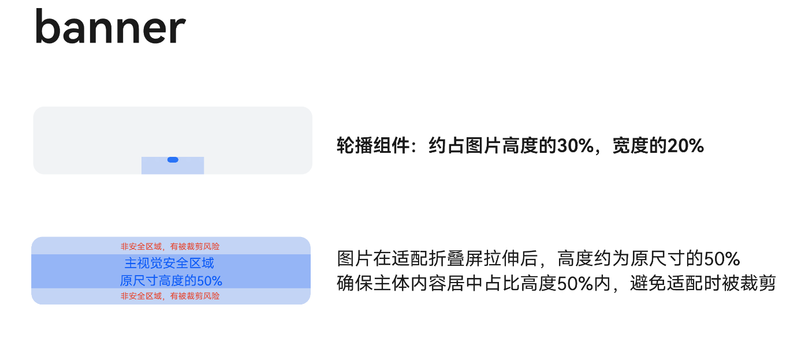
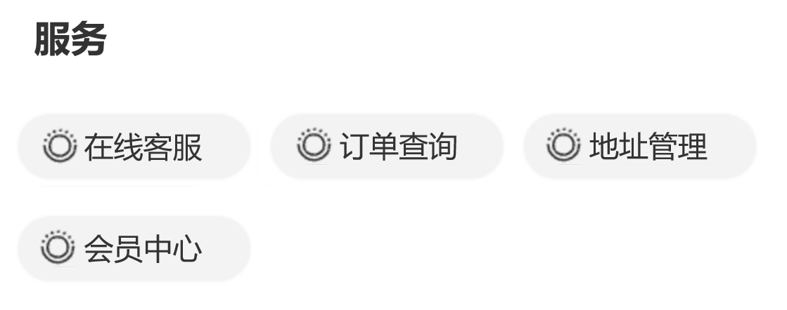
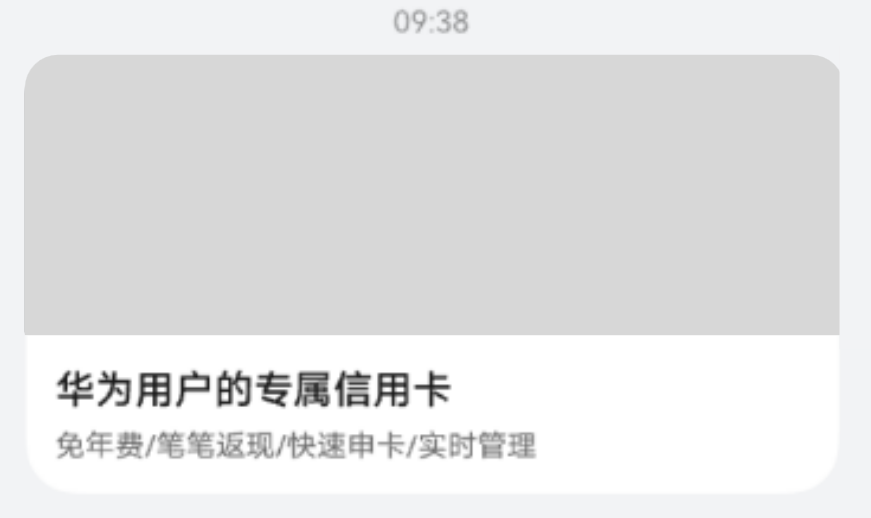

# 服务号主页素材规范

服务号主页是商户与用户建立深度连接、实现商业价值的核心枢纽。它不是一个简单的信息展示页，而是一个集品牌塑造、内容营销、用户服务与商业转化于一体的私域经营生态系统。

通过五个模块化设计，主页将引导用户完成从“认知”到“信任”，再到“转化”和“留存”的经营闭环，成为商户品牌增长的坚实阵地。

（如图所示）：

## 视觉沉浸区

该区域作为用户进入主页的第一视觉焦点，通过高质量的图片，快速建立品牌形象，营造氛围，吸引用户注意力。

**比例与尺寸：**

* 直板机高宽比4:3，推荐分辨率：1280×960px
* 折叠屏高宽比3:1，推荐分辨率：1920×640px
* 平板自动裁剪适配

**格式**：JPG/JPEG/PNG

**大小**：≤1MB

**跳转链接：**非必选。默认权限，可跳转打开设定的元服务/图文详情页； 特殊权限，可跳转打开APP/H5。

**图片规范：**

1. 背景画面素材需具备高分辨率，杜绝锯齿状边缘及模糊不清的情况
2. 画面内容应简约大气，兼具美观度及创意设计感
3. 设计上避免传统风格、商务风格、低幼风格、颜色花哨、元素搭配复杂混乱等效果
4. 禁止出现模拟app界面场景，例如“弹窗、系统UI、伪造商品卡片、轮播图按钮”等
5. 背景图出现人物或者产品等元素, 尽可能完整露出, 不可割裂人物或产品

## 生态品牌区

该区域是服务号主页的官方身份标识，用于集中展示品牌的核心信息，建立用户信任感。平台根据服务号基本信息自动生成，无需装修。

## 转化引导区（商品组件）

该区域以可横向滑动的组件形式呈现，是承载多样化运营目标、引导用户进行深度交互的核心区域。

**页签规范：**

数量：0 或 2~3个

名称：≤4字符， 每个页签名称均采用对仗形式，以保持统一和谐

**商品组规范**：

商品图片：

* 数量：4~6个；
* 直板机高宽比：3:4；平板高宽比：3:4；推荐分辨率960×1280px；折叠屏自动裁剪适配；
* 格式：JPG/JPEG/PNG；
* 大小：≤200KB/图

商品名称：可自定义，字数≤6个字符

营销标签：可自定义，字数：≤10字符

信息栏底色：从商品图片自动取主色

**跳转链接：**必选。 默认权限，可跳转打开设定的元服务/图文详情页； 特殊权限，可跳转打开APP/H5。

**图片规范：**

1. 宣传产品的主体形象鲜明，易于辨识
2. 背景保持干净，避免出现复杂或分散注意力的元素
3. 所有上传的卡片均不得采用纯透明背景设计
4. 素材需具备高分辨率，杜绝锯齿状边缘及模糊不清的情况
5. 上传的素材应充分利用空间，避免出现大片空白区域
6. 画面中的文字和图形等信息不应与已有的其他宣传素材内容相重复

## 转化引导区（banner）

该区域以轮播组件形式呈现，与头部的视觉沉浸区（头图）形成“记忆回廊”效应，旨在通过视觉呼应，强化用户对核心活动或品牌的记忆，并提供转化入口。

* 通过上传活动图片（Banner）并配置对应的跳转目标，作为用户向下浏览时的行动号召。
* 为营造“记忆回廊”视觉体验，建议此Banner的视觉元素（如主色调、核心文案、形象）与顶部的视觉沉浸区保持一致或关联性。

**比例与尺寸：**固定高宽比4:1 ，推荐分辨率：2880×720px

**格式**：JPG/JPEG/PNG

**数量**：0~3个，支持轮播

**大小**：≤500KB/图

**跳转链接：**必选

**图片规范：**

1. banner图需采用高分辨率图像，确保画面边缘平滑无锯齿，整体清晰度高，杜绝模糊不清等影响视觉效果的现象。
2. 画面整体风格应简约大气，兼具美观性与创意设计感，体现良好的视觉审美与设计品质。
3. 设计风格需避免传统、商务、低龄化等倾向，严禁使用色彩杂乱、元素堆砌、搭配混乱等影响整体协调性的表现方式。
4. 禁止出现模拟app界面场景，例如“弹窗、系统UI、伪造商品卡片、轮播图按钮”等。

## 用户服务区

该区域是服务号的功能导航中枢，旨在为用户提供便捷、高效的服务与工具入口，提升用户黏性和解决问题的效率。

* 核心功能：以小尺寸的圆角矩形按钮形式，展示一系列快捷服务入口，如“在线客服”、“订单查询”、“会员中心”、“地址管理”等。
* 业务定位：此区域不以直接销售转化为主要目的，而是通过提供有价值的服务功能，建立用户信任，培养用户使用习惯，是服务号“服务”属性的核心体现。
* 与“转化引导区”的区别：
  + 目的不同：用户服务区是“工具导向”，帮助用户完成任务；转化引导区是“内容/商品导向”，引导用户浏览或消费。
  + 内容不同：用户服务区是“功能入口”，相对固定；转化引导区是“运营内容”，灵活多变，随活动更新。

## 消息留存区

该区域是服务号的内容信息流，是承载服务号信息发布、与用户进行深度沟通的核心阵地。所有通过服务号触达用户的重要内容都将在此处按时间顺序聚合展示。

* 内容来源：
  + 图文消息：由运营人员主动推送的图文消息，用于品牌宣传、活动通知、内容营销等。
  + 欢迎消息：由系统在关注场景下自动触发的欢迎消息。
* 核心价值：构建服务号的内容档案，方便新用户回溯历史群发消息，也为老用户提供一个持续获取信息的固定渠道。

## 链接规范

服务号链接如涉及违反以下规范，一经发现，将驳回链接上线申请或下线服务号，整改完成后重新上线，包括但不限于：

**基本规范**

1. 当前只支持跳转元服务、图文详情页，链接支持Applinking、开发者自己的H5网站；
2. 跳转链接不能存在死链、恶意网址，或提示有安全风险的情况；
3. 链接打开不能转到APP下载页面（也不能有APP诱导下载的标识）；
4. 链接内容需要和其跳转的图片、图片对应的标题内容相匹配；
5. 打开链接左上方显示网页标题需要与其跳转页面的内容相匹配；
6. 第三方服务名应为商家名称或其注册的服务号名称；
7. 单个主页原则上不能使用重复链接。

**页面功能、交互、活动信息规范**

1. 不允许页面选项内容点击无反应，需保证跳转链路可用；
2. 不允许无法返回上一层的重定向页面；
3. 不允许使用PC页面；
4. 各级页面无拉伸、收缩、扭曲等变形或者跑版的情况，适配不同分辨率手机屏幕；
5. 各级页面不能出现闪屏情况；
6. 各级页面访问时不能出现超过5秒的缓慢情况；
7. 各级页面内不能出现图片失效、字体重叠等问题；
8. 页面活动需真实有效、客观合理，不能存在任何非法不良信息、误导性信息或者违法行为；
9. 页面中需对活动内容进行详细介绍，活动规则需明确，活动流程体验需顺畅；
10. 活动页面需提供活动有效时间（如：1月1日至1月31日活动有效），已超过活动期限的页面不准接入。
