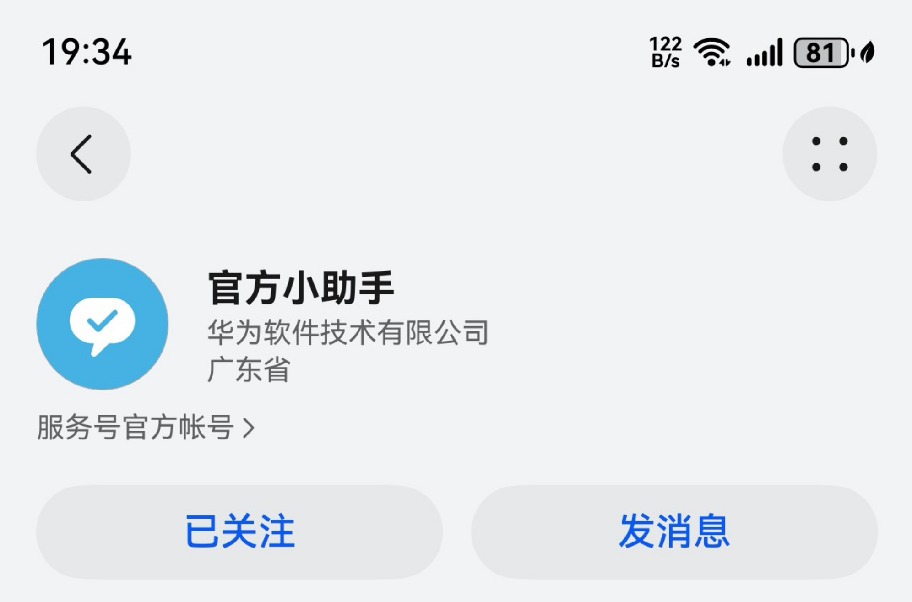
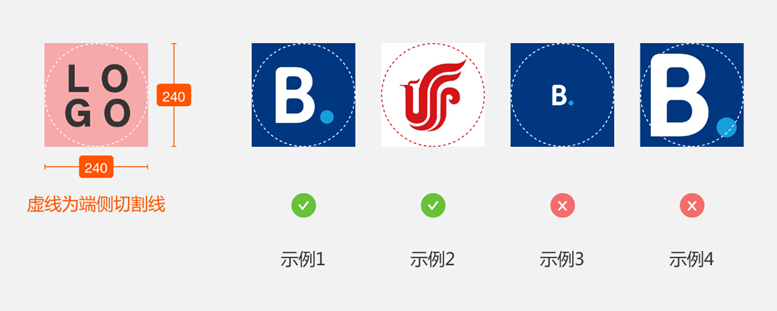
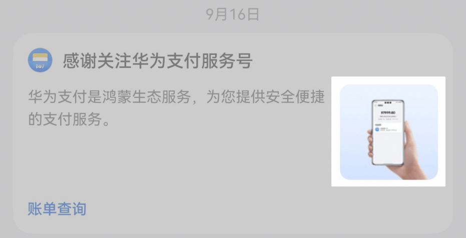
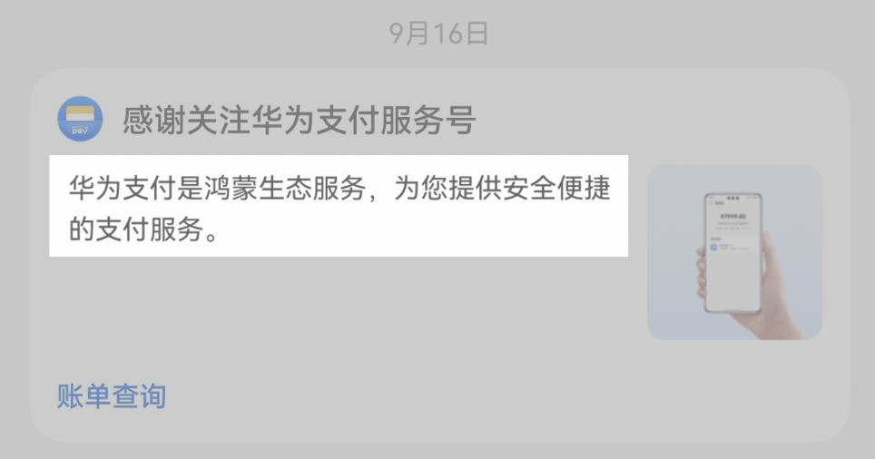
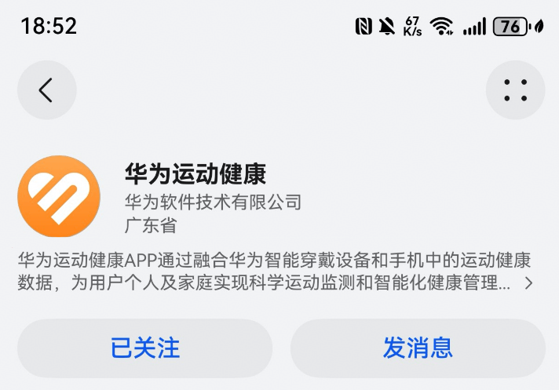
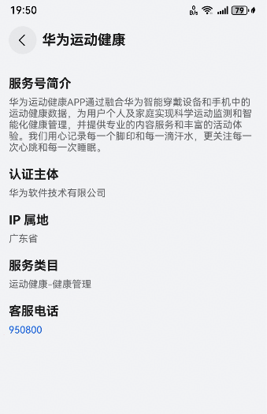

# 服务号基本信息规范

您创建华为服务号时需提供基本信息包括：华为服务号名称、所属行业、服务号Logo、宣传图片、宣传语、服务号简介、IP属地等信息。

## 华为服务号名称

1. 服务号名称字符数不少于2个字，限制在30个字符以内，建议控制在20个字符以内（超过20个字符会导致体验效果不佳）；
2. 名称不允许涉及侵害他人隐私权、名誉权、肖像权、知识产权、商业秘密等合法权利的内容；
3. 名称不允许与平台已有帐号重复、高度相似、或存在混淆（涉嫌侵权），否则申请可能会被驳回；
4. 非公共服务类取名，非政府、事业单位等公共服务类组织不得取与公共服务类相关或近似的名称；
5. 若商家名称包含英文字母，建议使用大写英文字母，不建议使用小写字母；
6. 服务号名称不能涉及色情、暴力、赌博等违法违规内容；
7. 非华为官方服务号，禁止在服务号名称、输出内容中出现与华为已有知识产权内容相同（如‘华为’、‘HUAWEI’等）、相近似（例如华伪、鸿朦、HUAWI等）的字样，或者容易与目前已有华为产品设计主题、外观等相混淆的内容；
8. 名称不允许使用过于宽泛的通用名词、行业词、产品名称、行业词、活动名称、功能词的，如：绿茶、香肠、网课、驾校、扫码领红包、健身等，建议添加商标名称/企业名称等体现业务特性的名称；
9. 名称不得以纯地域位置（例如重庆、武汉），或地域+类目名称（例如温州男鞋、杭州开锁服务）的方式命名；
10. 名称不得含有无实际含义的数字，例如外婆缘1、虹乐2 ；
11. 名称含有夸大意义，或有明显营销信息，例如关注赚百万、点击有礼等；
12. 名称涉及国家领导人等重要政治人物，将不予通过；
13. 名称不允许以存在明显语意歧义的词语来命名，例如呵呵、小三等；
14. 不得山寨、冒用他人名称，不得使用第三方品牌名称，包括但不限于节目名称、知名影视作品/人物等；
15. 名称中不得出现广告法禁止行为的信息。

## 所属行业

请参考[鸿蒙元服务应用分类信息](https://developer.huawei.com/consumer/cn/doc/app/ability-0000002032931302)进行填写，[禁止入驻的行业类目](https://developer.huawei.com/consumer/cn/doc/service/content_specification-0000001053325353#section166941348192713)除外。

特殊行业需要提供[特殊行业资质](https://developer.huawei.com/consumer/cn/doc/app/80302)材料。

## 服务号LOGO图片

**场景介绍**

您上传的Logo图片将会被展示在服务号主页等任何使用到服务号LOGO的区域。

尺寸： 240\*240（1:1）

图片大小：不超过500kb，

支持格式：jpg，jpeg，png

1. 清晰展现企业或商家Logo外形，识别度必须高；
2. Logo必须居中于红色区域内，并建议略小于裁切区域（如下图示例1、示例2）；
3. Logo不能太小或太大，超出红色区域部分将被裁切，影响可识别性（如示例3和4）；
4. 如果有多种Logo排版形式可选，尽量选择占幅饱满美观的方案；
5. 图片切图为直角，系统会自动切圆角，不要再单独添加圆角；
6. 图片不能有透明度，会导致深色主题显示异常。

## 宣传图片

**场景介绍**

您上传的宣传图将会被展示在欢迎消息卡片等区域。

**图片规范**

尺寸： 240X240（1:1）

图片大小：不超过200K

支持格式：jpg，jpeg，png

1. 图片要清晰，可识别度必须高，不可使用曝光度过高或劣质模糊或过于花哨刺眼的图片，影响体验；建议使用风景，店铺等氛围图；也可自行设计有强烈品牌企业感的宣传图；
2. 不可在宣传图内里打广告，并保证图片的干净大气；
3. 宣传图与商户Logo勿使用相近的色调或内容，避免视觉上无法有区分度；如背景图上有文字，需居中摆放，避免出现文字被切割情况；
4. 尽可能避免宣传图上重复出现商户Logo；
5. 宣传图不能和Logo使用相同的图片。

## 宣传语

**场景介绍**

您上传的宣传语将会被展示在欢迎消息卡片、一键关注组件等区域。

**标题规范**

1. 字符数不超过80个字符；
2. 宣传语不得与服务号简介使用相同文案；
3. 不能含有敏感、消极、恶俗、色情、黄赌毒、广告法禁用等违法违规信息;
4. 宣传语内容需与商家品牌信息、服务号名称、服务号简介等内容相匹配；
5. 宣传语应保持书面用语，应避免使用地方性语言或口水语；
6. 宣传语不得含有明显的营销夸大信息，或涉及诱骗用户打开服务号的字眼，例如关注领百万，日赚五千等；
7. 不得添加无意义的数字、字母、字符、表情符号等内容，例如“666”、“~\(≧≦)/~”等；
8. 宣传语应突出商家业务特点，不能使用无商家辨识度的宣传语（例如使用【华为服务号为您服务】）；原则上单个宣传语只能由单个服务号使用，不支持由多个服务号使用；
9. 不得使用过度夸张、断章取义、捏造不存在的人物与事件、故意营造悬念引人好奇等标题党文案。

## 服务号简介

**场景介绍**

服务号简介将展示在服务号主页等区域。

**简介规范**

1. 简介不超过150个字符，内容需为商家对服务号的介绍；
2. 简介内容不能含有敏感、消极、恶俗、色情、黄赌毒、广告法禁用等违法违规信息；
3. 简介内容应保持书面用语，不能使用口水文或地域性用语；
4. 简介内容需要与商家品牌信息、对应的服务号名称内容相匹配；
5. 简介不能与宣传语使用相同文案；
6. 简介内容不能含有欺诈、不诚信、或夸大类营销信息；
7. 简介不能包含网站链接、社交账号资料（如微信、淘宝、QQ账号、电话信息）等信息；
8. 简介中不得添加无意义的数字、字母、字符、表情符号等内容，例如“666”、“~\(≧≦)/~”等；
9. 简介内容应保持内容逻辑清晰，不能存在语法不通，语义不明、乱用标点符号、病句、错别字等有碍于读者理解文章内容的信息。

## IP属地

1. IP属地为企业营业执照上注册所在地的省份；
2. 如企业注册地与企业运营机构所在地不一致的情况下，请填写公司营业执照上对应地址的省份。

## 特殊行业资质

1. 特殊行业需要提供行业资质材料，服务号与元服务行业资质要求相同，请参考[鸿蒙元服务资质审核要求](https://developer.huawei.com/consumer/cn/doc/app/80302)。
2. 格式支持jpeg、jpg、png，且大小不超过5M，最多可上传5张。

## 权属证明材料

1. 请提交商标注册证或商标使用授权相关材料；
2. 入驻服务号的所有商家需提供有效的营业执照，请参考[营业执照规范](https://developer.huawei.com/consumer/cn/doc/service/content_specification-0000001053325353#section19297389271)；
3. 由平台服务商接入的商家需提供与平台服务商签署的授权书，请参考[权属证明材料](#section7355171420366)。

## 客服信息

**场景介绍**

服务号客服信息将展示在服务号档案页等区域。

1. 企业客服电话仅支持录入固定电话、企业短号、400的企业电话，不允许填写个人手机号。
2. 企业客服电话需有效且正常提供用户客服服务，信息审核期间平台可能会拨打该电话进行确认。
3. 客服时段按实际填写，如网络24小时提供服务，则可填写00:00:00-23:59:59。

## 联系人信息

1. 填写服务号运营者的个人联系人姓名、联系手机、联系邮箱。
2. 请录入真实且有效的联系人的手机和邮箱，联系方式有变更时，请实时修改。平台如果发现您的服务号有违规或其他需要联系服务号运营者的情况，会通过此信息联系您，商户应确保运营人员能及时处理问题。
3. 如果运营者有变更时，请主动登录并将信息更新为新的联系人。
