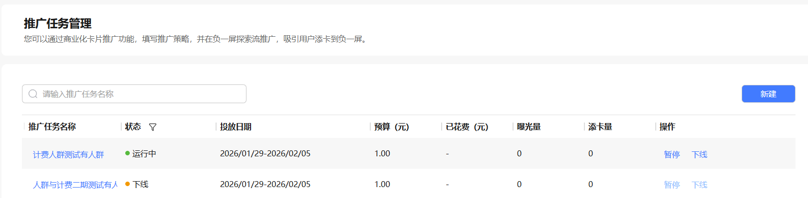
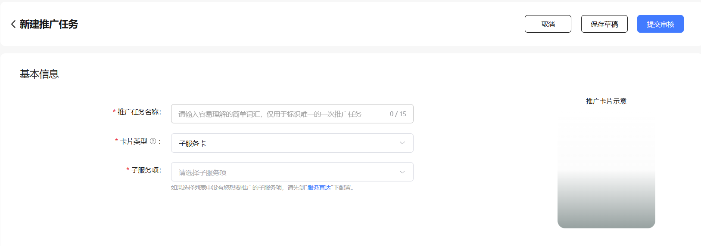
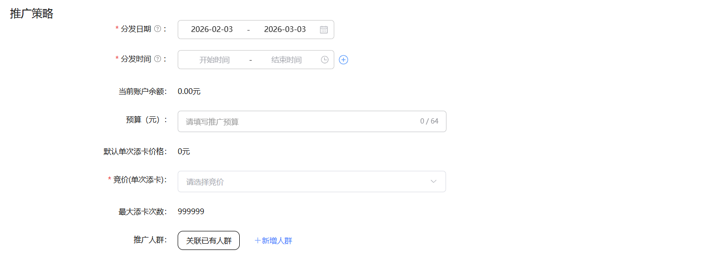

# 配置指南

卡片分发配置指南如下：

（一）[登录AGC](https://developer.huawei.com/consumer/cn/service/josp/agc/index.html#/)，选择要推广的元服务或鸿蒙应用，并在【服务直达】添加“服务项”卡片，参考[服务直达](/docs/dev/atomic-dev/instant-service/instant-service)的说明；

（二）在卡片分发>推广任务管理中创建推广任务：

* 进入推广任务管理菜单，点击【新建】按钮创建推广任务，进入推广界面：

* 新建推广任务，选择要推广的卡片，推广任务支持两种卡片类型：

Formkit卡：元服务开发时，由开发者写在程序包中的Formkit卡片（目前仅支持元服务的卡片）；子服务卡：在步骤1中自定义的卡片。

配置推广策略：

* 推广策略主要包含：推广时间、推广预算、推广人群等；
* 推广人群支持新建人群与关联已有人群。每个账号下最多创建20个人群。如额度超出，则先删除不再使用的人群后再增加。人群的最大有效期是180天，过期自动失效。关联的推广任务的有效期不能超过人群的有效期；
* 推广预算：通过选择不同档位的竞价和预算后，负一屏会为您整个推广周期提供服务，出价越高，推广的力度越大。当推广任务达到限额或达到推广截止时间时，则不再提供付费推广服务，改为自然流量推广；
* 点击【提交审核】，等待添卡生效；
* 子服务项的推广任务提交后系统自动审核，Formkit卡片的推广任务提交后还需要运营审核，运营一般会在1-2个工作日完成审核。
