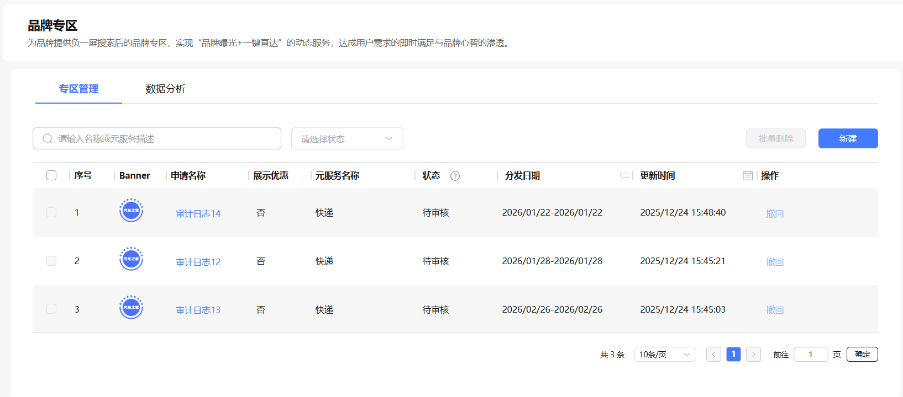
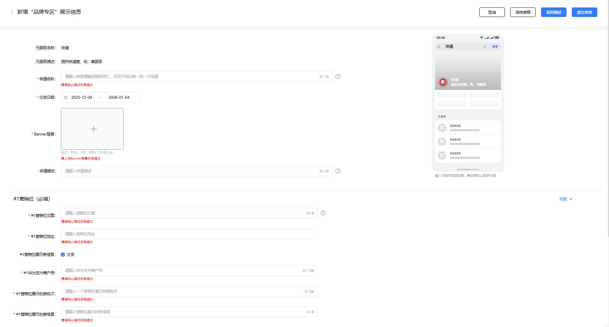

# 配置指南

品牌专区的配置指南如下：

（一） 简易开通流程，快速启用

* 权限申请：联系负一屏运营人员，提交品牌专区开通申请，联系方式：servicedist@huawei.com；
* 资质审核：负一屏对商家资质、品牌合规性等进行审核，审核通过后开通品牌专区权限；
* 内容配置：商家登录运营后台，自主设计并配置专区运营位内容（含视觉素材、跳转链接等）；
* 权益设置：配置商家券规则；
* 上线运营：提交配置内容经平台审核通过后，品牌专区正式在负一屏搜索结果页上线。

（二）清晰准入条件，合规入驻

* 主体要求：需为已入驻 HarmonyOS 元服务的企业开发者账号或合规服务商账号，具备合法有效的品牌经营资质；
* 品牌要求：拥有自有品牌或合法品牌授权，品牌信息完整（含品牌LOGO、品牌介绍等规范素材），无违法违规侵权记录；
* 元服务要求：已发布符合平台规范的元服务，且元服务类目与品牌经营业务一致；
* 其他要求：同意并遵守平台品牌专区运营规范，配合平台开展内容巡检与合规审核。

（三）具体操作

* 在服务分发增长>品牌专区>专区管理，点击新建。

* 商家可以自主配置banner、运营位的信息同时可以利用运营位去发放商家券（需有对接华为商家券系统），填写完成后，商家可以通过右侧看到效果预览，也可以通过现网测试进行测试，点击“提交审核”，待审核通过后可在现网上线。
