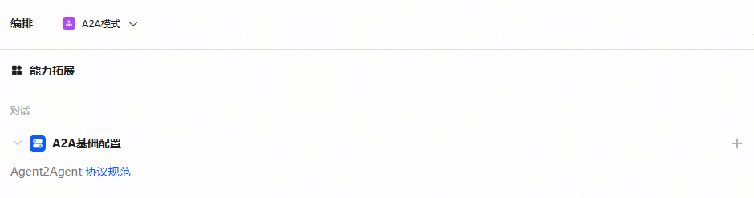
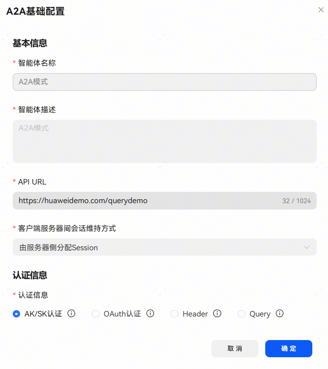

# A2A基础配置

A2A模式创建智能体是以HarmonyOS Agent2Agent协议接入三方智能体。在该模式下，开发者必须完成此节点的配置，否则无法正常发布智能体。

【API URL】

与智能体对话时的访问接口，通信协议参考[鸿蒙Agent通信协议接入方案](https://developer.huawei.com/consumer/cn/doc/service/agent2agent-0000002498656261)。

**【客户端服务器间会话维持方式】：**

由服务器侧分配Session；

服务器间采用无状态通信，每次携带认证凭据。

**【认证信息】：**

AK/SK认证：使用预共享密钥认证方式；

OAuth认证：使用OAuth2.0流程认证，当前仅支持Client模式，OAuth2.0协议规范，可访问[OAuth 2.0官方网站](https://oauth.net/2/)；

Header：使用HTTP请求Header域传递参数方式认证；

Query：使用Query传递参数方式认证。该认证方式可能存在安全风险，建议使用其他认证方式。

认证方式可参考[创建插件](/docs/distribute/xiaoyi/cloud-plug-in-0000002471344189/create-plugin-0000002471264325)认证方式部分。

