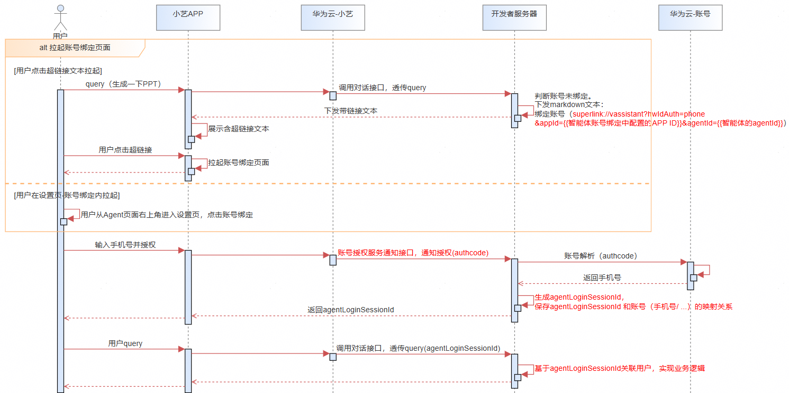
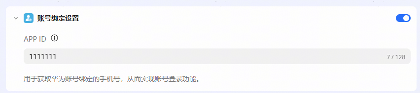
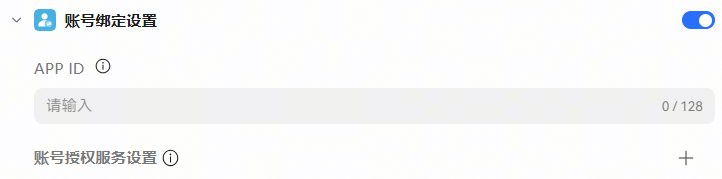
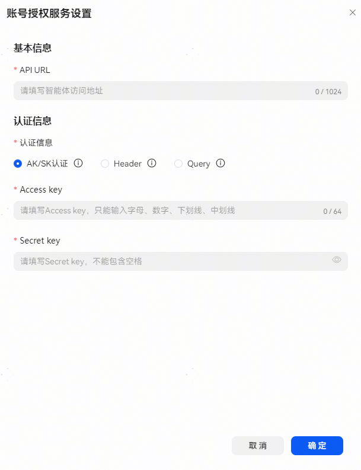
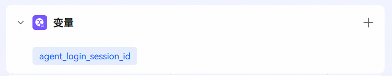
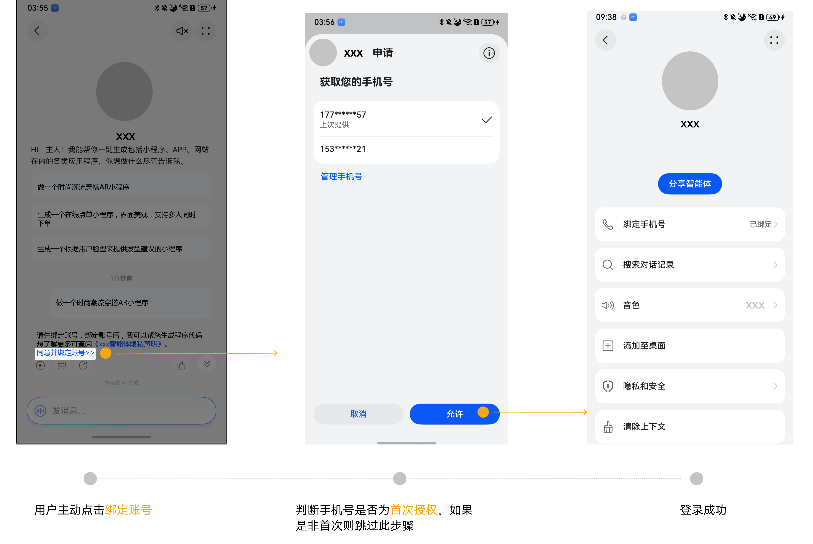

# 账号绑定设置

## 功能介绍

当搭建的智能体需要登录账号时，可以通过【账号绑定设置】进行配置实现，完成后，可在手机端基于华为账号一键授权登录。目前，仅**A2A模式**和**工作流模式**支持账号绑定设置。

账号绑定交互流程图：

## A2A模式账号绑定

配置：

打开账号绑定开关并输入APP ID（绑定应用的Client ID）保存后，联系华为侧支撑人员走内部评审流程。填写APP ID前请先完成[开发准备](#section675792123719)。

接口实现：

用户在智能体中绑定账号时，将请求A2A基础配置中配置的地址获取会话凭证，具体实现请参考[鸿蒙Agent通信协议接入方案](https://developer.huawei.com/consumer/cn/doc/service/agent2agent-0000002498656261)实现账号绑定流程。

## 工作流模式账号绑定

账号绑定设置：

APP ID：同A2A模式APP ID说明；

账号授权服务设置：

API URL：用户在智能体里绑定账号时，调此地址获取会话凭证。

认证信息：认证方式可参考[创建插件](/docs/distribute/xiaoyi/cloud-plug-in-0000002471344189/create-plugin-0000002471264325)认证方式部分。

* AK/SK认证：使用预共享密钥认证方式。
* Header：使用HTTP请求Header域传递参数方式认证。
* Query：使用Query传递参数方式认证。该认证方式可能存在安全风险，建议使用其他认证方式。

配置完成后，智能体将自动关联系统变量：agent\_login\_session\_id。agent\_login\_session\_id将获取用户登录成功后开发者返回的用户登录凭证唯一ID（授权接口响应中的agentLoginSessionId）。

流程：

* 当用户在手机端发起账号授权/解授权请求时，调用账号绑定配置中的API URL获取登录凭证，接口实现请参考[授权登录/解授权](/docs/distribute/xiaoyi/agent2agent-definition-0000002500439093/authorize-deauthorize-0000002505921274)。
* 正常会话时，执行智能体关联的工作流，工作流配置中对接开发者接口节点（如云插件）引用系统变量agent\_login\_session\_id，会话时，开发者根据此字段判断用户登录状态。

## 账号绑定方式

需要账号绑定的智能体，用户有两种绑定账号的方式：

1. 与智能体对话时，若账号未授权过或授权已过期，智能体答复一个superlink引导用户点击登录，点击超链接时，发起账号绑定授权流程。

此方式适用于强制用户绑定账号的智能体，未绑定时无法正常与智能体对话。

superlink示例：请先绑定账号，绑定账号后，我可以帮您XX，想了解更多可查阅[《xxx智能体隐私声明》](xxx智能体的隐私声明网址)。\n[同意并绑定账号>>](superlink://vassistant?hwIdAuth=phone&appId=\\{\\{智能体账号绑定中配置的APP ID\\}\\}&agentId=\\{\\{智能体的agentId\\}\\})

手机端效果示例：

2. 可通过智能体详情页点击绑定手机号栏，进行账号绑定/解绑操作。

## 开发准备

APP ID是智能体申请获取华为账号的唯一标识，开发者需要在华为开发者联盟账号服务中获取APP ID或者创建一个APP ID，并将其在智能体开发界面注册保存。注意获取APP ID使用的产品名称和应用图标要与智能体名称和图标保持一致。

**1、创建服务**

在 AppGallery Connect（简称AGC）上，参考[创建项目](https://developer.huawei.com/consumer/cn/doc/distribution/app/agc-help-createproject-0000001100334664)和[创建web应用](https://developer.huawei.com/consumer/cn/doc/app/agc-help-createweb-0000001912720988)完成鸿蒙应用的创建。创建完成后将拿到APP ID（注意：取应用信息中的**Client ID**的值）。

**2、申请账号权限**

a、申请前自检

申请权限前请参考表1，了解账号权限支持的能力和使用条件，并根据表2完成自检，确认您的**设备类型、开发者类型等**是否符合申请条件，不符合条件的申请将被驳回。

表1 账号权限说明：

| 权限名称 | 权限描述 | 支持的开发者类型 | 支持的设备类型 |
| --- | --- | --- | --- |
| 获取您的手机号 | 支持元服务获取华为账号绑定的**手机号**或用户选择的**其他手机号**。 | 企业开发者 | Phone、Tablet |

表2 获取您的手机号权限申请自检表：

| 序号 | 自检项内容 |
| --- | --- |
| 1 | 开发者必须为企业开发者，不支持个人开发者申请。 |
| 2 | 若近期存在违规记录，则不予审批或有权收回权限。 |
| 3 | 若用户举报或发现开发者不合理的使用，华为有权收回权限。 |

b、手机号权限申请流程

1）登录[华为开发者联盟](https://developer.huawei.com/consumer/cn/console#/scopeManage)，选择“管理中心”。

2）菜单选择“授权管理”，进入页面后，点击左上角下拉框确认待授权项目，选择对应的应用名称（若应用名称重复，请进入凭证页依据客户端ID、创建时间等信息确定待授权应用），选择“华为帐号服务”，在敏感权限中选择“获取您的手机号”权限，点击“申请”。

3）点击申请后，选择对应“服务类型”选项，在使用场景中填写并提交以下申请需求的合理性材料，材料中需包含如下项目：

* 使用场景类型：从预置场景选择（如“网络借贷类”、“房屋租售类”等）或按实际填写。
* 业务场景描述：清晰说明业务场景（如“用户注册时快速验证手机号”）。
* 实际使用说明：描述该数据权限的使用流程和每秒请求次数峰值预估。

4、提交申请成功后会显示待审核状态，待审核完成即可。
