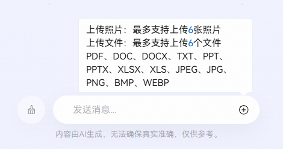
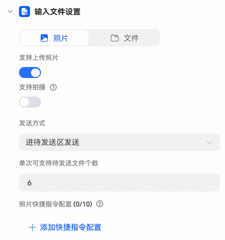
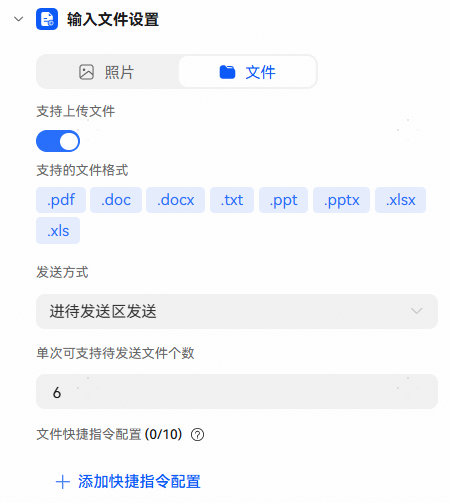

# 输入文件设置

与智能体对话时，除了发送文本，还可以通过【输入文件设置】勾选图片或文件，勾选后对话时点击输入框右侧【+】，可发送图片或文件，适用于支持处理图片或文件的智能体。

输入文件设置：

照片：

【支持上传照片】：按钮打开后，对话时支持发送照片，支持格式：JPEG、JPG、PNG、BMP、WEBP。

【支持拍摄】：按钮打开后，对话时支持使用相机拍摄直接发送；注意：不支持网页调测，请到真机上体验拍摄功能。

【发送方式】：可配置直接发送、进待发送区发送。

* 直接发送：表示直接发送用户上传的照片。
* 进待发送区发送：表示用户可同时发送文本和照片；单次最多支持上传6张照片。

【照片快捷指令配置】：配置后用户可以快速对待发送区的图片发起预设对话。

文件：

【支持上传文件】：按钮打开后，对话时支持发送文件，支持格式：pdf，doc，docx，txt，ppt，pptx，xlsx，xls。

【发送方式】：可配置直接发送、进待发送区发送。

* 直接发送：表示直接发送用户上传的文件。
* 进待发送区发送：表示用户可同时发送文本和文件；单次最多支持上传6个文件。

【文件快捷指令配置】：配置后用户可以快速对待发送区的文件发起预设对话。

