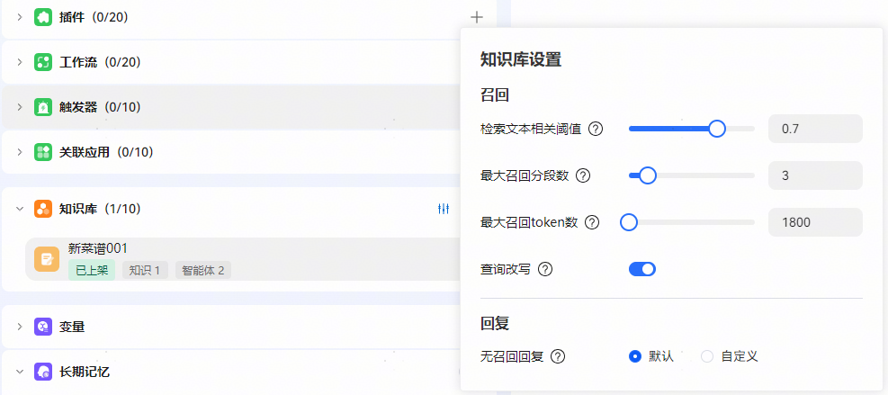

# 知识库

开发者可以设置自己的知识库，使智能体可以参考知识库回答用户的问题。

知识库开发指南请参考[开发知识库](https://developer.huawei.com/consumer/cn/doc/service/develop-a-knowledge-base-0000002435989624)。

【知识库设置】：

【检索文本相关阈值】检索召回知识库段落的相关系数，范围0-1。

根据设置的召回知识库段落的相关系数，选取要返回给大模型的内容片段。

系数设置的越高，返还给大模型的内容片段的完整度和相关度越高，大模型生成的回复内容其准确性和可用性也就越高。

系数设置的越低，返还给大模型的内容片段的完整度和相关度越低，大模型生成的回复内容其准确性和可用性也就越低。

【最大召回分段数】召回并输入给大模型的最大分段数，范围0-20。

选择从检索结果中返回多少个内容片段给大模型使用。数值越大，返回给大模型的内容片段就越多。数值越小，返回的内容片段就越少。

【最大召回token数】召回并输入给大模型的最大token数，范围0-999999。

【查询改写】在多轮对话中，用户的 Query 和对话的上下文息息相关，仅凭借用户最新一条提问可能无法正确识别用户的真实检索意图。查询改写是指根据对话历史对用户输入的 Query 进行优化或重构，从而更准确地捕捉真实的用户意图，提升信息检索的效率。知识库检索节点默认开启查询改写。

例如用户对话的上下文为：

问题1：知识库检索节点可以用来做什么？

回复1：知识库检索节点可以基于用户输入查询指定的知识库，召回最匹配的信息，并将匹配结果以列表形式返回。

问题2：怎么用？

对于问题2，不参考上下文的情况下无法判断用户的真实意图。开启查询改写后，问题2会被改写为“知识库检索节点怎么用？”。

【回复】无召回回复指的是知识库检索未命中时给的回复，支持可配置，目前支持两种方式：

默认：这种形式系统使用默认回复语“抱歉，这个问题不在知识范围内”。

自定义：这种模式支持开发者自定义回复语，例如回复语可配置为“抱歉，暂时未检索到相关内容，有疑问请联系XXX”。
