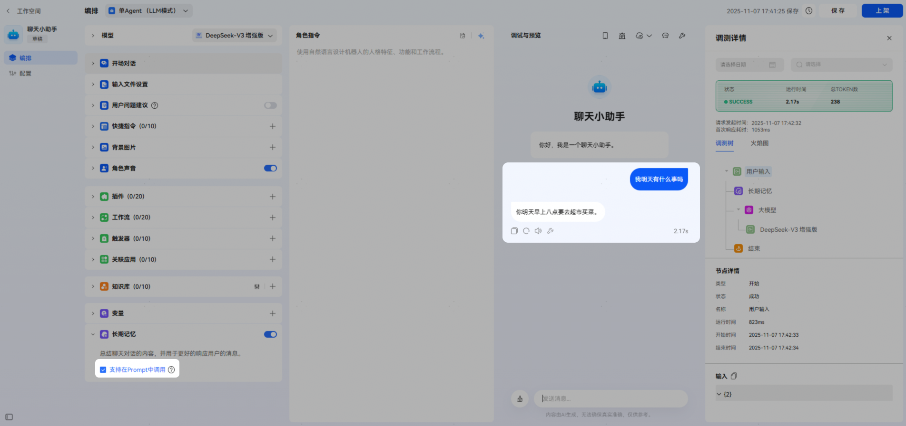
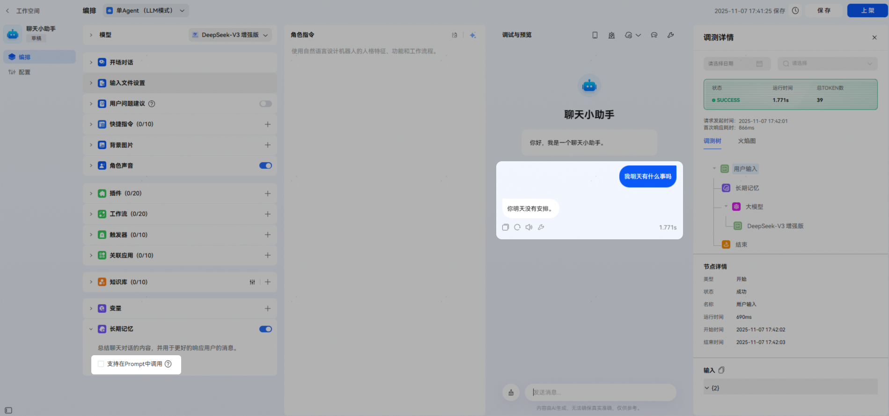
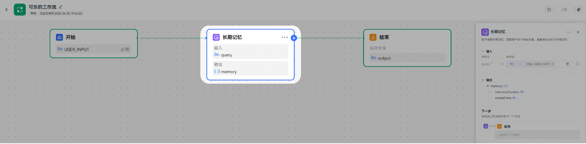
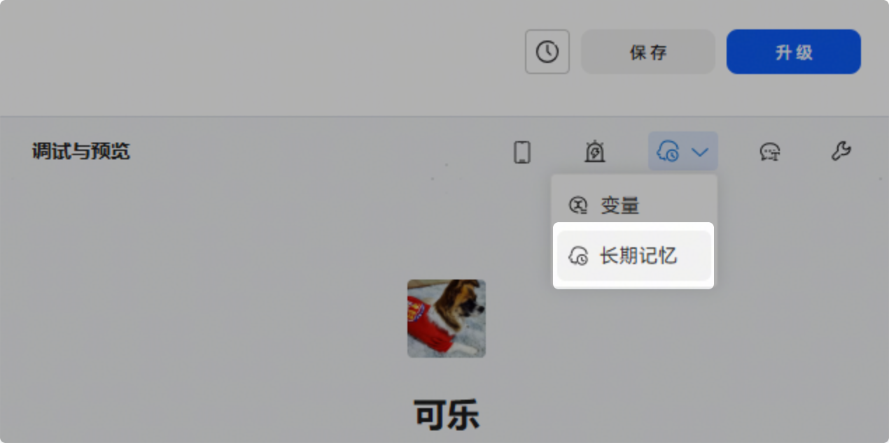

# 长期记忆

长期记忆可提取对话中的内容并保存，用于更好地响应用户的请求。

模型最大对话轮数是有限的，记忆相关的能力可以为模型提供能反复调用的长期记忆，让智能体的回复更加个性化。长期记忆功能模仿人类大脑形成对用户的个人记忆，基于这些记忆可以提供个性化回复，提升用户体验。

功能说明：在多轮对话中，智能体会根据对话的上下文生成更符合当下场景的回复。但上下文是相对短期的记忆，超过模型指定的轮数之后，对话效果经常会打折扣，尤其在和AI助理、情感陪伴类的智能体对话时，对话体验更依赖模型的长期记忆能力。这些智能体需要记录用户的个性化信息，通过不断的对话来理解、记录用户信息，以了解用户的偏好，在和用户对话时能召回相关的记忆，生成个性化的回复，更加拟人。

编排功能**【**对话设置**】**对于长期记忆的影响：上下文轮数可以决定长期记忆的抽取时机，例如在同一会话轮次中，上下文轮数设置为20，则长期记忆的抽取就会在第21轮对话后，从当前对话的前面20轮对话中提取需要存储的重要信息。

长期记忆默认**【**支持在Prompt中调用**】**，Prompt中无需显式调用，后台会自动拼接长期记忆内容。取消勾选后将不支持在Prompt中调用（仅能在Workflow中调用）。

**在Prompt中召回长期记忆**

如果开启长期记忆并勾选“支持在Prompt中调用”，用户可以在和智能体的对话中主动查询和用户输入相关的长期记忆，并在回复中使用：

如果未开启长期记忆，或未勾选“支持在Prompt中调用”，用户清空对话记录后，智能体不会在回复中使用长期记忆内容：

**在工作流中****使用长期记忆**

**查看当前取值或重置数据**

点击右上角【记忆】-【长期记忆】，也可以查看长期记忆内容。

