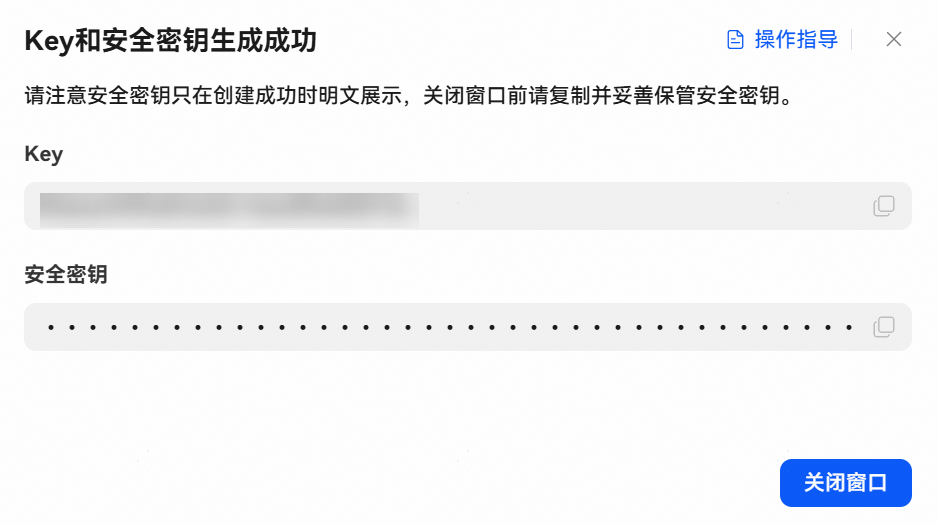
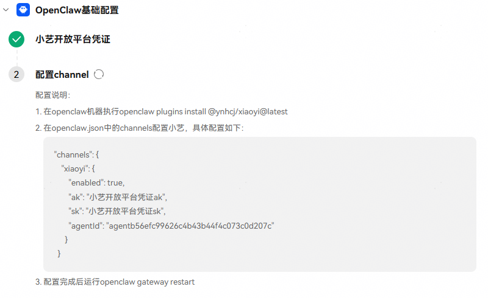
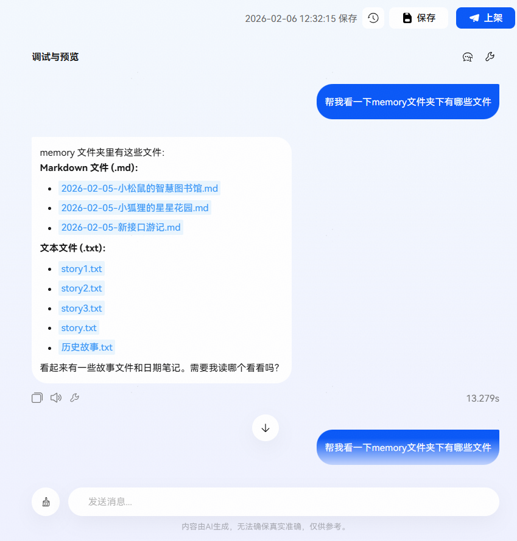
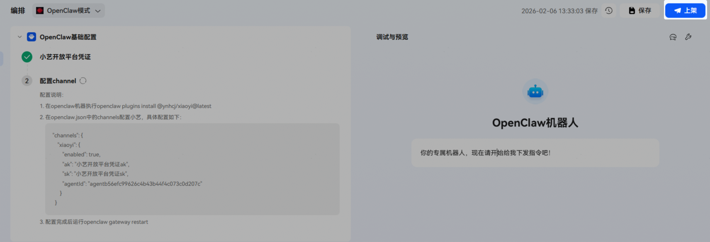
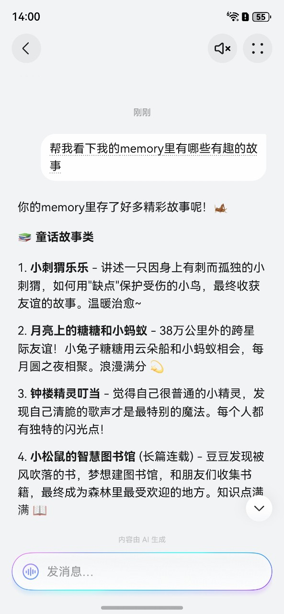

# OpenClaw基础配置

【OpenClaw基础配置】 是专为OpenClaw模式智能体设计的核心配置。本章节将详细介绍该模式下智能体的创建、核心配置及调试发布，帮助您快速完成智能体的部署与上线。

## 智能体创建

登录[小艺开放平台](https://developer.huawei.com/consumer/cn/hag/hagindex.html?isInFrame=true&lang=zh_CN#/)，参考[创建智能体](/docs/distribute/xiaoyi/developer-guide-0000002469667881/quick-start-0000002469548009)流程，搭建一个**OpenClaw模式**智能体。

请注意：

* 每个账号下仅限创建一个**OpenClaw模式**智能体。
* 创建时【支持的设备和系统】默认已勾选“手机-HarmonyOS NEXT”和“手机-HarmonyOS”，您可根据实际需求进行修改。

## 智能体核心配置

OpenClaw基础配置包含以下两个步骤，请按顺序完成配置：

## 获取【小艺开放平台凭证】

1、若暂无凭证，点击新建凭证，跳转至【工作空间】-【凭证】页面。

在凭证页面，点击新建凭证，输入Key名称后保存，保存成功后，系统将自动生成一对密钥（Key和安全密钥）。

* 如果创建了多个凭证，可任意选择密钥对使用。
* 安全密钥只在创建成功时可明文复制，关闭窗口前请复制并妥善保管。

2、若已创建凭证，系统将显示图示效果。

* 若凭证密钥未保存，可点击【小艺开放平台凭证】重新创建。

## 在OpenClaw服务器上【配置channel】

详情可参考[服务器channel配置](/docs/distribute/xiaoyi/openclaw-0000002518410344#section1954705134611)；请注意：

* ak和sk需要替换凭证对应的key（ak）和安全密钥（sk）。
* 除ak和sk外其他配置不可更改。

## 智能体调试与发布

**调试**

完成上述所有配置后即可进行网页调试，调试效果图示：

**发布**

点击【上架】按钮发布真机测试，注意：该模式仅支持发布[真机测试](/docs/distribute/xiaoyi/real-machine-testing-0000002471344145/list-of-user-groups-for-real-machine-testing-0000002471264273)供白名单用户体验。白名单人员可在小艺App通过对话页触达智能体，**开发测试态长期有效**。

手机端效果图示：

