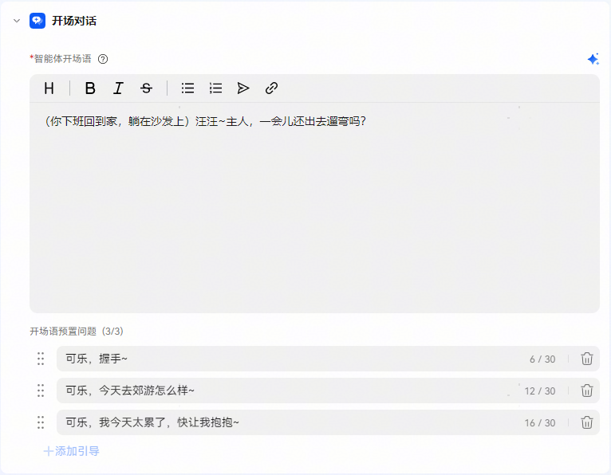

# 开场对话&预置问题

开场对话是用户首次进入智能体后自动展示的引导信息。它的主要目的是帮助用户理解智能体的用途或背景，以及如何与其进行交互。

【智能体开场语】：支持MarkDown输入，预置有一级、二级、三级标题、加粗、斜体、中划线、无序列表、有序列表、引用、链接等快捷操作，也可以手动输入MarkDown格式语法。

【开场语预置问题】：每个智能体最多可以设置三个预置问题，可以让用户通过点击快速体验智能体的能力。

