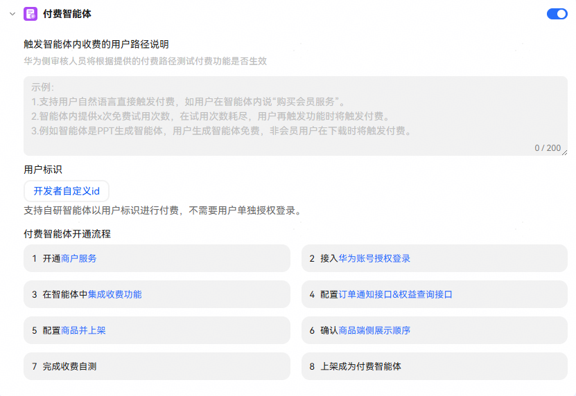

# 付费智能体

如果您的智能体内提供需要付费使用的数字商品或服务，如虚拟点卡、游戏道具、游戏货币、各种无时限和有时限的会员权益（视频/音乐会员）等，可以集成“智能体数字商品支付服务”实现用户付费和权益发放的商业闭环。

目前“智能体数字商品支付服务”在内测阶段，仅企业开发者可用，企业开发者在使用前请通过商务或提[华为开发者联盟工单](https://developer.huawei.com/consumer/cn/support/feedback/#/)联系小艺商业化运营人员申请开通。

详细实现可参考[智能体数字商品支付服务配置以及使用指导](https://developer.huawei.com/consumer/cn/doc/service/digital-product-payment-0000002537601305)。

