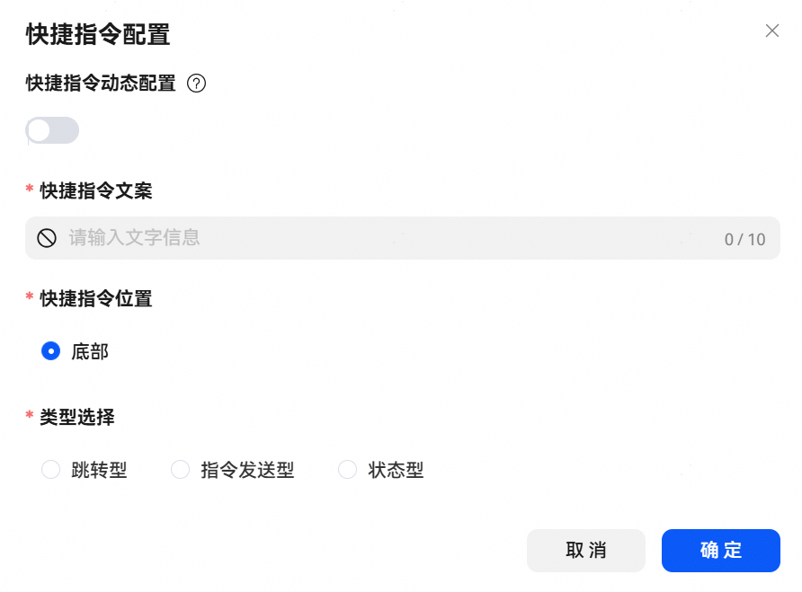
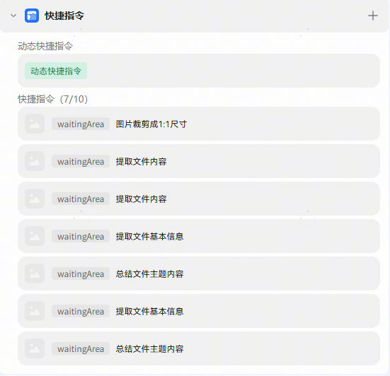
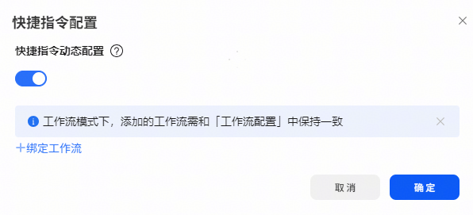
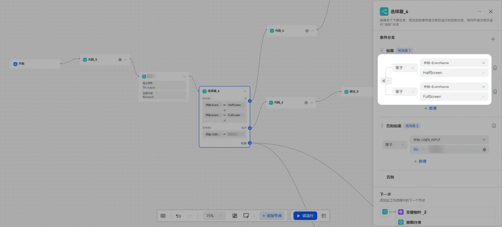

import MergeTable from '@site/src/components/MergeTable';

# 快捷指令

## 概述

【快捷指令】配置完成后，用户可以通过点击快捷指令快速发起预设对话。


每个智能体最多支持配置十个快捷指令和一个动态快捷指令（最后生成的快捷指令条数由动态计算得出）。开发者可以在调试与预览区域体验快捷指令的效果，部分功能不支持调试与预览区域预览，开发者可以通过真机测试体验（详见下各类型及说明表格）。



快捷指令支持拖动调整顺序，如果有设置动态快捷指令，则默认固定排在最前面，动态指令位置不可调整。如果动态指令不足5条，则按顺序取后面静态指令。



## 快捷指令设置

【快捷指令动态配置】：通过执行配置的工作流，在不同场景下动态生成不同的快捷指令。

【快捷指令文案】：用于展示的指令名称。

【指令图标】：配置后展示在快捷指令名称左侧，可选。

【快捷指令位置】：固定底部，配置完成后展示在输入框上方。

【类型选择】：支持类型及类型说明如下：

|  |  |  |
| --- | --- | --- |
| <strong>类型选择</strong> | | <strong>说明</strong> |
| <strong>跳转型</strong> | DEEP LINK | 点击该快捷指令可通过DeepLink跳转至配置的APP。  配置：  类型选择：跳转型。  快捷指令跳转：固定为DEEP LINK。  DEEP LINK设置：  应用名称：预跳转应用的应用名称。  应用包名：预跳转应用的应用包名。  DeepLink：预跳转链接。  app最小版本号：支持的APP最小版本号。  Action名称：意图名称，可选。  注意：该快捷指令暂不支持页面调试预览，需在手机端体验。 |
| <strong>指令发送型</strong> | 文档 | 点击文档快捷指令，支持上传并发送本地文档，并将配置的指令文本内容填充至对话待发送区。  配置：  类型选择：指令发送型。  关联对象：文件。  指令文本内容：点击该指令时自动填充的文本内容。 |
| 图片 | 点击图片快捷指令，支持上传并发送本地图片，并将配置的指令文本内容填充至对话待发送区。  配置：  类型选择：指令发送型。  关联对象：图片。  指令文本内容：点击该指令时自动填充的文本内容。 |
| 文本 | 点击文本快捷指令，支持直接将配置的指令文本内容发送至对话区。  配置：  类型选择：指令发送型。  关联对象：文本。  指令文本内容：点击该指令时自动填充的文本内容。 |
| 拍摄 | 点击拍摄快捷指令，支持用户拉起相机，拍照上传。  配置：  类型选择：指令发送型。  关联对象：拍摄。  拍摄镜头：前置/后置，默认后置。  拍照后是否需要进一步裁剪图片：默认否，配置为是时，拍摄后进入图片裁剪，裁剪完成后发送。  指令文本内容：点击该指令时自动填充的文本内容。  注意：该快捷指令暂不支持页面调试预览，需在手机端体验。 |
| 选择面板 | 支持开发者配置复杂的组件面板。  配置：  类型选择：指令发送型。  关联对象：选择面板。  选择面板-组件类型：  A：上传对象（支持图片、拍摄、文件），单一快捷指令内最大配置1个。  B：图片模板，单一快捷指令内最多配置1个。  C：平铺选择器（支持单选、多选），单一快捷指令内最大配置2个。  D：下拉选择器，单一快捷指令内最大配置2个。  指令文本内容：配置指令文本内容后，系统会自动组装"指令文本内容"+"各组件信息"生成query指令, 格式如下: "指令文本内容", \{$\{组件1名称\}是$\{用户选择的组件值1\},…\}。  注意：该快捷指令暂不支持页面调试预览，需在手机端体验。 |
| <strong>状态型</strong> | - | 【状态型】智能体面向用户提供某一功能，用户可打开或者关闭该功能。  配置：  类型选择：状态型。  状态值：指令的状态值，此处配置内容与关联变量的默认值不能相同。  是否默认选中：默认选中时高亮显示该状态指令，点击快捷指令可切换选中状态。指令在选中状态下，用户query携带该指令的状态值。  关联变量：限制一个快捷指令只能关联一个变量，默认值为空的变量不能被关联。 |

## 动态快捷指令

支持通过执行配置的工作流，在不同场景下动态生成不同的快捷指令。注意：（1）工作流模式下，此配置应绑定智能体配置的主工作流，关联其他工作流无法触发动态快捷指令流程。(2)工作流开始节点需包含系统默认参数EVENT\_INPUT字段；工作流结束节点需包含dynamicDirective、eventInfo字段。



EVENT\_INPUT：动态快捷指令执行工作流的输入。

示例：

```
{
            "payload": {
                "timeZone": "GMT+08:00", //动态快捷指令场景不使用。
                "time": "2025-11-01 15:31:45" // 动态快捷指令场景不使用。
            },
            "header": {
                "name": "HalfScreen",// 事件名称，后续节点可通过引用开始节点EVENT_INPUT.EventName时获取此值使用。
                "namespace": "System"
            }
        }
```

dynamicDirective【Array``<Object>``】：给端侧展示的动态快捷指令信息

示例：

```
"dynamicDirective":
[ // 给端侧展示的动态快捷指令信息
	{
		"content": "总结摘要", // 显示内容
		"query": "帮我进行总结摘要" // 发给智能体的请求
	},
	{
		"content": "一起跳舞", // 显示内容
		"query": "跟我一起来跳舞" // 发给智能体的请求
	}
]
```

eventInfo【Object】：事件信息，用于判断是否生成快捷指令

示例：

```
"eventInfo":{
"directiveName": "QuickChips",  // 固定值
"eventName": "HalfScreen"  // 事件名
}
```

支持eventName及eventName说明如下

|  |  |  |
| --- | --- | --- |
| <strong>事件选择</strong> | | <strong>说明</strong> |
| 半屏态 | HalfScreen | 填写eventName的值为HalfScreen时，在小艺处于半屏态状态下触发该动态快捷指令的显示。 |
| 全屏态 | FullScreen | 填写eventName的值为FullScreen时，在小艺处于全屏态状态下触发该动态快捷指令的显示。 |

## FAQ

问题1：动态快捷指令是如何使用的？

回答：前提：智能体编排中配置了动态快捷指令并添加执行工作流，快捷指令执行工作流按规范输出dynamicDirective、eventInfo，智能体已发布到真机上。

手机端触发流程：智能体处于半屏态或全屏态时会触发HalfScreen（半屏态）或FullScreen（全屏态）事件，触发后将事件名传给待执行工作流的EVENT\_INPUT.EventName，工作流执行后输出dynamicDirective、eventInfo，端接收到这是触发eventInfo.eventName事件输出的动态快捷指令，然后就会用快捷指令的样式展示该指令，指令显示内容为：dynamicDirective.content，点击快捷指令时将给智能体发送内容为：dynamicDirective.query的消息。

问题2：工作流模式的智能体，工作流配置中添加的工作流和动态快捷指令绑定的是同一个工作流，如何同时实现对话逻辑和快捷指令功能？

回答：工作流编排时，可以配合选择器节点使用：当触发动态快捷指令的EventName值不为空或为对应事件名时走动态快捷指令功能流，否则走对话逻辑流。

