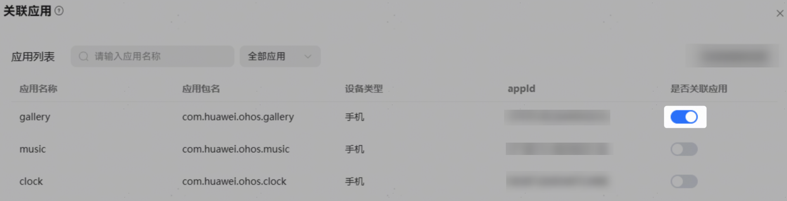
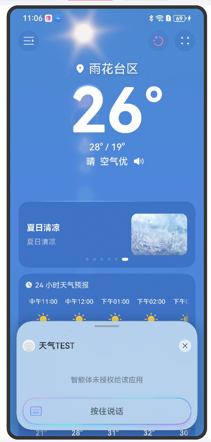

# 关联应用

## 功能介绍及效果示例

关联应用是指智能体与应用关联，支持在应用中一键呼出智能体。

前提条件：

1、开发者已在AppGallery Connect创建了鸿蒙应用。

2、已为鸿蒙应用配置签名：使用真机设备调试前需要对HAP进行签名，否则无法调试。

3、开发者在小艺开放平台已创建智能体，并关联应用。

4、应用APP端已集成AgentKit能力。

效果示例：

## 开发步骤

**1、注册鸿蒙应用：**

AppGallery创建鸿蒙应用请参考：[应用开发准备](https://developer.huawei.com/consumer/cn/doc/harmonyos-guides/application-dev-overview)、[创建鸿蒙应用指导](https://developer.huawei.com/consumer/cn/doc/app/agc-help-create-app-0000002247955506)。

**2、配置签名**

使用手动签名方式对HAP进行签名，详情请参考：[配置签名](https://developer.huawei.com/consumer/cn/doc/harmonyos-guides/application-dev-overview#section42841246144813)；如果未签名无法真机调试。

**3、创建智能体并关联应用****：**

在智能体编排页点击关联应用右侧【添加】按钮，将应用列表中目标应用的“是否关联应用”开关打开（仅支持选择此账号在AppGallery Connect中已上架的应用）；此处配置限制了当前智能体允许在哪些应用APP中被拉起。

**4、应用APP集成AgentKit能力****：**

AgentKit能力实现请参考：[通过Function组件拉起智能体指南](https://developer.huawei.com/consumer/cn/doc/harmonyos-guides/harmony-agent-framework-kit-guide)、[通过Function组件拉起智能体API参考](https://developer.huawei.com/consumer/cn/doc/harmonyos-references/harmony-agent-framework-api)。

## 调试及发布

开发工作完成后，开发者可将智能体发布真机测试进行能力调试。发布真机测试请参考[真机测试](https://developer.huawei.com/consumer/cn/doc/service/list-of-user-groups-for-real-machine-testing-0000002471264273)章节。调试完成后即可发布智能体。

调试步骤：

1、调试设备（手机）已登录华为账号，并且处于联网状态。

2、智能体已发真机测试到调试设备。

3、打开应用APP，点击“组件图标”，即可呼出半屏态智能体进行使用。

调试效果：

## FAQ

问题1：应用中点击“组件图标”时，显示“智能体未授权给该应用”？

答：可能原因：1）小艺开放平台未配置目标智能体与目标应用的关联关系，请在平台配置后重新发布智能体调试。2）智能体关联应用中配置的应用名称、应用包名、appid与目标应用实际值不一致，请修改后重试。3）对HAP进行签名时使用了自动签名方式，在此方式下，应用运行时的appid是随机生成的，跟智能体关联应用中配置的appid不一致，导致授权异常；请修改为手动签名方式后重试。

问题2：智能体已发真机测试到调试手机或智能体已上架，但目标应用中无“组件图标”？

答：可能原因：1）应用APP未集成AgentKit能力，请集成后重新调试；2）手机的ROM版本或者API SDK版本低；ROM版本需6.0.0及以上（可通过手机设置-关于本机-软件版本查看），对应API SDK 需20及以上（可通过手机设置-关于本机-API版本查看）。

问题3：目标智能体上架发布后，应用中仍呼出“开发中”（真机测试）智能体？

答：智能体已发布，但对于真机白名单中的设备，会优先拉起“开发中”（真机测试）智能体；可通过删除真机白名单配置或取消真机发布解决。

问题4：目标智能体发布真机测试后，小艺APP里有“开发中”（真机测试）智能体，但应用中点击“组件图标”呼不出来“开发中”（真机测试）智能体？

答：小艺APP版本号低，需11.3.8.300及以上版本（通过小艺-头像-设置-关于 查看小艺版本号）。
