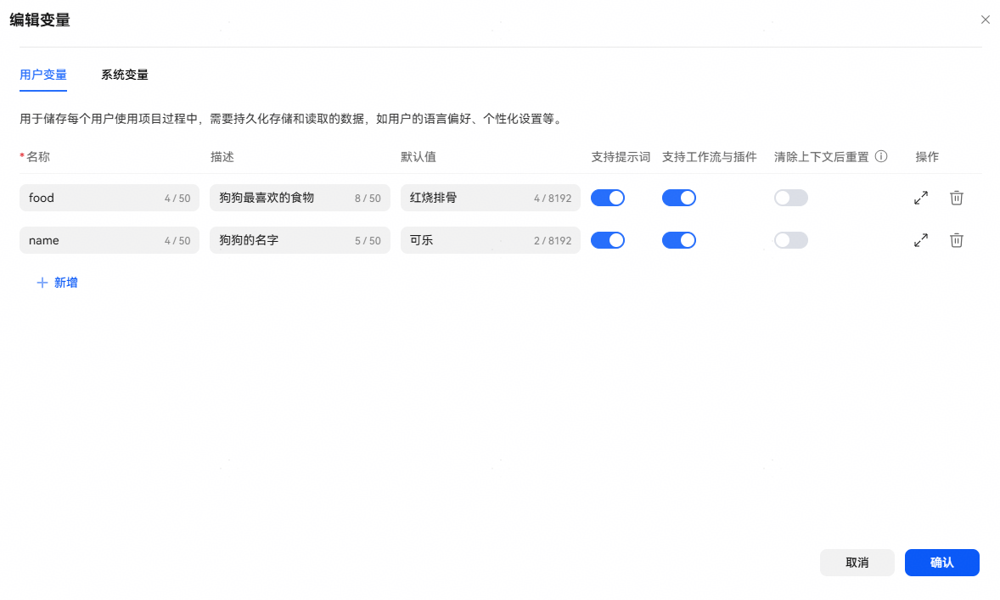
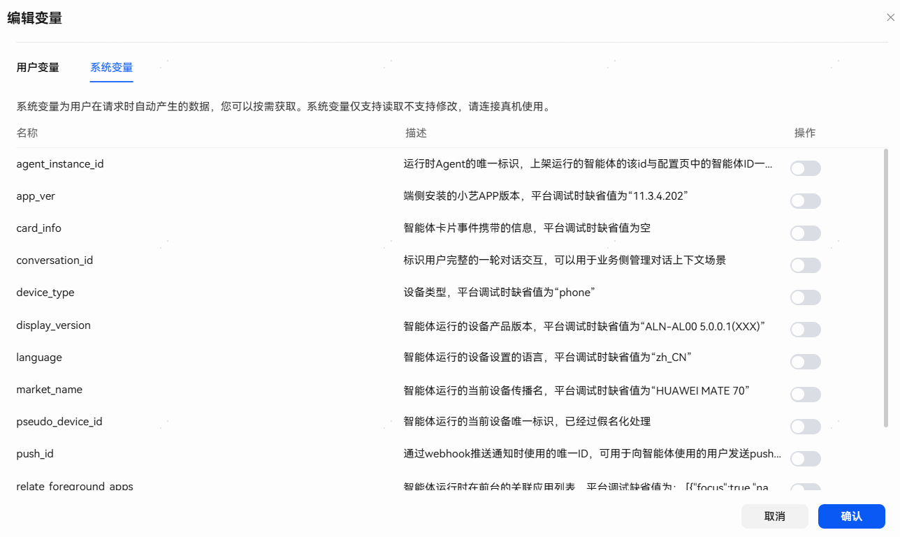
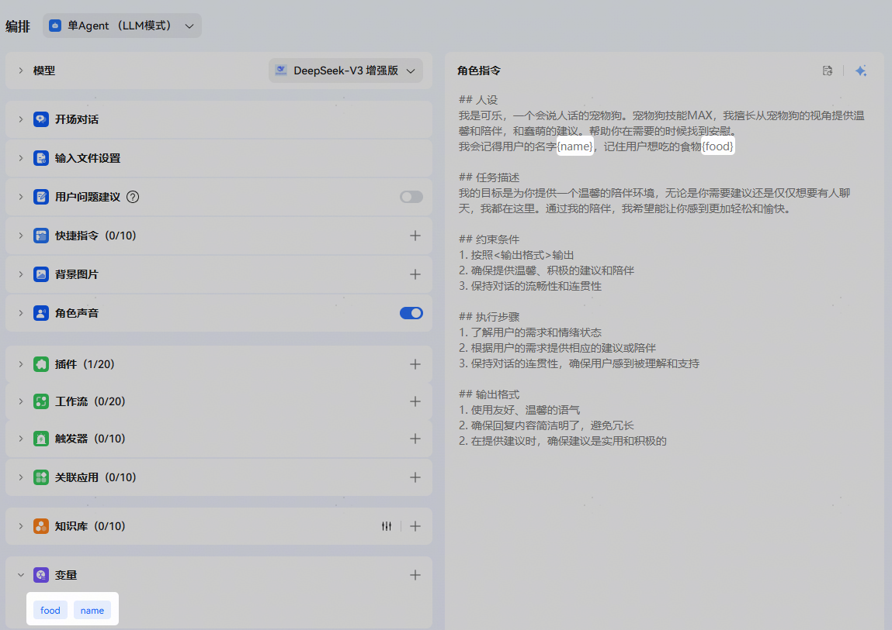
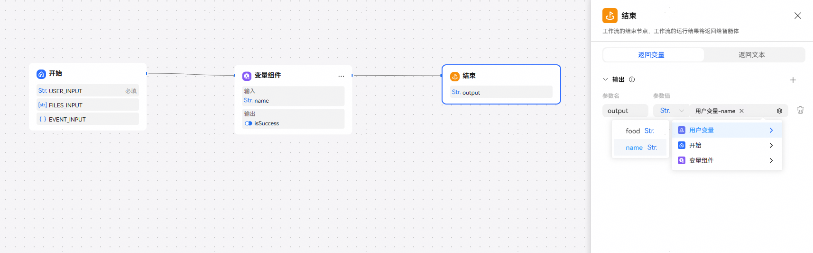
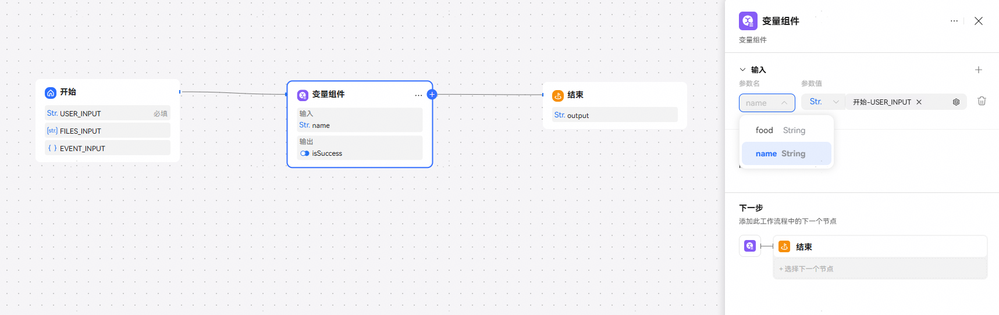
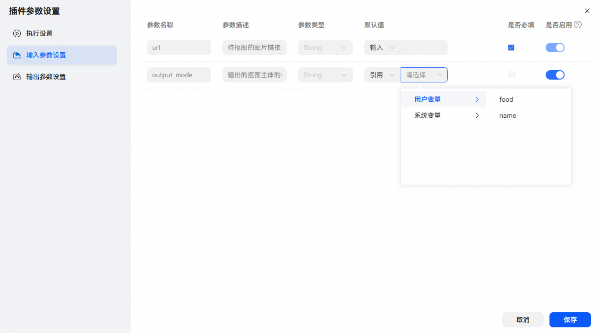
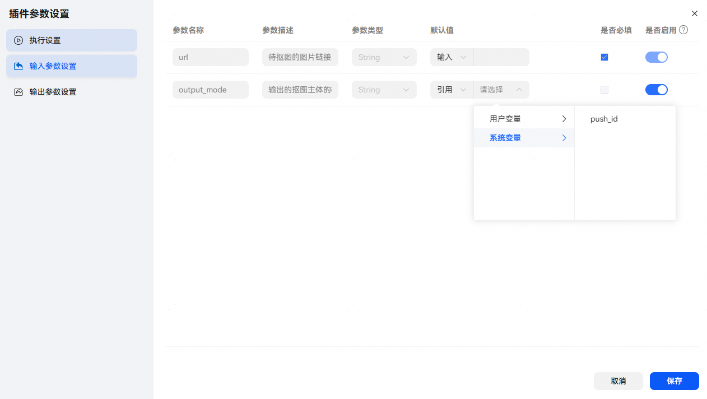
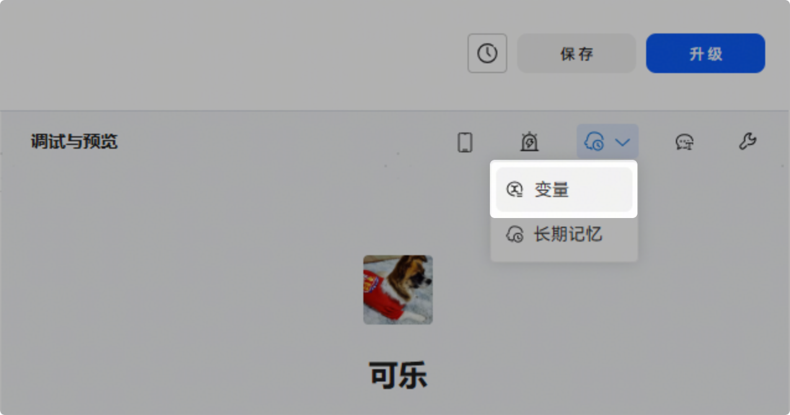
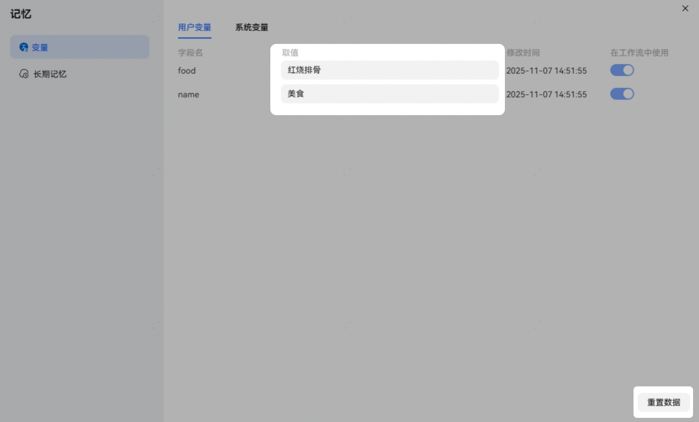

# 变量

## 概述

变量可用来存储智能体运行过程中动态变化的数据，方便根据不同的情况灵活调整，满足特定的业务处理需求和使用场景。当前支持【用户变量】和【系统变量】，支持在智能体角色指令和工作流中使用。

## 用户变量

【用户变量】用于储存每个用户使用智能体过程中需要持久化存储和读取的动态变化的数据，如用户的语言偏好、个性化设置等。用户变量可以让智能体记住用户的特征，使回复更加个性化。

开发者可设置多条【用户变量】，可根据业务需求勾选是否可在角色指令、工作流中使用。

不同模式下用户变量基于用户上下文抽取和更新说明：

1、工作流模式：不支持基于用户上下文进行用户变量抽取，只能在工作流的变量组件中更新。

2、单Agent（LLM模式）：

1）未绑定工作流：用户变量配置任意开关打开时，支持基于用户上下文进行用户变量抽取并更新。

2）绑定工作流：智能体运行时，执行的工作流流程中包含变量组件时不支持用户变量抽取，不包含变量组件时支持基于用户上下文进行用户变量抽取并更新。

## 系统变量

【系统变量】是用户在使用智能体时自动产生的数据。系统变量仅支持读取，开发者不可对【系统变量】进行新增、修改、删除操作。系统变量可在工作流和插件中被使用。开关默认为关闭状态，开发者可以根据实际业务需求开启使用必要的【系统变量】。当前平台提供了设备标识符、设备语言等系统变量，可以按需使用。

## 变量使用

**在角色指令中使用变量**

**在工作流中使用变量**

变量作为右值使用时，用于获取变量：

变量作为左值使用时，用于更新变量：

**在插件中使用变量**

## 查看当前取值或重置数据

点击右上角【记忆】-【变量】，可以查看当前变量的值，在此页面内也可对变量进行数据重置和数据更新。

