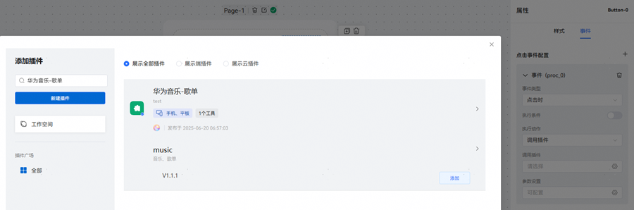
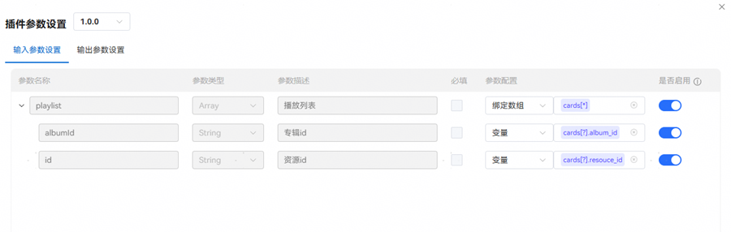
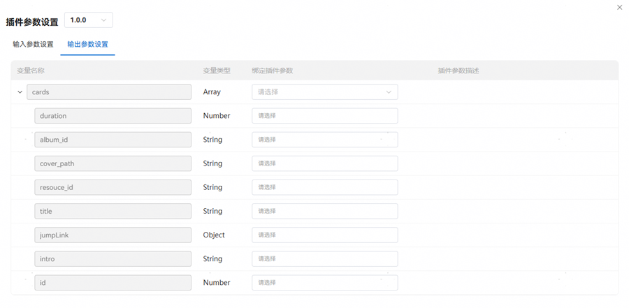

# 调用插件

绑定插件事件中可选择"更新卡片数据"和"回复消息"两个动作之一：

选择"更新卡片数据"动作时，调用插件后将更新卡片中使用的数据，此后数据将自动进行局部刷新；

"回复消息"动作仅限在小艺主对话中使用，调用插件后将会发送消息，消息内容可选择固定文本或选中的变量。

插件分为云插件和端插件两类，可以在插件广场选择已上架插件，也可根据需求新建自定义插件，构建完成后可在工作空间中看到。

添加插件后，根据需求配置输入参数、输出参数：

输入参数：把变量的值和插件输入参数做对应，传给插件。

输出参数：把插件输出参数与卡片变量做对应，接收到插件返回的值时用来刷新卡片。

