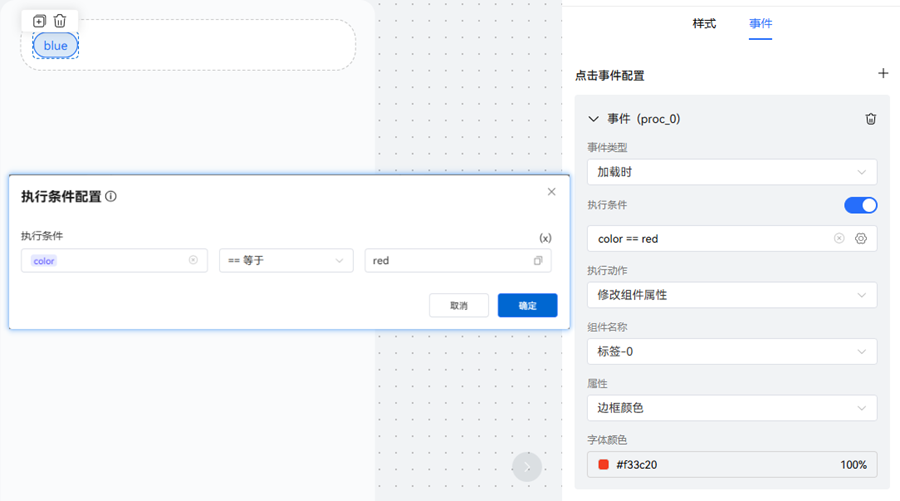
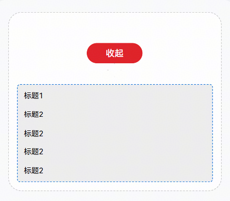
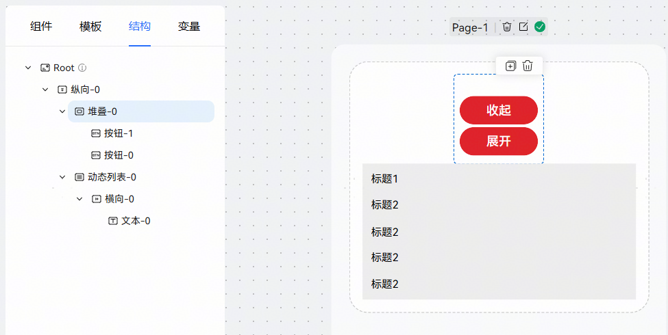
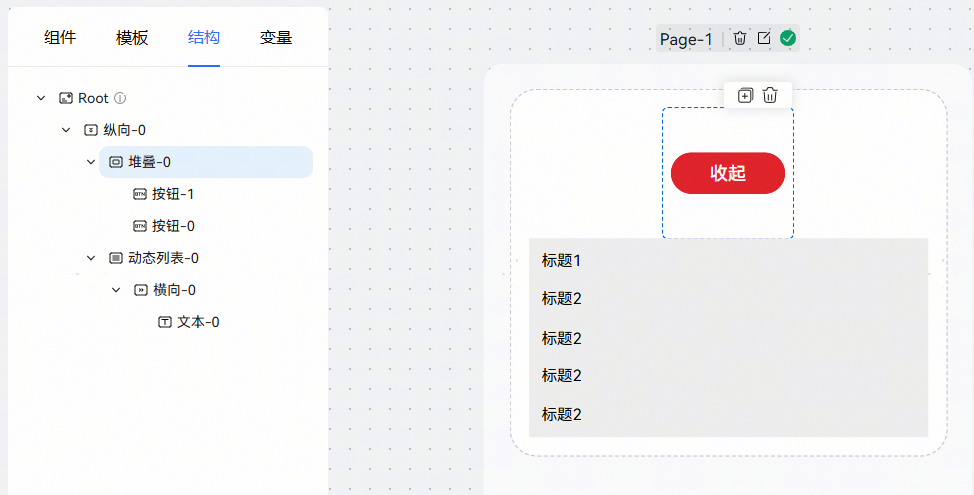
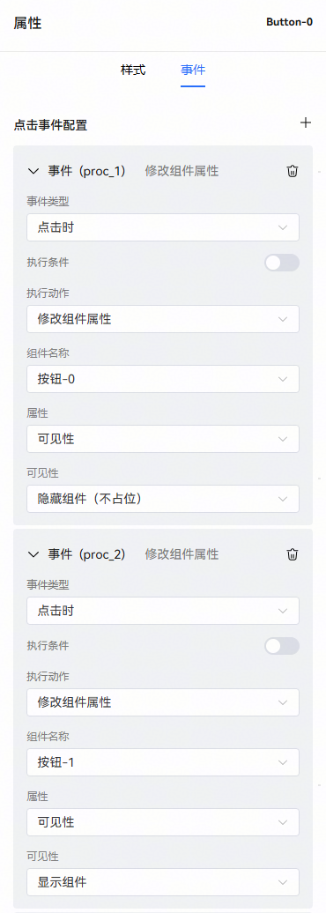
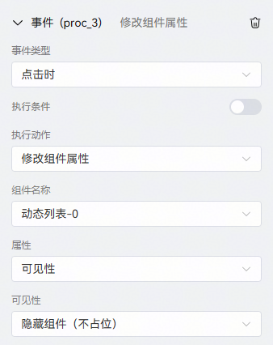
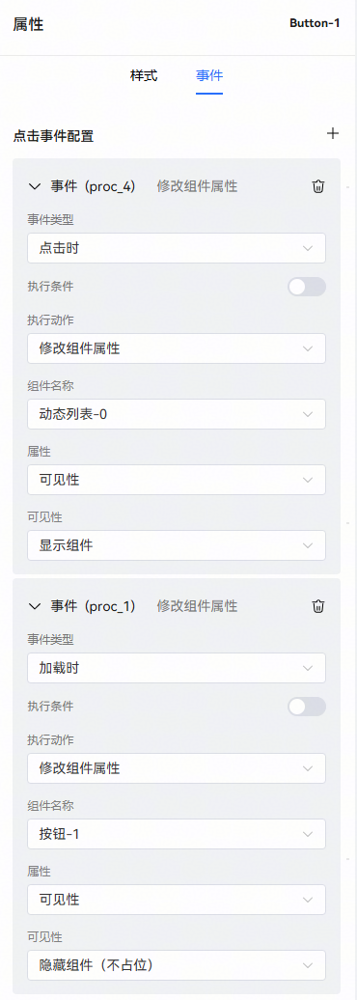

# 修改组件属性

提供以下组件，可修改其部分属性

布局组件：横向、纵向、动态列表、堆叠。

基础组件：图片、文本、标签、图标、按钮、开关。

例子1：新增执行条件功能，当传入的数据为“red”时，标签的字体颜色就会变为设置的颜色“#f33c20”。

例子2：控制列表的显示与隐藏

通过点击红色按钮，控制列表属性的显示与隐藏。

步骤：

1、在堆叠组件里放置两个按钮，使其重叠在一起。

2、给“收起”按钮（按钮-0）配置点击事件。

事件链：点击后把“收起”按钮隐藏、把“展开”按钮显示、把列表组件隐藏。

3、给“展开”按钮（按钮-1）配置事件

事件链：点击后把“展开”按钮隐藏、把“收起”按钮显示、把列表组件显示。再给“展开”按钮配置加载时事件，卡片加载时把“展开”按钮隐藏。

这样就能实现点击按钮，控制列表显示与隐藏。
