# 跳转

跳转是指点击卡片跳转至对应的应用、元服务或web页面等操作，可以将数组或对象中的某个属性设置为跳转链接类型，跳转只能绑定跳转变量。

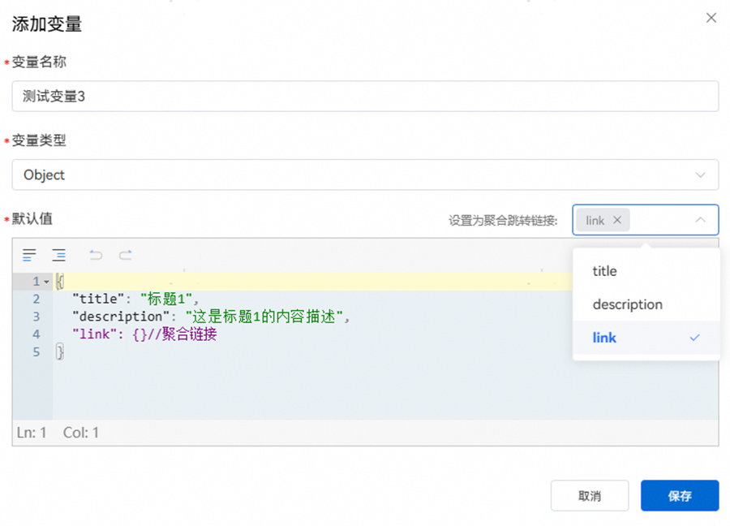

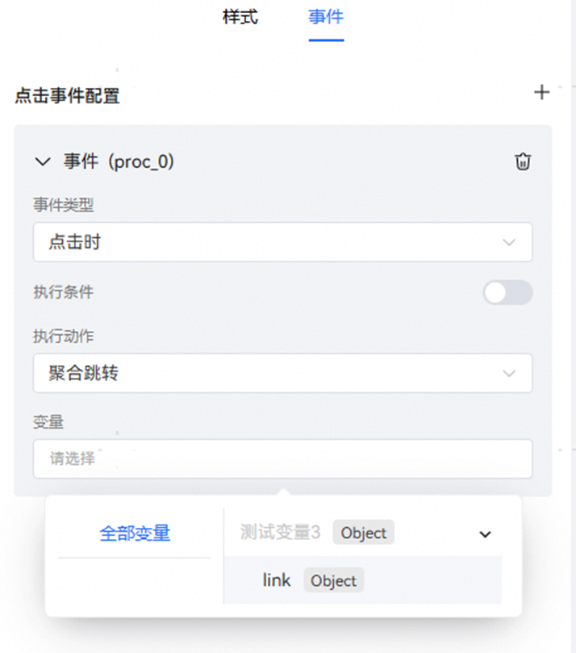

## 跳转变量介绍

目前，跳转变量分为6种类型，分别为executeIntentReserves（多类型跳转），executeIntent（意图跳转），faLink（元服务跳转），appLink，deepLink，webURL（网页跳转）。

跳转变量之间有执行优先级之分，从高到低为：executeIntentReserves > executeIntent > faLink > appLink > deepLink > webURL。若在配置跳转变量时，同时配置了多种跳转变量，则在执行跳转时，只会执行优先级最高的跳转变量对应的跳转事件。

跳转变量的数据结构示例：

```
{
   "webURL": "string",
   "deepLink": {
     "url": "string",
     "appName": "string",
     "appPackage": "string",
     "minVersion": 0,
     "action": "string"
   },
  "appLink": {
    "longUrl": "string",
    "shortUrl": "string"
  },
   "faLink": {
     "packageName": "string",
     "serviceName": "string",
     "moduleName": "string",
     "faParams": "JSON"
   },
   "executeIntent": {
     "bundleName": "string",
     "moduleName": "string",
     "abilityName": "string",
     "intentName": "string",
     "executeMode": "string",
     "intentParam": {}
   },
   "executeIntentReserves": [
     {
       "bundleName": "string",
       "moduleName": "string",
       "abilityName": "string",
       "intentName": "string",
       "executeMode": "string",
       "intentParam": {}
     }
   ]
 }
```

注意：所有跳转变量都是跳转变量的元素，单个变量不被视作完整的跳转变量，无法触发跳转。

不同类型的跳转变量有不同的功能和数据格式：

**webURL**：

webURL类型用于触发H5页面跳转，该类型包含1个参数：

webURL：预期变量类型为string，表示跳转的目标URL链接；

**deepLink**：

deepLink类型用于触发应用跳转，该类型包含5个参数：

url：预期变量类型为string，表示app的deeplink地址；

appName：预期变量类型为string，表示app名称；

appPackage：预期变量类型为string，表示app包名；

minVersion：预期变量类型为number，表示支持的app的最小版本号versionCode；

action：预期变量类型为string，表示app跳转动作。

**appLink**：

appLink类型用于触发应用跳转，该类型包含2个参数：

longUrl：预期变量类型为string，表示标准的https协议的Applink地址；

shortUrl：预期变量类型为string，表示标准的https协议的Applink地址。

注意：分屏跳转效果只能通过deepLink触发（appLink不支持该功能）。

**faLink**：

faLink类型用于触发元服务跳转及应用跳转，该类型包含4个参数：

packageName：预期变量类型为string，表示FA包名；

serviceName：预期变量类型为string，表示FA服务名；

moduleName：预期变量类型为string，表示FA组件名；

faParams：预期变量类型为string，表示FA的跳转参数，其内容应当为json结构，端侧调用FA时，应将该key的值传给FA。

**executeIntent**：

executeIntent类型用于触发意图跳转，该类型包含7个参数：

bundleName：预期变量类型为string，表示包名；

moduleName：预期变量类型为string，表示模块名；

abilityName：预期变量类型为string，表示服务名；

executeMode：预期变量类型为string，表示执行模式；

intentName：预期变量类型为string，表示意图名；

intentParam：预期变量类型为object，表示意图参数；

achieveType：预期变量类型为string，表示意图实现方式，关键字值应当为Intent和AtomicServiceTagMapping二者之一，缺省值为Intent，前者表示意图标准方式，后者表示元服务打标。

**executeIntentReserves：**

executeIntentReserves类型格式上为一个数组，由多个符合executeIntent变量格式的object组成，分别代表意图跳转，元服务跳转及元服务打标跳转。

通过该类型触发跳转时，将按照意图跳转>元服务跳转>元服务打标跳转的优先级顺序触发跳转。

三种意图类型的区别在于必填字段不同：

意图跳转必填：bundleName，abilityName，moduleName，executeMode，intentName，achieveType为Intent；

元服务跳转必填：bundleName，abilityName，moduleName，achieveType为Intent；

元服务跳转打标必填：bundleName，achieveType为AtomicServiceTagMapping。

## 演示案例

本案例将以点击卡片执行deepLink跳APP（华为音乐）为例，演示配置卡片跳转的全流程。

## 1、创建卡片并绑定跳转事件

拖拽生成需要的卡片结构，并在预期应当触发跳转的组件上绑定跳转事件。

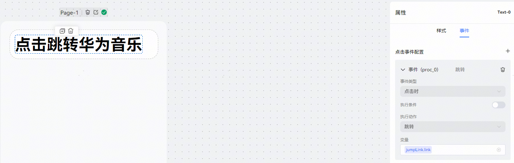

## 2、传输所需数据

为确保跳转正常运行，应通过工作流或其他方式向卡片中传输预期的跳转数据。

本演示案例中，使用工作流通过代码节点输出deepLink跳转链接传输跳转数据。若要详细了解工作流使用方法，请参考[开发工作流](https://developer.huawei.com/consumer/cn/doc/service/development-workflow-0000002435989628)章节。

工作流编排：

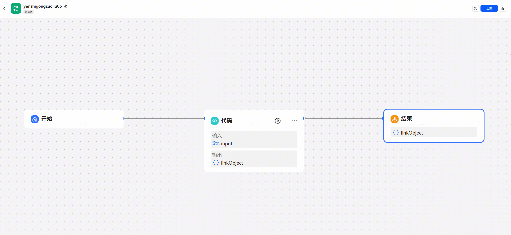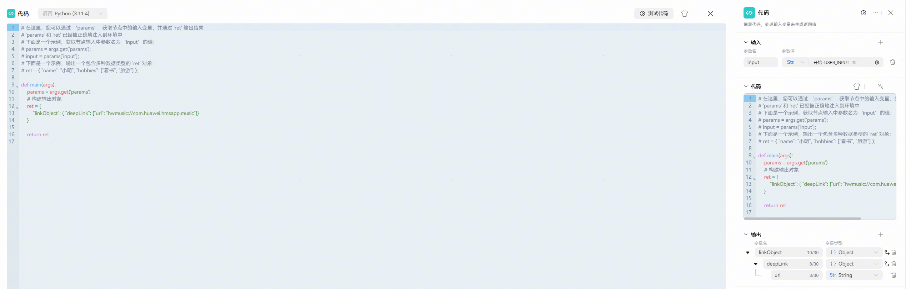

编排完成后，点击试运行，试运行完成后，上架此工作流。

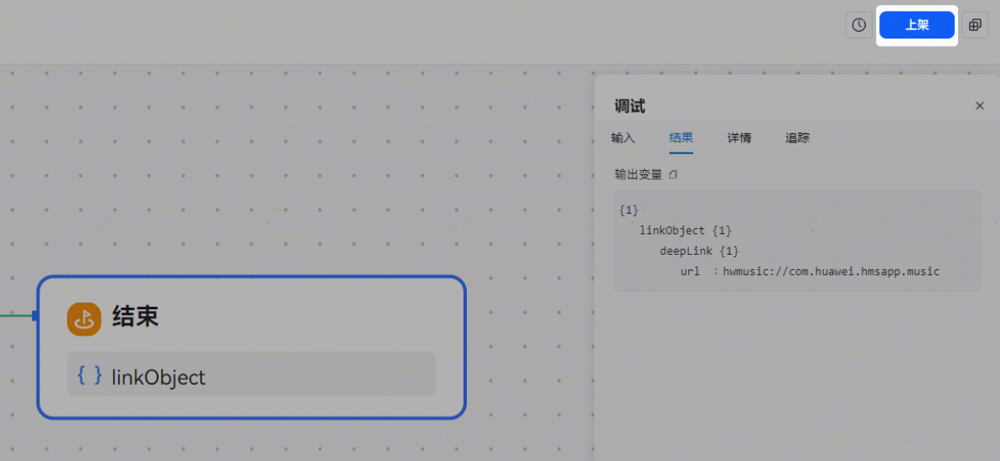

## 3、绑定回复卡片

要在对话中触发出卡，需要在智能体中绑定卡片。本案例中以智能体添加工作流触发出卡为例演示全流程。

创建智能体后，添加步骤2中工作流后，给工作流结束节点绑定卡片。

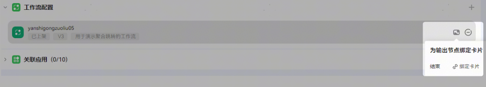

在绑定卡片页面中，添加步骤1创建的卡片，在右侧绑定需要使用的变量。

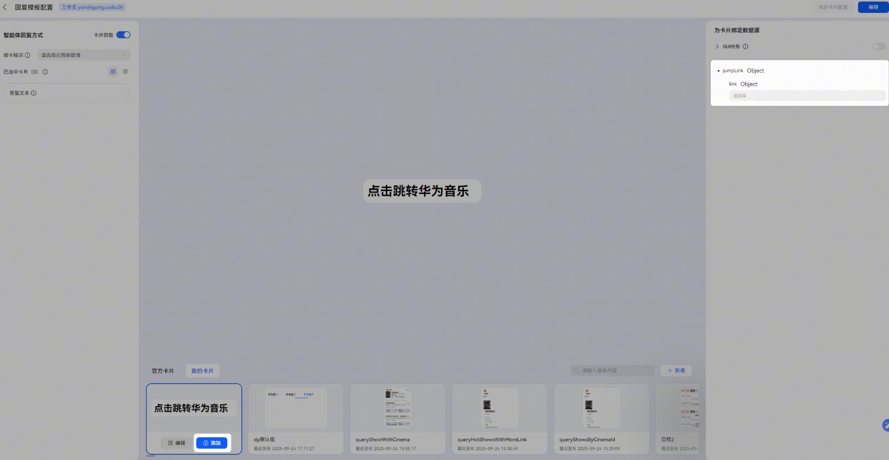

完成后，点击保存，返回智能体编辑页面，发布该智能体；

若要使用插件回复出卡，则可通过插件一栏的加号添加插件，后续步骤与工作流回复绑卡类似。

## 4、手机端查看效果

在小艺智能体搜索上述步骤发布的智能体，触发出卡并查看跳转效果。

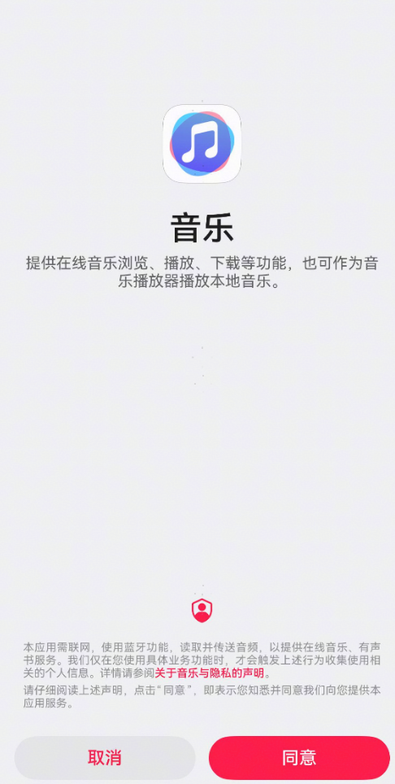

## 跳转预览

若只需预览聚合跳转事件绑定是否正确，可考虑直接配置Object(跳转)变量并将其绑定至点击事件。具体操作如下。

移动到变量页面，点击添加变量，选择变量类型为Object(跳转)。

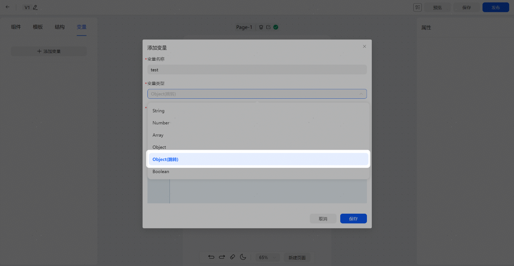

在下方的跳转类型一栏中选择至少一项需要使用的跳转类型。注意：选择多种类型时跳转的触发顺序仍然满足前文所述的优先级顺序。

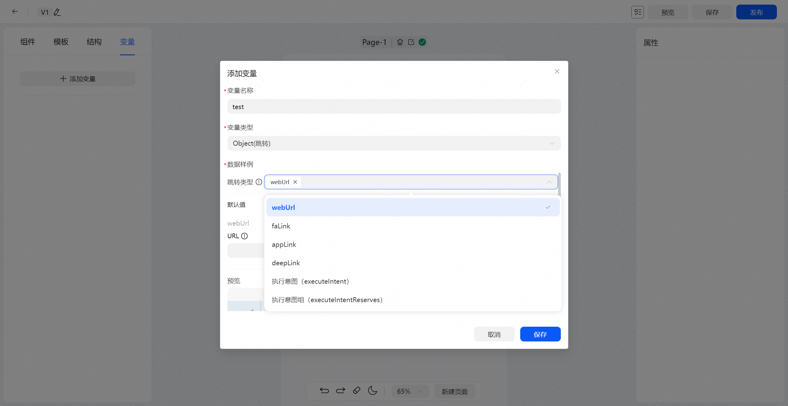

每选中一个类型，便会在下方默认值处弹出类型对应的字段的输入框。鼠标悬浮在字段名称旁的感叹号符号上即可查看字段作用说明。

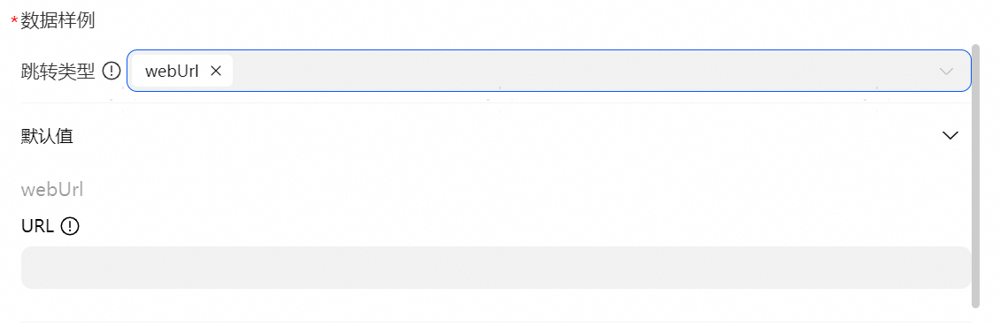

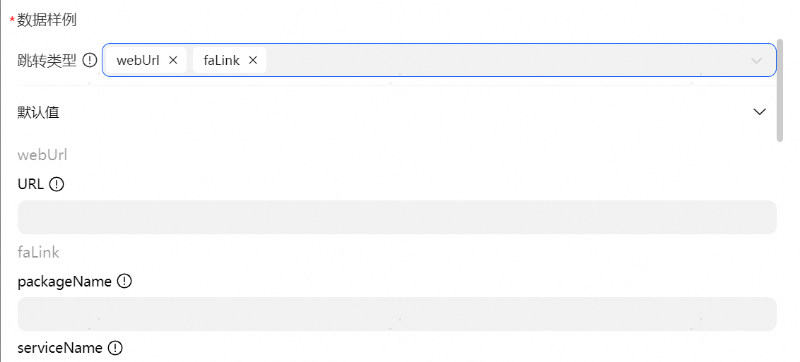

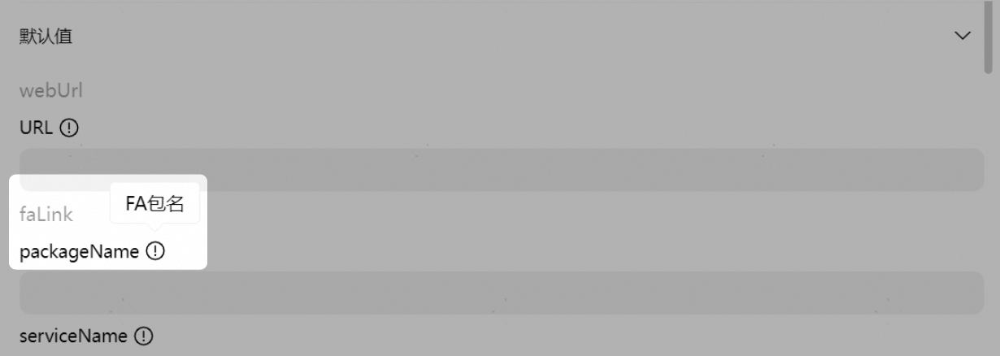

在输入框中输入的内容将实时显示在弹窗底部的预览中。点击预览右上角的复制图标可将当前预览中的内容复制到剪贴板。

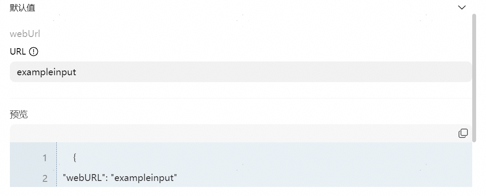

所有字段编辑完成后，点击保存即可。

与前文所述类似，为组件绑定跳转事件，跳转变量使用之前配置完成的Object(跳转)变量。事件配置完成后点击界面上方的保存。

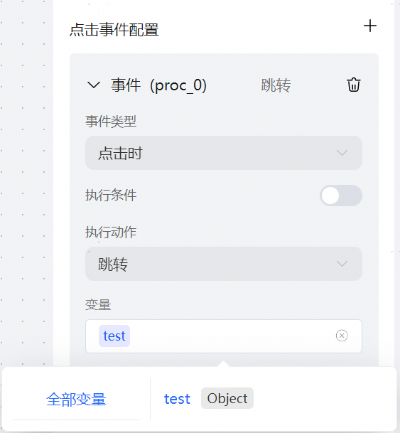

保存后，点击界面上方的预览按钮，选择设备侧预览，扫码即可查看当前卡片配置效果和跳转事件的跳转效果。
