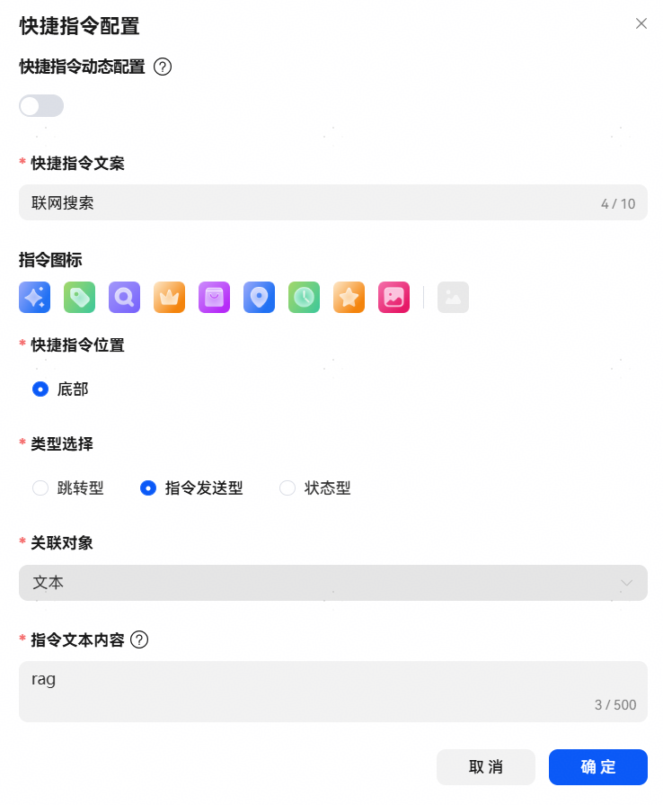
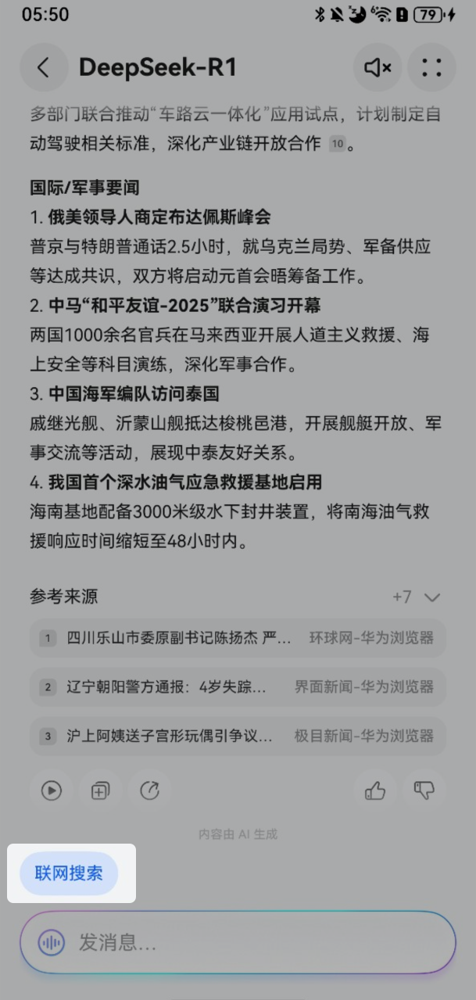

import MergeTable from '@site/src/components/MergeTable';

# 底部快捷指令说明

Agent内底部快捷指令用户点击事件上报，需要先在小艺开放平台智能体内配置对应快捷指令：



Agent Client请求Agent Server侧的data数据结构定义：

```
"userInputInfo": {
      "statusInfo": [{
   "isSelected": true,
   "statusKey": "Agent开发平台定义的快捷指令的Key",
   "statusValue": "Agent开发平台定义的快捷指令的Value，如联网搜索"
      }]
}
```

UserInputInfo参数说明：

| <strong>字段名称</strong> |  | 类型 | 是否必填 | 字段描述 |
| --- | --- | --- | --- | --- |
| kind | - | string | 是 | 字段类型，此处固定为“data”。 |
| data | - | object | 是 | 数据类型为data类型的结构体定义。 |
| userInputInfo | string | 否 | 仅在用户点击Agent内快捷指令时必选。 |

底部快捷指令手机端展示效果：

