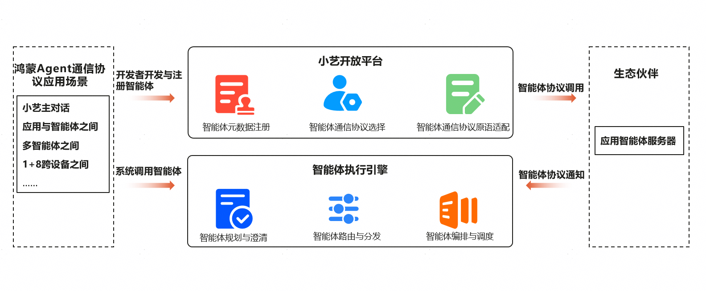
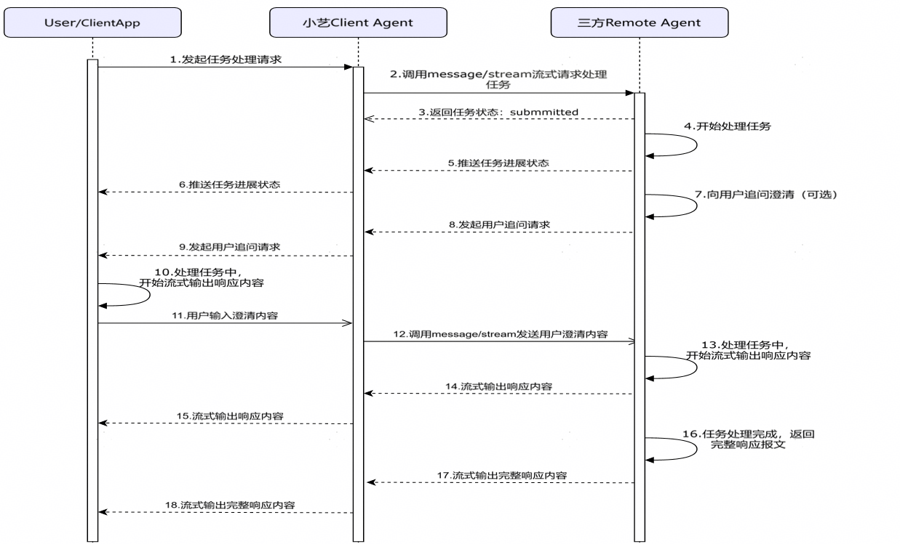
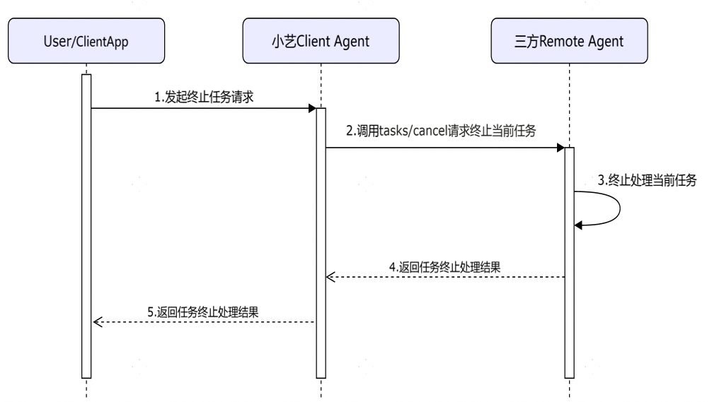
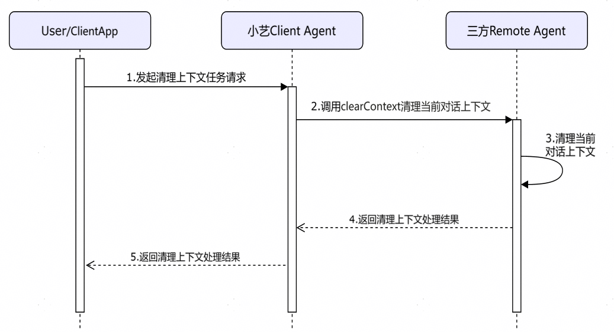
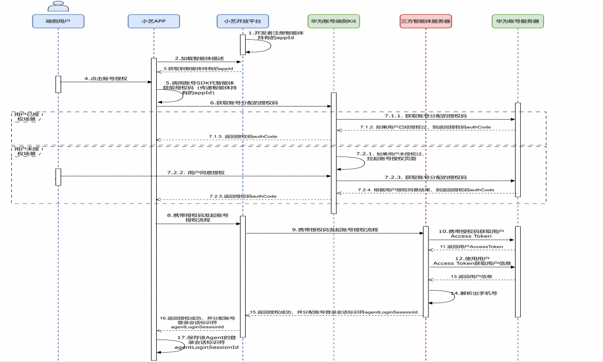

# 鸿蒙Agent通信协议技术规范总览

**鸿蒙****Agent****通信协议使能三方智能体处理任务请求时序图**

小艺Client Agent在收到三方Agent处理请求后，会使用message/streamRPC方法请求三方Remote Agent，三方Remote Agent异步处理任务请求，并通过SSE协议返回：

1）给用户侧推送任务处理进展状态；

2）可选地，向用户发起追问澄清请求；

3）在首Token生成后，向小艺Client Agent流式输出响应内容；

4）在任务处理完成后，返回完整的响应报文；

5）要求三方Remote Agent基于用户sessionId缓存对话上下文。

**鸿蒙****Agent****通信协议使能三方智能体主动终止当前对话****&****主动清除当前对话上下文时序图**

1）使用tasks/cancel RPC方法终止当前任务处理：

2）使用clearContextRPC方法清除当前对话上下文：

**鸿****蒙****Agent****通信协议使能应用智能体基于华为账号一键授权登录方案**

关键技术点**：**

1）开发者需要在华为开发者联盟账号服务获取一个appId，并将appId在华为开发者联盟小艺开放平台智能体开发页面注册保存。

2）小艺APP在加载三方智能体页面时会从小艺开放平台获取到智能体的appId。

3）用户在使用三方智能体时，可以在智能体内点击账号授权，发起账号授权流程，如果用户已经授权过，则静默发起授权流程到三方智能体服务器，三方智能体服务器返回新的agentLoginSessionId，如果用户未授权过，则给用户弹框获取用户授权，三方智能体服务器基于华为账号分配的授权码获取用户手机号，然后返回新的agentLoginSessionId。

4）小艺APP保存该智能体的agentLoginSessionId，后续用户给该智能体发消息时携带该字段给三方智能体服务器。

5）小艺APP会在agentLoginSessionId超期失效或不存在时重新发起账号授权流程，从三方智能体服务器申请新的agentLoginSessionId。

开发者在华为开发者联盟账号服务申请appId：[申请appId指导](https://developer.huawei.com/consumer/cn/doc/HMSCore-Guides/web-preparations-0000001050050891)；

开发者获取华为用户手机号：[获取手机号指导](https://developer.huawei.com/consumer/cn/doc/harmonyos-guides/account-get-phonenumber)；

开发者监听华为用户取消授权手机号和用户销户回调信息：[用户信息变更指导](https://developer.huawei.com/consumer/cn/doc/harmonyos-guides/subscribe-process-userinfo-change)。

**鸿蒙****Agent****通信协议操作原语（****primitive function****），统一一个****Endpoint****，仅****POST****方法，采用****Streamable****HTTP+JSON RPC****协议，服务器侧不用维护长链接，支持断线重连**

两种模式：

模式1：接口间通信基于session维护状态（推荐方案），由服务器侧分配agent-session-id，类似于MCP的mcp-session-id，客户端每次在请求服务器侧时，将agent-session-id放在header中带给服务器侧，服务器侧需要实现“initialize”、“notifications/initialized”方法，服务器侧需要保证可以对同一个AK/SK、APIKey、Oauth客户端同时分配多个agent-session-id，以防止多个客户端请求服务器侧时存在的凭证吊销间隙问题，建议不低于5个同时保持有效性。

模式2：接口间通信不基于session维护状态（简化版方案），客户端每次请求服务器侧时，都在header中携带认证凭据，如AK/SK、APIKey等信息到服务器侧，服务器侧不需要实现“initialize”、“notifications/initialized”方法。

接口间认证对接样例报文参见：[认证参考](https://developer.huawei.com/consumer/cn/doc/service/interface-0000001195110098)。

| 鸿蒙Agent通信协议规范RPC方法 | 功能定义 |
| --- | --- |
| 1、initialize（Request/Response阻塞式调用） | agent-client客户端发起agent-server服务器侧初始化，获取agent-server服务器侧返回的sessionId，表示服务器-服务器之间的接口初始化。 |
| 2、notifications/initialized（Request/Response阻塞式调用） | agent-client客户端通知agent-server服务器侧初始化完成，表示服务器-服务器之间的接口初始化。 |
| 3、message/stream（Request/Response非阻塞式调用，agent-server可以使用Content-Type: text/event-stream升级返回SSE流式响应） | agent-client客户端会在用户发起对话时，请求agent-server处理该对话，并接收agent-server返回的流式输出结果（包括markdown文本、图片、数据等报文，还包括任务当前进展状态报文，agent-server也可以返回向用户追问的报文，或者返回给用户当前任务执行的进展状态）。 |
| 4、tasks/cancel（Request/Response阻塞式调用） | agent-client客户端请求终止agent-server服务器侧当前任务输出。 |
| 5、clearContext（Request/Response阻塞式调用） | agent-client客户端请求清理agent-server服务器本次多轮对话上下文。 |
| 6、authorize（Request/Response阻塞式调用） | agent-client客户端向agent-server服务器侧发送宿主APP代agent-server智能体获取的用户授权信息。 |
| 7、deauthorize（Request/Response阻塞式调用） | agent-client客户端向agent-server服务器侧发送用户取消当前授权登录消息。 |
| 8、push（Request/Response阻塞式调用） | agent-server服务器侧向agent-client推送PUSH通知（适用于异步长耗时任务，比如音、视频、文件生成）。 |
