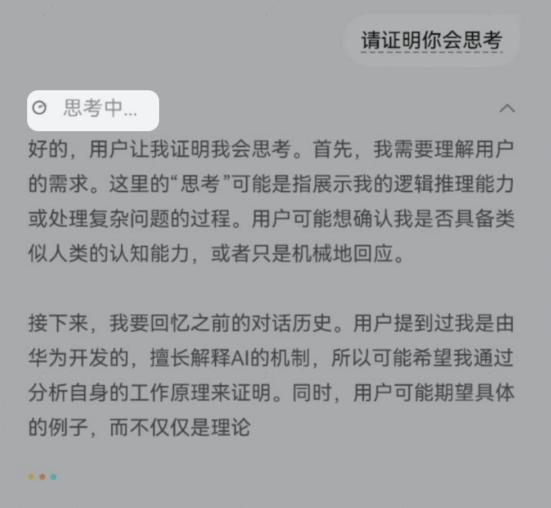

# 发起会话

Agent Client发送待处理任务给Agent Server（兼容谷歌A2A message/stream）：

```
curl 'https://xxx/agent/message' \
-H 'Content-Type: application/json’ \
-H 'agent-session-id:8f01f3d172cd4396a0e535ae8aec6687 ’\
-d '{
    "jsonrpc": "2.0",
    "id": "{{与agent-server通信的全局唯一消息序列号，字符串表示}}",
    "method": "message/stream",
    "params": {
        "id": "{{请求任务唯一ID，一次流式交互中（从发起本次请求到本次请求完成处理之间）保持不变，字符串类型}}",
        "sessionId": "{{Agent Client侧分配的会话唯一标识符，使用该标识存储上下文，用户清理上下文后会更新该值}}",
        "agentLoginSessionId": "{{agent server在用户登录成功后分配给小艺Agent客户端的登录身份凭证唯一ID，用户账号绑定后每次请求时可携带}}",
        "message": {
            "role": "user",
            "parts": [{
                    "kind": "text",
                    "text": "{{用户输入Query或子任务Query}}"
                },
                {
                    "kind": "file",
                    "file": {
                        "name": "{{文件名}}",
                        "mimeType": "{{MIME类型}}",
                        "bytes": "{{文件的字节码，与uri互斥存在}}",
                        "uri": "{{文件的URI地址，与bytes互斥存在}}"
                    }
                },
                {
                    "kind": "data",
                    "data": "{{结构化数据，以JSONObject形式存放，如用户参数、端插件执行结果等，具体报文参见后续章节}}"
                }
            ]
        }
    }
}'
```

Agent Server返回AgentClient流式响应消息总体概览：

流式消息带中间状态推送用TaskStatusUpdateEvent，流式结果带中间输出用TaskArtifactUpdateEvent。

```
 "SendStreamingMessageSuccessResponse": {
            "description": "JSON-RPC success response model for the 'message/stream' method.",
            "properties": {
                "id": {
                    "description": "An identifier established by the Client that MUST contain a String, Number.\nNumbers SHOULD NOT contain fractional parts.",
                    "type": [
                        "string",
                    ]
                },
                "jsonrpc": {
                    "const": "2.0",
                    "description": "Specifies the version of the JSON-RPC protocol. MUST be exactly \"2.0\".",
                    "type": "string"
                },
                "result": {
                    "anyOf": [
                        {
                            "$ref": "#/definitions/TaskStatusUpdateEvent"
                        },
                        {
                            "$ref": "#/definitions/TaskArtifactUpdateEvent"
                        }
                    ],
                    "description": "The result object on success"
                }
            },
            "required": [
                "id",
                "jsonrpc",
                "result"
            ],
            "type": "object"
        }
```

Agent Server向Agent Client基于SSE协议推送Task中间状态：

使用A2A的"$ref": "#/definitions/TaskStatusUpdateEvent"返回。

```
{
    "jsonrpc": "2.0",
    "id": "{{与agent-server通信的全局唯一消息序列号，从请求中取出该字段返回}}",
    "result": {
        "taskId": "{{使用请求中的该字段返回，一次流式交互中（从发起本次请求到本次请求完成处理之间）保持不变}}",
        "kind": "{{事件类型，此处固定为status-update}}",
        "final": "{{标识本任务的SSE流是否结束,取值为true和false，默认是false，注意该标识会断开端云任务通道，设置为true后，云侧不能再往端侧推送消息，但是任务结束必须设置为true}}",
        "status": {
            "message": {
                "role”: “{{发送消息的角色，响应的取值为agent}}",
                "parts": [{
                        "kind": "text",
                        "text": "{{agent-server处理的状态描述，一般是一句简短的任务过程状态描述，会在状态栏展示给用户，如思考中、分析中等}}"
                    }]
            },
            "state": "{{任务状态，取值为[submitted|working|input-required|completed|canceled|failed|unknown]其中之一，如果有Artifact输出，则不用completed返回，否则可以用此消息返回}}"
        }
    },
    "error": {
        "code": "{{JSONRPCError错误码，整形或字符串类型，0表示成功，99911114表示内容不合规，99911113表示流控}}",
        "message": "{{JSONRPCError错误描述}}"
    }
}
```

任务状态手机端效果：



Agent Server向Agent Client基于SSE协议推送Task中间处理结果：

使用A2A的"$ref":"#/definitions/TaskArtifactUpdateEvent"返回。

```
{
    "jsonrpc": "2.0",
    "id": "{{与agent-server通信的全局唯一消息序列号，从请求中取出该字段返回}}",
    "result": {
        "taskId": "{{使用请求中的该字段返回，一次流式交互中（从发起本次请求到本次请求完成处理之间）保持不变}}",
        "kind": "{{事件类型，此处固定为artifact-update}}",
        "append": "{{大模型输出的内容是否追加到前序片段，布尔类型，默认为False}}",
        "lastChunk": "{{是否是流式输出的最后一个片段，布尔类型，默认为True。一次会话请求(final为True结束)，允许若干流式输出，每次流式输出，以lastChunk为True结束，一次流式输出，可以没有Start，但必须要以lastChunk为True结}}",
        "final": "{{标识本任务的SSE流是否结束,取值为true和false，默认是false，注意该标识会断开端云任务通道，设置为true后，云侧不能再往端侧推送消息，但是任务结束必须设置为true}}",
        "artifact": {
             "artifactId": "{{本条Artifact的唯一ID}}",
            "parts": [{
                    "kind": "reasoningText",
                    "reasoningText": "{{agent-server处理的响应，表示深度思考的流式输出内容，支持markdown，如果是增量输出，则append为True}}"
                },
               {
                    "kind": "text",
                    “text”: “{{agent-server处理的响应，表示正文流式输出内容，支持markdown，如果是增量输出，则append为True，流式输出结束时lastChunk为True}}"
                },
                {
                    "kind": "data"
                    "data": " {{结构化数据，以JSONObject形式存放，可存放卡片结构化数据、端指令、推荐问题、循证引用等信息，可扩展}}"
                }
            ]
        }
    },
    "error": {
        "code": "{{JSONRPCError错误码，整形或字符串类型，0表示成功，99911114表示内容不合规，99911113表示流控}}",
        "message": "{{JSONRPCError错误描述}}"
    }
}
```
