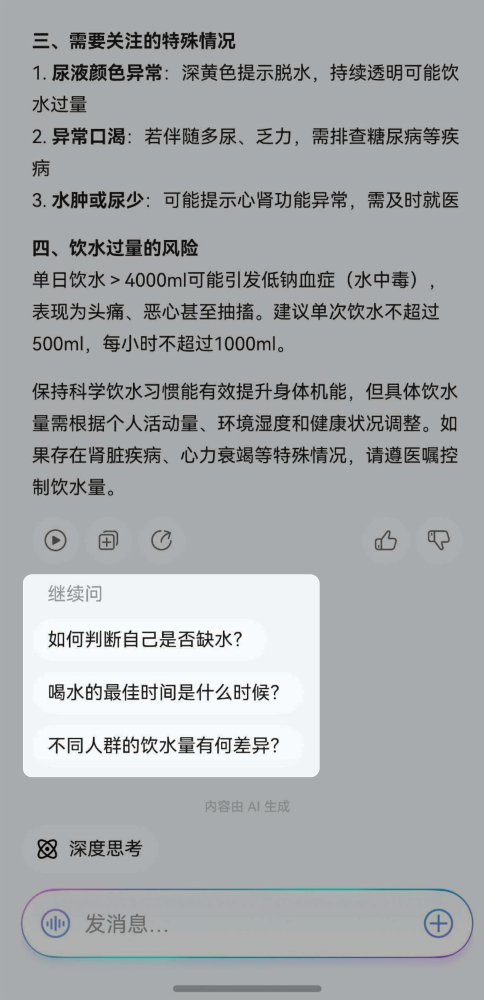
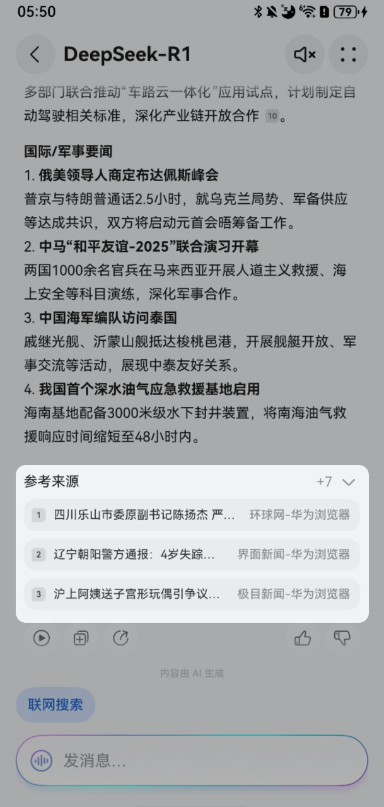

import MergeTable from '@site/src/components/MergeTable';

# 响应data数据结构定义

服务器给客户端返回文本时放在text（可以是纯文本，也可以是markdown）中，返回其它结构化数据放在data中。

| <strong>字段名称</strong> | | 类型 | 是否必填 | 字段描述 |
| --- | --- | --- | --- | --- |
| kind | - | string | 是 | 字段类型，此处固定为“data”。 |
| data | - | object | 是 | 数据类型为data类型的结构体定义。 |
| commands | array[CommandObject] | 否 | 服务器侧响应客户端调用时，需要调用端侧工具时下发的调用指令。 |
| cardsInfo | array[CardDataObject] | 否 | 服务器侧响应客户端调用时，返回的卡片模板填充数据。 |
| chipsInfo | ChipDataObject | 否 | 服务器侧响应客户端调用时，返回的接续追问气泡数据。 |
| reference | ReferenceDataObject | 否 | 服务器侧响应客户端调用时，返回的循证引用数据。 |

## CommandObject参数说明

| <strong>字段名称</strong> | | | 类型 | 是否必填 | 字段描述 |
| --- | --- | --- | --- | --- | --- |
| commands | - | - | - | - | - |
| header | - | Object | - | - |
| namespace | String | 是 | 按具体业务场景填充。 |
| name | String | 是 | 按具体业务场景填充。 |
| payload | - | Object | - | 按具体业务场景填充。 |

Agent Server需要返回给小艺APP用户可见的卡片数据结构指令CardDataObject，以开发者或者华为侧支撑人员在小艺开放平台按照产品需求定义出的卡片实际数据结构定义为准。

Agent Server通过小艺APP下发给开发者自己的APP的调用指令，需要按照鸿蒙意图框架的指令规范，先让APP支持通过意图框架指令调用APP，包括从APP取数据，意图框架调用的开发指导，参见：[开发指导](https://developer.huawei.com/consumer/cn/doc/service/intents-kit-0000001677103865)，Agent Server在判定实际需要下发调用自己的APP时，通过上述CommandObject指令经过小艺APP下发给自己的APP，具体的CommandObject格式待细化提供。这种Agent Server端侧调用指令需要在小艺开放平台注册端调用插件加白名单后才能生效（Deeplink跳转指令除外） 。

Agent Server也可以通过小艺APP下发跳转到外部指令，包括DeepLink、H5、鸿蒙元服务，也是通过上述CommandObject指令经过小艺APP下发给自己的APP，具体的CommandObject格式待细化提供。

开发者自己的APP如果需要上报APP中的数据给Agent Server，可以在Agent Server下发意图框架调用指令后，开发者自己的APP按照意图框架调用指令的输出参数，放在上述EventObject带回给Agent Server。

## CardDataObject参数说明

| <strong>字段名称</strong> | | 类型 | 是否必填 | 字段描述 |
| --- | --- | --- | --- | --- |
| cardsInfo | - | Object | 是 | 业务卡片结构化数据。 |
| cardName | String | 是 | 业务卡片名称，与小艺开放平台A2A模式智能体中输出配置中的卡片名称一致。 |
| cardData | Object | 是 | 业务卡片数据，如果是多条记录建议放在items.[\*].[JSONObject]里面返回，如果是非数组，则用JSONObject返回。 |
| displayType | String | 否 | 枚举值包含：EmbedMarkdown（嵌入MD显示），DisplayFaCard（独立出卡） ，不传值默认独立显示，即卡片展示在文字下方。 |

## ChipDataObject参数说明

| <strong>字段名称</strong> | | | | 类型 | 是否必填 | 字段描述 |
| --- | --- | --- | --- | --- | --- | --- |
| chipsInfo | - | - | - | Object | - | - |
| displayChips | - | - | Object | - | - |
| chipsList | - | ArrayObject | - | - |
| content | String | 是 | 问题内容，与卡片内容引导问题内容格式一致，使用superlink格式，参数可扩展， text放问题内容，startmode标识点击问题执行文本识别。  样例数据：superlink://vassistant?text=\{\{推荐问题内容\}\}&startmode=recognize 问题内容长度不得超过64个字符。 |
| domain | String | 是 | 问题所属垂域，documentSummary文档摘要，AIGC LLM生成。数据样例：AIGC。 |
| icon | String | 否 | 气泡图标URL。 |

追问建议设备端效果：

## ReferenceDataObject参数说明

| <strong>字段名称</strong> | | | | | | | 类型 | 是否必填 | 字段描述 |
| --- | --- | --- | --- | --- | --- | --- | --- | --- | --- |
| reference | - | - | - | - | - | - | Object | - | - |
| items | - | - | - | - | - | ArrayObject | 是 | 打点参数。 |
| params | - | - | - | - | Object | 是 | 打点参数。 |
| name | - | - | - | String | 是 | 打点用的站点名称。 |
| source | - | - | - | String | 是 | 打点用的站点来源类型。 |
| card | - | - | - | - | Object | 是 | 参考来源卡片显示信息。 |
| type | - | - | - | String | 是 | 卡片模板类型，为固定值：leftPictureRightText。 |
| params | - | - | - | Object | 是 | 卡片参数信息。 |
| title | - | - | String | 是 | 显示的网页标题。 |
| subTitle | - | - | String | 是 | 显示的站点名称。 |
| link | - | - | Object | 是 | 跳转链接信息。 |
| webLink | - | Object | 是 | 固定weblink方式跳转。 |
| startMode | Integer | 是 | 启动方式 0小艺内部拉起，1浏览器 默认0。 |
| url | String | 是 | 网页跳转链接。 |
| imageInfo | - | - | Object | 否 | 网页标题logo。 |
| small | - | Object | 否 | small小尺寸。 |
| url | String | 否 | Logo对应的URL链接。 |

参考来源设备端效果：

