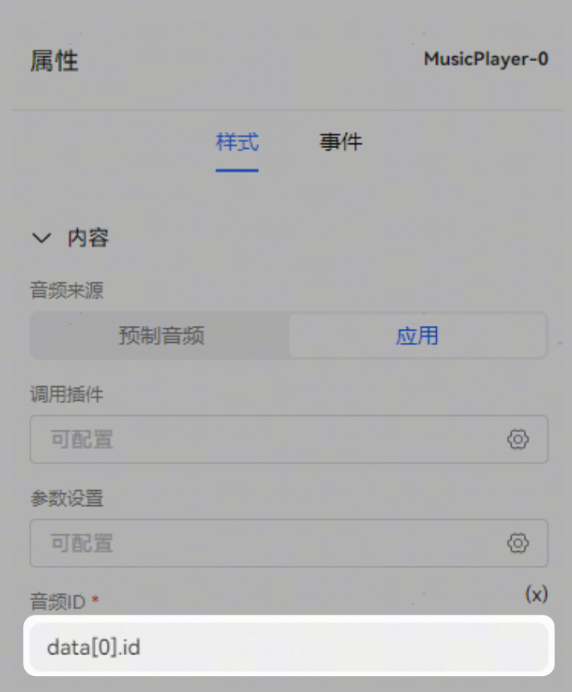
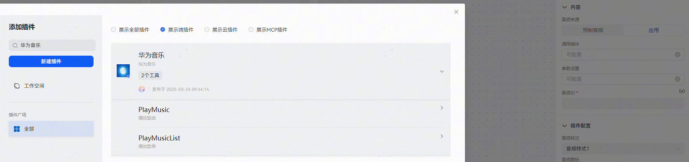
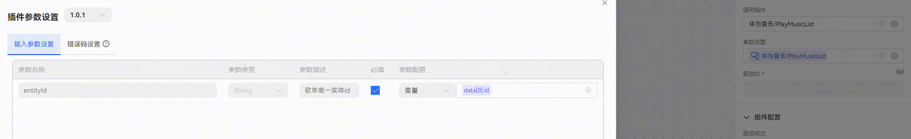
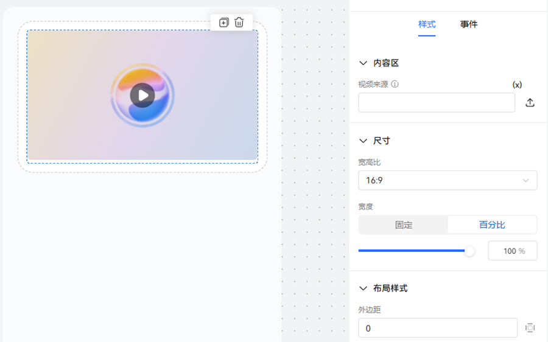

# 组件使用方法概述

**音频来源**：

预置音频：音频来自于URL。可给卡片绑定固定音频地址，也可通过绑定变量，实现动态获取音频地址。

应用：音频来自于APP。通过调用插件的方式来调用APP功能，实现音频播放。

使用音频组件，音频来源选择应用，给音频组件绑上ID，音频ID为必选项，必须保证ID唯一性。

为音频组件添加插件（仅支持添加端插件）

对插件进行配置，将插件输入参数与卡片变量一一对应。

**视频组件的用法**：

与音频组件类似，视频来自于URL。可给卡片绑定固定视频地址，也可通过绑定变量，实现动态获取视频地址。

